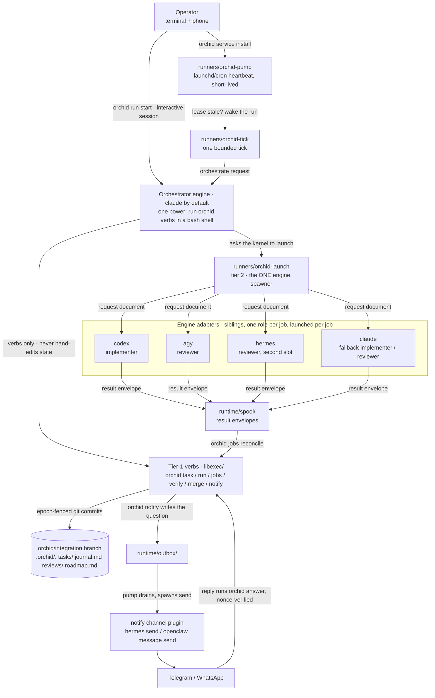
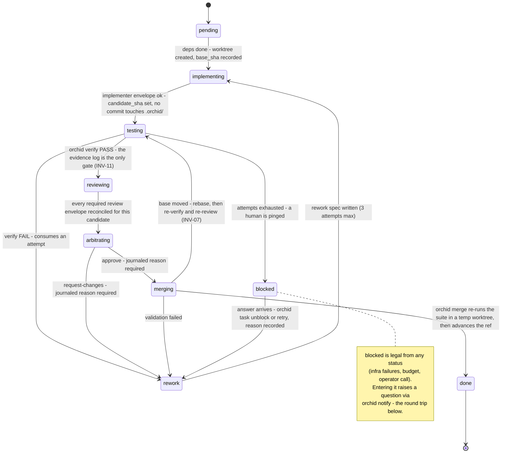
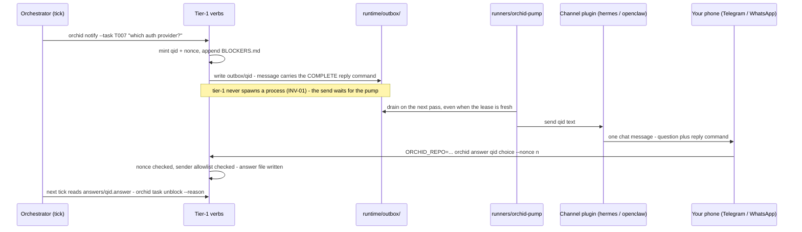

# orchid

**A small, auditable orchestration kernel — bash + git + jq, no daemon, no
API keys — that turns the coding-agent CLIs you already subscribe to
(Claude Code, Codex, Antigravity, Hermes, …) into an autonomous dev team:
it plans, implements, reviews, merges, and pings your phone only when a
human decision is needed.**

Works with **Claude Code · Codex · Antigravity · Hermes · OpenClaw**
(compatibility, not endorsement or partnership — orchid is an independent,
unaffiliated tool that shells out to each vendor's own CLI).

```sh
curl -fsSL https://raw.githubusercontent.com/bilal-/orchid/v1.0.0/install.sh | bash
```

That command stays on the immutable `v1.0.0` release, independent of the
caller's current directory (including inside a dirty Orchid checkout). To
upgrade, use the new version's equally pinned URL; following `main` is an
explicitly labeled development channel. Flags, channels, `--uninstall`, the
prepared Homebrew tap, and the git-clone method:
[docs/install.md](./docs/install.md).

> Orchid is in final private dogfooding — the one-liner goes live the day
> this repo does. Until then, install from a clone
> ([docs/install.md](./docs/install.md#git-clone-for-hacking-on-orchid-itself)); that is the
> exact path the timed rehearsal below used.

## The 60-second story

1. Install (the one line above).
2. `cd` into your repo. `orchid doctor` names what's missing — a
   `verify=<your test command>` line, an engine CLI — then `orchid init`
   creates an integration branch. Your own branches are never touched.
3. Write `requirements.md`: goal, constraints, acceptance criteria. A
   second engine critiques the plan before it becomes real work.
4. For a headless tick/service, review the target and run `orchid trust
   unattended "$PWD" --reason "..."`; then `orchid run start` or `orchid
   service install`. Engines implement, independent engines review, `orchid
   verify` runs your real test command, and merges land only after
   re-verification. Interactive/manual operation needs no acknowledgement.
5. When something genuinely needs a human, one Telegram message arrives on
   your phone. You reply; the answer lands nonce-verified.
6. Come back to merged, verified code on the integration branch, with
   every decision journaled and every merge carrying its evidence.

That pace is measured, not aspirational: the release rehearsal ran clone →
install → doctor → plan → implement → review → merge → accepted on a
clean-machine profile, following the quickstart alone, in **13m19s**
([docs/dogfood-notes.md](./docs/dogfood-notes.md), "v1-m4 Task 12 —
release rehearsal").

Full walkthrough: [quickstart.md](./docs/quickstart.md) (existing repo) ·
[quickstart-greenfield.md](./docs/quickstart-greenfield.md) (new product,
no code yet).

## What makes orchid different

- **Runs on the subscriptions you already pay for.** Engines are vendor
  CLIs in their own first-party headless modes. Orchid never holds an API
  key, never meters tokens, never proxies a request — billing stays on
  whatever plan each CLI is already logged into.
- **A deterministic kernel, not an agent framework.** Orchid's supported
  launch path routes engine jobs through a small bash state machine and
  brokers every result as a file; each state change is a git commit on the
  integration branch with its evidence attached — verify output, review
  verdicts, an append-only journal. See [Who runs whom](#who-runs-whom).
- **Any engine, any role.** Implementer, reviewer, orchestrator, plan
  critic are config lines, not hardcoded vendors — capability-gated by a
  real conformance suite and labeled honestly (tested vs.
  works-by-construction vs. untested): the
  [matrix below](#any-engine-any-role) and
  [docs/frontends.md](./docs/frontends.md).
- **Crash-anywhere resumability.** Durable state is single-writer,
  git-committed on the integration branch, and every mutating verb is
  fenced by a monotonic epoch. Kill it mid-run; a crash loses at most the
  current uncommitted tick, and the next tick resumes from files.
- **Blockers reach you where you live.** Telegram/WhatsApp via the Hermes
  or OpenClaw channel plugins; answers come back from your phone
  nonce-verified and sender-allowlisted — proven in a live round trip
  ([docs/dogfood-notes.md](./docs/dogfood-notes.md), F18).
- **Zero infrastructure.** bash 3.2 + git + jq — nothing else. No Python,
  no Node runtime, no cloud, no telemetry, no accounts. Unattended mode is
  one launchd/cron line running a short-lived pump, not a resident daemon.
- **The record is public, failures included.**
  [docs/dogfood-notes.md](./docs/dogfood-notes.md) is the ledger: runs
  driven to `run_status: complete` unattended (including a headless,
  pump-launched tick that finished a run with no human in the loop), a
  live production run on a real application repo whose incidents fed
  straight back into the design, the timed rehearsal above, the live phone
  round trip — and every F-numbered bug those runs surfaced, stated
  plainly, with the fix.

## How it works

Who runs whom, top to bottom. Every arrow Orchid itself implements into an
engine adapter comes from a tier-2 runner. This is a property of Orchid's
source and supported control flow, not OS containment: a shell-capable,
prompt-injected orchestrator is still an operating-system process and there
is no command broker preventing it from invoking some other executable.

<!-- Diagram grounding: docs/specs/kernel.md "Architecture" (tier split,
     normative process model, INV-01/INV-06) and PROTOCOL.md (the tick).
     Role labels are the tested defaults from orchid.config.example. -->


Every arrow into an engine box is a **request document**; every arrow back
out is a **result envelope** — both plain files, written and read by the
kernel, never trusted claims taken at face value. `orchid verify` (a real
shell command you configure) is the only thing that ever says "tests
pass."

The deeper visual tour — including the dual-review independence and
epoch-fencing diagrams this front page skips:
[architecture, in five diagrams](./docs/architecture.md).

## One task's journey

Every transition below is a kernel verb, refused unless its evidence gate
holds — a passing `orchid verify` log, reconciled review envelopes bound to
this exact candidate SHA, a journaled reason. State lives in git commits on
the integration branch, so a crash anywhere resumes from files.

<!-- Source of truth: PROTOCOL.md "THE TICK - 3. State-machine walk" (the
     feature archetype's walk) and docs/specs/kernel.md "Task lifecycle"
     (the canonical transition table). Every state and edge below appears
     in that table; none is invented here. -->


The same walk, in verbs:

1. `orchid task advance T001 implementing` — a worktree is created, base
   SHA recorded; the resolved `implementer` engine is launched via
   `runners/orchid-launch` with a request document naming that worktree.
2. The engine edits files; the **adapter** (not the engine) commits them —
   engines never need commit capability, only edit capability
   (`docs/dogfood-notes.md`'s F3 finding, why every implementer adapter
   works this way).
3. `orchid verify T001` runs your real test command against the candidate
   commit — deterministic, evidence-logged.
4. `orchid task advance T001 reviewing` launches the resolved reviewer
   chain (one or two engines, by risk tier); each writes a verdict envelope
   nobody hand-edits.
5. Agreement → `orchid task advance T001 merging` → `orchid merge T001`
   re-verifies in a temp worktree and advances the integration branch.
   Disagreement → the orchestrator (inline, ≤10 lines of judgment) reads
   the diff and arbitrates.
6. `done`. Repeat, up to `concurrency` tasks in flight at once, until the
   roadmap is complete.

## Who runs whom

This is the one design decision every other choice in this project follows
from, stated exactly:

> **Orchid routes engine launches through its tier-2 runners.** The
> deterministic kernel brokers their results as files, and every non-default
> role×engine combination is disabled until the capability suite proves it.

Concretely, the protocol tells an orchestrator engine (by default, an
interactive Claude Code session) to use only `orchid` verbs and
`runners/orchid-launch`, the same commands shown throughout this README.
INV-01/INV-06 test that Orchid's own tier-1 and adapter launch sites follow
that topology. They do not jail the orchestrator's Bash process or turn the
prompt instruction into an enforceable command allowlist. Every other
role×engine pairing beyond the tested defaults is disabled at resolution
time until `orchid plugins test <engine> <role>` (the capability suite)
proves it eligible — see [any-engine-any-role](#any-engine-any-role) below.

## The blocker round trip

When a task genuinely needs a human — a design fork, an exhausted rework
budget, a prohibited external mutation — the run doesn't stall in a
terminal you have to babysit. One message reaches your phone; your reply
comes back nonce-verified. This exact flow is live-proven end-to-end over
hermes-Telegram ([docs/dogfood-notes.md](./docs/dogfood-notes.md), F18):

<!-- Grounded in the LIVE-PROVEN flow: docs/dogfood-notes.md F18 (the
     hermes-telegram phone round trip), docs/engines/openclaw.md "The
     OUTBOX pattern", and PROTOCOL.md "4. Blockers". -->


The message IS the interface: it carries the complete `orchid answer`
command inline (the F18 fix), so any answering agent — hermes, OpenClaw, or
you pasting into a terminal — can execute it verbatim from any directory.
The reply is refused unless its nonce matches the question's, and, when
`answer_allowlist` is configured, unless the sender is on it. If no channel
is configured at all, `BLOCKERS.md` plus the terminal is the same complete
interaction surface — the phone is a convenience, never a dependency.

## Why this design

- **Nobody signs off on their own work.** An engine-independent (or, at
  minimum, session-independent) reviewer judges every candidate — the same
  reason code review exists for humans, backed by research showing LLM
  evaluators measurably favor their own generations
  ([research.md](./docs/research.md)).
- **Deterministic verification over model claims.** `orchid verify` is a
  real command you own; an engine's own narration of success is a
  diagnostic, never evidence.
- **Files are the truth.** No daemon, no database, no hidden session
  state — everything durable is a git-committed file on the integration
  branch. A crash loses at most the current uncommitted tick.
  ("Kernel guarantees / non-guarantees," `docs/specs/kernel.md`.)
- **Any engine, any role — enforced, not just documented.** Roles are
  capability requirements, not hardcoded names; the kernel never branches
  on which vendor CLI happens to be bound.
- **Subscriptions, not API metering.** Engines run through their own
  first-party headless modes, so billing stays on whatever plan you
  already pay for.

## Any engine, any role

Roles are pure configuration — a capability requirement, satisfied by
whichever engine's manifest declares enough:

| Role | Requires | Job |
|---|---|---|
| `orchestrator` | `shell`, `git` | Drives verbs, launches adapters — the tick's primary engine |
| `implementer` | `workspace_write`, `shell`, `git` | Edits the workspace and commits |
| `reviewer` | `structured_text` | Reads structured input, returns a verdict — the minimum needed to judge a diff |
| `arbiter` | `structured_text` | Resolves conflicting reviews (inline judgment, not a launched job) |
| `plan_critic` | `structured_text` | Critiques a draft plan before it becomes real work |

**Tested defaults** (shipped and verified in this project's own test suite
and dogfood runs — `orchid.config.example`):

| Role | Tested default | Fallback chain |
|---|---|---|
| `role.orchestrator` | `claude` | `claude,codex` |
| `role.implementer` | `codex` | `codex,claude` |
| `role.reviewer` | `agy` | (risk-tiered — see `review.<tier>` below) |
| `role.arbiter` | `claude` | `claude,codex` |
| `role.plan_critic` | `codex` | `codex,claude` |

**Capability-gated (any other binding):** any engine whose declared
capabilities satisfy a role's requirements can hold it — `orchid doctor`
labels a non-default binding `unverified` until `orchid plugins test
<engine> <role>` passes it; once it does, it's eligible exactly like a
tested default, just not the one this project itself has run in anger.
Concretely, today's built-in engines sort like this:

| Engine | Capabilities | Eligible roles |
|---|---|---|
| `codex`, `claude` | `structured_text, workspace_read, workspace_write, shell, git` | all five |
| `codex-review` | `structured_text, workspace_read, git` (capability-restricted wrapper around `codex`) | `reviewer`, `plan_critic` |
| `agy` | `structured_text` only | `reviewer`; `plan_critic` capability-eligible in principle, but its own adapter explicitly refuses a plan-critique job (no plan-critique prompt) — don't actually bind it there |
| `hermes` | `structured_text` only | `reviewer`, `plan_critic` — see [docs/engines/hermes.md](./docs/engines/hermes.md) for why `implement` isn't offered yet |

**Degraded independence.** `medium`/`high` risk tasks want dual review: one
worktree-capable engine for depth, one engine-independent for diversity.
With only two engines actually installed, the second reviewer often can't
be BOTH worktree-capable and a third distinct vendor — that's "degraded
independence": `medium` accepts a labeled session-independent fallback
(same vendor, fresh session); `high` instead queues, waiting for a genuinely
engine-independent reviewer to become available, rather than silently
accepting the weaker guarantee. Never silent either way — always labeled
and journaled.

**Worked example — swapping the implementer:**

```sh
# 1. Confirm claude is actually eligible for the implementer role first —
#    never bind blind:
orchid plugins test claude implementer
# ok: manifest_valid / capability_coverage / requires_binaries / dryrun_envelope
# -> capsuite result written to ~/.orchid/capsuite/claude--implementer.json

# 2. Bind it — primary claude, codex as fallback:
echo 'role.implementer=claude,codex' >> orchid.config
orchid config commit --reason "try claude as implementer"

# 3. Confirm the resolver sees it:
orchid doctor   # role implementer: claude,codex (claude: verified)
```

**Driving orchid from any agent product** (not just Claude Code):
[docs/frontends.md](./docs/frontends.md) — per-engine status (tested vs.
untested), what `install.sh` auto-wires, and manual steps for the rest.

## Install / uninstall

The one-liner at the top of this page is the normal path — it clones a
canonical copy and runs its installer; see
[docs/install.md](./docs/install.md) for how flags pass through, the
prepared Homebrew tap, and `--prefix` support. From a checkout (best if
you're hacking on orchid itself):

```sh
./install.sh              # symlinks skills/ + bin/orchid, seeds ~/.orchid/
./install.sh --uninstall  # reverses precisely those symlinks; config/trust left in place
```

See [quickstart.md's step 1](./docs/quickstart.md#1-clone-and-install) for
the full explanation of exactly what gets linked where.

To run continuously without babysitting a terminal:

```sh
orchid trust unattended "$PWD" --reason "reviewed this repository for unattended execution"
orchid service install     # launchd agent (macOS) or crontab line (Linux)
orchid service status
orchid service uninstall
```

`orchid trust show "$PWD"` displays the machine-local acknowledgement and
its identity/root/policy provenance; without an identity-keyed record it
reports root verification as pending and returns denied without walking
history. `orchid trust revoke "$PWD"` disables future pump/tick runs without
removing an already-installed schedule; it needs only the on-disk identity,
so it still works when Orchid cannot inspect the repository. Acknowledgement
and verification of an existing candidate require Git 2.45 or newer; older
Git remains usable for manual operation, but is denied before any repository
object walk.

## State files, guardrails, operator verbs

**Durable** (committed on the integration branch only):
`requirements.md`, `roadmap.md`, `tasks/*.md` (state machine lives in
frontmatter), `reviews/` (envelopes + verify/merge evidence), `journal.md`
(append-only decision log), `lessons.md` (cross-run memory),
`plugins.lock`, `BLOCKERS.md`.

**Runtime** (gitignored, machine-local): `lock/`, `lease.json`,
`jobs/<job_id>.json`, `spool/`, `engines.json` (availability ledger),
`answers/`, `logs/`, `status.html`.

**Guardrails:** rate limits pause one engine, never the run; a dead job is
detected by pgid+start-time liveness, a hung one by log-mtime/size
stalling, a spinning one by a false-positive-guarded duplicate-line check;
three rework attempts exhausts to `blocked`; no tier-1 verb ever spawns a
long-lived process (INV-01). Orchid's deterministic verbs provide no push,
deploy, or publish operation, and PROTOCOL.md instructs engines to treat
external mutation as a blocker. The absent verb is Orchid's enforced
boundary; the blocker instruction is prompt policy. With no command broker
or OS containment, Orchid cannot prohibit external mutation outright: a
shell-capable engine process with external credentials, network access, or
other host capabilities could invoke another executable and mutate an
external system.

**Operator verbs** (no hand-editing `.orchid/` ever needed):
`orchid task unblock/retry <id> --reason "..."`, `orchid answer <qid>
<choice>`, `orchid config commit --reason "..."`, `orchid run
release-lease`, `orchid jobs gc --reap-prepared`. Full incident-by-incident
detail: [troubleshooting.md](./docs/troubleshooting.md).

## Extending orchid

Everything outside the kernel is a plugin — **the built-ins are plugins
too** (same discovery, same contracts). Five extension points:

| Kind | Contract | Stage |
|---|---|---|
| **engine** | executable `run`; request document in, result envelope out | v0 (seam), v1 (manifests) |
| **archetype** | data-only workflow declaration (transition-table subset + templates) | feature v0; review v1-m1; refactor/test/migrate v1-m3 |
| **notify channel** | `send <question-id> <text>`; inbound via `orchid answer` | v1-m4 |
| **hook** | named lifecycle hook handler, typed payload | v1-m3 |
| **role** | descriptor: required/forbidden capabilities + hook bindings | v1-m3 |

**Your first adapter, in under an hour:**
[docs/extending/first-engine.md](./docs/extending/first-engine.md) walks a
minimal engine from `mkdir` to a green `orchid plugins conform` — no repo,
no real vendor CLI, no quota spent, the whole way. Reference:
[docs/extending/conformance.md](./docs/extending/conformance.md) (the
seven-check battery). Built-in adapters as reading material once you're
wiring up a real CLI: [docs/engines/](./docs/engines/).

**Patterns glossary** (the codebase's own vocabulary — one line each):

- **Engine** — a vendor AI accessed through an adapter plugin. Not a role.
- **Role** — a named job (orchestrator/implementer/reviewer/arbiter/
  plan_critic/custom) bound to engines by config. Not an engine.
- **Adapter** — the executable translating one engine into the
  request/envelope contract.
- **Runner** — a tier-2 effectful launcher (launch/tick/pump). Not a verb.
- **Verb** — a tier-1 deterministic state transition; never spawns a
  long-lived process.
- **Archetype** — a declared workflow shape (transitions + templates). Not
  code.
- **Ledger** — per-machine engine availability state (`runtime/engines.json`).
- **Spool** — where engine result envelopes wait for reconciliation.
- **Lease** — the orchestrator's ownership heartbeat (`runtime/lease.json`).
- **Request document / Envelope / Input pack** — invocation contract /
  result contract / materialized per-job memory.
- **Plugin trust record** — a digest-pinned entry outside the repo that
  enables one repo-local plugin.
- **Unattended trust record** — an operator-authored machine-local
  acknowledgement, bound to Git common-directory and non-reusable witness
  filesystem identities, root history, and policy version; it enables the
  pump/tick boundary, not code safety.
- **Hook** — a named lifecycle extension point with a typed payload.

## FAQ

**Can an engine spawn another engine?** Orchid never does so in its supported
launch flow: INV-01/INV-06 statically test that kernel launch sites use the
tier-2 runners. That is source-level mediation, not OS containment. A
shell-capable engine process is not jailed by those invariants, and no
command broker is wired yet.

**Is this sandboxed?** Plugins (including the built-ins) are **trusted
code** — orchid v1 doesn't containerize them and says so plainly rather
than implying protection it doesn't have. Vendor-CLI sandbox flags
(`--sandbox workspace-write`, read-only modes, etc.) are a real second
layer. The launcher's stripped environment is hygiene, PROTOCOL.md's
command restrictions are prompt policy, no command broker is wired yet,
and full OS-level plugin/process containment is post-v1 roadmap. The
unattended acknowledgement makes this residual target-repository
prompt-injection risk explicit; it does not remove it.

**Does orchid push or deploy?** Orchid's shipped verbs and adapters do not
intentionally perform those actions; PROTOCOL.md requires external mutation
to become a blocker, and the installed pre-push hook is defense in depth.
That policy is not a network sandbox for a prompt-injected, Bash-capable
orchestrator. Review the target and explicitly acknowledge that residual
risk before enabling unattended mode. Moving the integration branch to
`origin` remains an operator action.

**What if my engine's own CLI changes its flags?** Each adapter documents
the exact invocation it verified and why (`docs/engines/*.md`) — a drifted
flag is a real, visible failure (`rate_limited`/`auth`/`failed`
classification, or a `malformed` envelope), never a silent misbehavior.

**Why not just use one really good agent?** Because nobody should grade
their own homework, and because harness quality — verification, memory,
guardrails, role separation — dominates any single model's capability; see
[research.md](./docs/research.md).

**Does orchid have a hosted/web version?** No, and it never will by
design — no server, no dashboard, no multi-user account system. `orchid
status --html` is a local static file, not a served page.

## Research grounding

`docs/research.md` is the full annotated bibliography — every citation
link-checked live against its actual published venue during this project's
own v1-m4 milestone, not carried over from memory. Summary:

| Design pillar | Key citations |
|---|---|
| Multi-agent division of labor | MetaGPT, ChatDev, AutoGen, CAMEL |
| Engine independence in review | LLM-as-judge (MT-Bench), self-preference bias (Panickssery et al.) |
| Reviewer diversity & arbitration | Multiagent debate (Du et al.), More Agents Is All You Need, Mixture-of-Agents |
| Memory design (rework/journal/lessons) | Reflexion, Self-Refine, Voyager, Generative Agents, MemGPT |
| Deterministic verification | SWE-bench, SWE-agent, Google's "New SDLC With Vibe Coding" |
| Harness > model | Google whitepaper, Karpathy's agentic-engineering framing |
| Productivity (both directions, honestly) | METR RCT (AI slower for experienced devs on familiar code), Peng et al. Copilot study (55.8% faster on a greenfield task) |

## Contributing

Community contributions are welcome. Start with the deterministic local gate
and lint policy in [docs/contributing.md](./docs/contributing.md). Third-party
engine, hook, role, archetype, and notification-channel authorship is fully
supported through the [extension points above](#extending-orchid).

## License

MIT.
