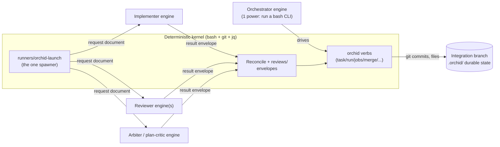

# orchid

**A small, auditable orchestration kernel — bash + git + jq, no daemon, no
API keys — that turns the coding-agent CLIs you already subscribe to
(Claude Code, Codex, Antigravity, Hermes, …) into an autonomous dev team:
it plans, implements, reviews, merges, and pings your phone only when a
human decision is needed.**

Works with **Claude Code · Codex · Antigravity · Hermes · OpenClaw**
(compatibility, not endorsement or partnership — orchid is an independent,
unaffiliated tool that shells out to each vendor's own CLI).

<!-- SCREENSHOT: hero — orchid status --html open in a browser, a run mid-flight -->

```sh
curl -fsSL https://raw.githubusercontent.com/bilal-/orchid/main/install.sh | bash
```

Running the same line again later is the upgrade command. Flags,
`--uninstall`, the Homebrew tap, and the git-clone method (for hacking
on orchid itself): [docs/install.md](./docs/install.md).

## The 60-second story

1. Install (the one line above).
2. `cd` into your repo. `orchid doctor` names what's missing — a
   `verify=<your test command>` line, an engine CLI — then `orchid init`
   creates an integration branch. Your own branches are never touched.
3. Write `requirements.md`: goal, constraints, acceptance criteria. A
   second engine critiques the plan before it becomes real work.
4. `orchid run start` — or `orchid service install` — and walk away.
   Engines implement, independent engines review, `orchid verify` runs
   your real test command, and merges land only after re-verification.
5. When something genuinely needs a human, one Telegram message arrives on
   your phone. You reply; the answer lands nonce-verified.
6. Come back to merged, verified code on the integration branch, with
   every decision journaled and every merge carrying its evidence.

That pace is measured, not aspirational: the release rehearsal ran clone →
install → doctor → plan → implement → review → merge → accepted on a
clean-machine profile, following the quickstart alone, in **13m19s**
([docs/dogfood-notes.md](./docs/dogfood-notes.md), "v1-m4 Task 12 —
release rehearsal").

Full walkthrough: [quickstart.md](./docs/quickstart.md) (existing repo) ·
[quickstart-greenfield.md](./docs/quickstart-greenfield.md) (new product,
no code yet).

<!-- SCREENSHOT: phone — Telegram blocker question and the nonce-verified reply -->

## What makes orchid different

- **Runs on the subscriptions you already pay for.** Engines are vendor
  CLIs in their own first-party headless modes. Orchid never holds an API
  key, never meters tokens, never proxies a request — billing stays on
  whatever plan each CLI is already logged into.
- **A deterministic kernel, not an agent framework.** Engines never spawn
  engines. A small bash state machine launches every engine and brokers
  every result as a file; each state change is a git commit on the
  integration branch with its evidence attached — verify output, review
  verdicts, an append-only journal. See [Who runs whom](#who-runs-whom).
- **Any engine, any role.** Implementer, reviewer, orchestrator, plan
  critic are config lines, not hardcoded vendors — capability-gated by a
  real conformance suite and labeled honestly (tested vs.
  works-by-construction vs. untested): the
  [matrix below](#any-engine-any-role) and
  [docs/frontends.md](./docs/frontends.md).
- **Crash-anywhere resumability.** Durable state is single-writer,
  git-committed on the integration branch, and every mutating verb is
  fenced by a monotonic epoch. Kill it mid-run; a crash loses at most the
  current uncommitted tick, and the next tick resumes from files.
- **Blockers reach you where you live.** Telegram/WhatsApp via the Hermes
  or OpenClaw channel plugins; answers come back from your phone
  nonce-verified and sender-allowlisted — proven in a live round trip
  ([docs/dogfood-notes.md](./docs/dogfood-notes.md), F18).
- **Zero infrastructure.** bash 3.2 + git + jq — nothing else. No Python,
  no Node runtime, no cloud, no telemetry, no accounts. Unattended mode is
  one launchd/cron line running a short-lived pump, not a resident daemon.
- **The record is public, failures included.**
  [docs/dogfood-notes.md](./docs/dogfood-notes.md) is the ledger: runs
  driven to `run_status: complete` unattended (including a headless,
  pump-launched tick that finished a run with no human in the loop), a
  live production run on a real application repo whose incidents fed
  straight back into the design, the timed rehearsal above, the live phone
  round trip — and every F-numbered bug those runs surfaced, stated
  plainly, with the fix.

## How it works



Every arrow into an engine box is a **request document**; every arrow back
out is a **result envelope** — both plain files, written and read by the
kernel, never trusted claims taken at face value. `orchid verify` (a real
shell command you configure) is the only thing that ever says "tests
pass."

## One task's journey

1. `orchid task advance T001 implementing` — a worktree is created, base
   SHA recorded; the resolved `implementer` engine is launched via
   `runners/orchid-launch` with a request document naming that worktree.
2. The engine edits files; the **adapter** (not the engine) commits them —
   engines never need commit capability, only edit capability
   (`docs/dogfood-notes.md`'s F3 finding, why every implementer adapter
   works this way).
3. `orchid verify T001` runs your real test command against the candidate
   commit — deterministic, evidence-logged.
4. `orchid task advance T001 reviewing` launches the resolved reviewer
   chain (one or two engines, by risk tier); each writes a verdict envelope
   nobody hand-edits.
5. Agreement → `orchid task advance T001 merging` → `orchid merge T001`
   re-verifies in a temp worktree and advances the integration branch.
   Disagreement → the orchestrator (inline, ≤10 lines of judgment) reads
   the diff and arbitrates.
6. `done`. Repeat, up to `concurrency` tasks in flight at once, until the
   roadmap is complete.

## Who runs whom

This is the one design decision every other choice in this project follows
from, stated exactly:

> **Engines never spawn engines.** The deterministic kernel launches every
> engine and brokers all results as files. The orchestrating engine needs
> exactly one power — running a bash CLI — and every other role×engine
> combination is disabled until the capability suite proves it.

Concretely: there is no LLM anywhere in this system that is permitted to
decide to invoke another LLM directly. An "orchestrator" engine (by
default, an interactive Claude Code session) does nothing more privileged
than run `orchid` verbs and `runners/orchid-launch` — the same commands
shown throughout this README — under a bash shell. It cannot reach an
implementer or reviewer engine except by asking the kernel to launch one on
its behalf, exactly the way a human operator would. Every OTHER
role×engine pairing beyond the tested defaults is disabled at resolution
time until `orchid plugins test <engine> <role>` (the capability suite)
proves it eligible — see [any-engine-any-role](#any-engine-any-role) below.

## Why this design

- **Nobody signs off on their own work.** An engine-independent (or, at
  minimum, session-independent) reviewer judges every candidate — the same
  reason code review exists for humans, backed by research showing LLM
  evaluators measurably favor their own generations
  ([research.md](./docs/research.md)).
- **Deterministic verification over model claims.** `orchid verify` is a
  real command you own; an engine's own narration of success is a
  diagnostic, never evidence.
- **Files are the truth.** No daemon, no database, no hidden session
  state — everything durable is a git-committed file on the integration
  branch. A crash loses at most the current uncommitted tick.
  ("Kernel guarantees / non-guarantees," `docs/specs/kernel.md`.)
- **Any engine, any role — enforced, not just documented.** Roles are
  capability requirements, not hardcoded names; the kernel never branches
  on which vendor CLI happens to be bound.
- **Subscriptions, not API metering.** Engines run through their own
  first-party headless modes, so billing stays on whatever plan you
  already pay for.

## Any engine, any role

Roles are pure configuration — a capability requirement, satisfied by
whichever engine's manifest declares enough:

| Role | Requires | Job |
|---|---|---|
| `orchestrator` | `shell`, `git` | Drives verbs, launches adapters — the tick's primary engine |
| `implementer` | `workspace_write`, `shell`, `git` | Edits the workspace and commits |
| `reviewer` | `structured_text` | Reads structured input, returns a verdict — the minimum needed to judge a diff |
| `arbiter` | `structured_text` | Resolves conflicting reviews (inline judgment, not a launched job) |
| `plan_critic` | `structured_text` | Critiques a draft plan before it becomes real work |

**Tested defaults** (shipped and verified in this project's own test suite
and dogfood runs — `orchid.config.example`):

| Role | Tested default | Fallback chain |
|---|---|---|
| `role.orchestrator` | `claude` | `claude,codex` |
| `role.implementer` | `codex` | `codex,claude` |
| `role.reviewer` | `agy` | (risk-tiered — see `review.<tier>` below) |
| `role.arbiter` | `claude` | `claude,codex` |
| `role.plan_critic` | `codex` | `codex,claude` |

**Capability-gated (any other binding):** any engine whose declared
capabilities satisfy a role's requirements can hold it — `orchid doctor`
labels a non-default binding `unverified` until `orchid plugins test
<engine> <role>` passes it; once it does, it's eligible exactly like a
tested default, just not the one this project itself has run in anger.
Concretely, today's built-in engines sort like this:

| Engine | Capabilities | Eligible roles |
|---|---|---|
| `codex`, `claude` | `structured_text, workspace_read, workspace_write, shell, git` | all five |
| `codex-review` | `structured_text, workspace_read, git` (capability-restricted wrapper around `codex`) | `reviewer`, `plan_critic` |
| `agy` | `structured_text` only | `reviewer`; `plan_critic` capability-eligible in principle, but its own adapter explicitly refuses a plan-critique job (no plan-critique prompt) — don't actually bind it there |
| `hermes` | `structured_text` only | `reviewer`, `plan_critic` — see [docs/engines/hermes.md](./docs/engines/hermes.md) for why `implement` isn't offered yet |

**Degraded independence.** `medium`/`high` risk tasks want dual review: one
worktree-capable engine for depth, one engine-independent for diversity.
With only two engines actually installed, the second reviewer often can't
be BOTH worktree-capable and a third distinct vendor — that's "degraded
independence": `medium` accepts a labeled session-independent fallback
(same vendor, fresh session); `high` instead queues, waiting for a genuinely
engine-independent reviewer to become available, rather than silently
accepting the weaker guarantee. Never silent either way — always labeled
and journaled.

**Worked example — swapping the implementer:**

```sh
# 1. Confirm claude is actually eligible for the implementer role first —
#    never bind blind:
orchid plugins test claude implementer
# ok: manifest_valid / capability_coverage / requires_binaries / dryrun_envelope
# -> capsuite result written to ~/.orchid/capsuite/claude--implementer.json

# 2. Bind it — primary claude, codex as fallback:
echo 'role.implementer=claude,codex' >> orchid.config
orchid config commit --reason "try claude as implementer"

# 3. Confirm the resolver sees it:
orchid doctor   # role implementer: claude,codex (claude: verified)
```

**Driving orchid from any agent product** (not just Claude Code):
[docs/frontends.md](./docs/frontends.md) — per-engine status (tested vs.
untested), what `install.sh` auto-wires, and manual steps for the rest.

## Install / uninstall

The one-liner at the top of this page is the normal path — it clones a
canonical copy and runs its installer; see
[docs/install.md](./docs/install.md) for how flags pass through, the
prepared Homebrew tap, and `--prefix` support. From a checkout (best if
you're hacking on orchid itself):

```sh
./install.sh              # symlinks skills/ + bin/orchid, seeds ~/.orchid/
./install.sh --uninstall  # reverses precisely those symlinks; config/trust left in place
```

See [quickstart.md's step 1](./docs/quickstart.md#1-clone-and-install) for
the full explanation of exactly what gets linked where.

To run continuously without babysitting a terminal:

```sh
orchid service install     # launchd agent (macOS) or crontab line (Linux)
orchid service status
orchid service uninstall
```

## State files, guardrails, operator verbs

**Durable** (committed on the integration branch only):
`requirements.md`, `roadmap.md`, `tasks/*.md` (state machine lives in
frontmatter), `reviews/` (envelopes + verify/merge evidence), `journal.md`
(append-only decision log), `lessons.md` (cross-run memory),
`plugins.lock`, `BLOCKERS.md`.

**Runtime** (gitignored, machine-local): `lock/`, `lease.json`,
`jobs/<job_id>.json`, `spool/`, `engines.json` (availability ledger),
`answers/`, `logs/`, `status.html`.

**Guardrails:** rate limits pause one engine, never the run; a dead job is
detected by pgid+start-time liveness, a hung one by log-mtime/size
stalling, a spinning one by a false-positive-guarded duplicate-line check;
three rework attempts exhausts to `blocked`; no tier-1 verb ever spawns a
long-lived process (INV-01); external mutation — push, deploy, publish — is
prohibited outright, always a blocker instead of an action.

**Operator verbs** (no hand-editing `.orchid/` ever needed):
`orchid task unblock/retry <id> --reason "..."`, `orchid answer <qid>
<choice>`, `orchid config commit --reason "..."`, `orchid run
release-lease`, `orchid jobs gc --reap-prepared`. Full incident-by-incident
detail: [troubleshooting.md](./docs/troubleshooting.md).

## Extending orchid

Everything outside the kernel is a plugin — **the built-ins are plugins
too** (same discovery, same contracts). Five extension points:

| Kind | Contract | Stage |
|---|---|---|
| **engine** | executable `run`; request document in, result envelope out | v0 (seam), v1 (manifests) |
| **archetype** | data-only workflow declaration (transition-table subset + templates) | feature v0; review v1-m1; refactor/test/migrate v1-m3 |
| **notify channel** | `send <question-id> <text>`; inbound via `orchid answer` | v1-m4 |
| **hook** | named lifecycle hook handler, typed payload | v1-m3 |
| **role** | descriptor: required/forbidden capabilities + hook bindings | v1-m3 |

**Your first adapter, in under an hour:**
[docs/extending/first-engine.md](./docs/extending/first-engine.md) walks a
minimal engine from `mkdir` to a green `orchid plugins conform` — no repo,
no real vendor CLI, no quota spent, the whole way. Reference:
[docs/extending/conformance.md](./docs/extending/conformance.md) (the
seven-check battery). Built-in adapters as reading material once you're
wiring up a real CLI: [docs/engines/](./docs/engines/).

**Patterns glossary** (the codebase's own vocabulary — one line each):

- **Engine** — a vendor AI accessed through an adapter plugin. Not a role.
- **Role** — a named job (orchestrator/implementer/reviewer/arbiter/
  plan_critic/custom) bound to engines by config. Not an engine.
- **Adapter** — the executable translating one engine into the
  request/envelope contract.
- **Runner** — a tier-2 effectful launcher (launch/tick/pump). Not a verb.
- **Verb** — a tier-1 deterministic state transition; never spawns a
  long-lived process.
- **Archetype** — a declared workflow shape (transitions + templates). Not
  code.
- **Ledger** — per-machine engine availability state (`runtime/engines.json`).
- **Spool** — where engine result envelopes wait for reconciliation.
- **Lease** — the orchestrator's ownership heartbeat (`runtime/lease.json`).
- **Request document / Envelope / Input pack** — invocation contract /
  result contract / materialized per-job memory.
- **Trust record** — a digest-pinned entry outside the repo that enables a
  repo-local plugin.
- **Hook** — a named lifecycle extension point with a typed payload.

## FAQ

**Can an engine spawn another engine?** No — structurally impossible
(INV-01: no tier-1 verb spawns a long-lived process; every engine launch
goes through the kernel's own launcher, never through another engine).

**Is this sandboxed?** Plugins (including the built-ins) are **trusted
code** — orchid v1 doesn't containerize them and says so plainly rather
than implying protection it doesn't have. Vendor-CLI sandbox flags
(`--sandbox workspace-write`, read-only modes, etc.) are a real second
layer; full OS-level plugin containment is post-v1 roadmap.

**Does orchid push, deploy, or touch anything outside my machine?** No.
External mutation (push/deploy/publish/prod-data) is prohibited outright in
every stage shipped so far — it surfaces as a blocker, never an action.
Moving the integration branch to `origin` is entirely your call, done by
you, outside orchid.

**What if my engine's own CLI changes its flags?** Each adapter documents
the exact invocation it verified and why (`docs/engines/*.md`) — a drifted
flag is a real, visible failure (`rate_limited`/`auth`/`failed`
classification, or a `malformed` envelope), never a silent misbehavior.

**Why not just use one really good agent?** Because nobody should grade
their own homework, and because harness quality — verification, memory,
guardrails, role separation — dominates any single model's capability; see
[research.md](./docs/research.md).

**Does orchid have a hosted/web version?** No, and it never will by
design — no server, no dashboard, no multi-user account system. `orchid
status --html` is a local static file, not a served page.

## Research grounding

`docs/research.md` is the full annotated bibliography — every citation
link-checked live against its actual published venue during this project's
own v1-m4 milestone, not carried over from memory. Summary:

| Design pillar | Key citations |
|---|---|
| Multi-agent division of labor | MetaGPT, ChatDev, AutoGen, CAMEL |
| Engine independence in review | LLM-as-judge (MT-Bench), self-preference bias (Panickssery et al.) |
| Reviewer diversity & arbitration | Multiagent debate (Du et al.), More Agents Is All You Need, Mixture-of-Agents |
| Memory design (rework/journal/lessons) | Reflexion, Self-Refine, Voyager, Generative Agents, MemGPT |
| Deterministic verification | SWE-bench, SWE-agent, Google's "New SDLC With Vibe Coding" |
| Harness > model | Google whitepaper, Karpathy's agentic-engineering framing |
| Productivity (both directions, honestly) | METR RCT (AI slower for experienced devs on familiar code), Peng et al. Copilot study (55.8% faster on a greenfield task) |

## Contributing

Community contributions (third-party plugins, an `awesome-orchid` listing,
issue/PR conventions) are welcomed from public launch — see
`CONTRIBUTING.md` (published alongside the public repository) once this
project leaves private dogfooding. Until then, third-party engine/hook/
role/archetype/notify-channel authorship is fully supported today via the
[extension points above](#extending-orchid) — you don't need to wait for
a public listing to build and use your own plugin locally.

## License

MIT.
