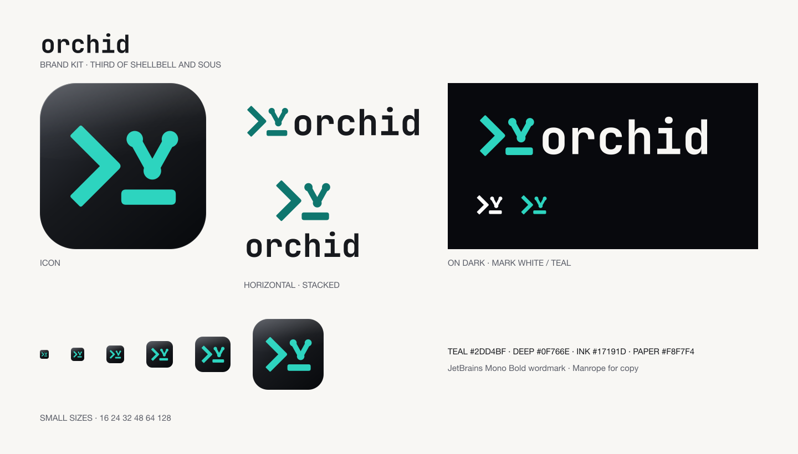

# orchid brand kit

The merge prompt: shellbell's `>_` with two branches meeting in one commit
over the cursor. Many engines, one integration branch.

<picture><source media="(prefers-color-scheme: dark)" srcset="svg/horizontal-on-dark.svg"></picture>



## A family

orchid is the third of [shellbell](https://shellbell.dev) and
[sous](https://sous.bilal.sh). They share one mark language, so they read as
a set:

- the same bold `>` chevron and `_` cursor, drawn from the same geometry
- the same glossy ink plate for app icons
- the same lowercase JetBrains Mono Bold wordmark, and Manrope for copy
- one glyph and one colour each: shellbell rings (two rays, amber); sous
  lines up what is waiting (two tickets, violet); orchid merges (two branches
  into one commit, teal)

## Pick an asset

| Need | Use |
| --- | --- |
| Main logo | `svg/horizontal-on-dark.svg` or `svg/horizontal-on-light.svg` |
| Symbol, wordmark, stacked logo | `svg/`: four compositions, each on dark, on light, black and white |
| Transparent PNG logos | `png/`: `@1x` is 128px high, `@2x` 256px |
| App icon | `icons/icon-gloss-rounded-1024.png` (flat and square variants beside it) |
| Website icons | `web/`: SVG favicon, 180px touch icon, 16 to 512px PNGs |
| Link preview | `social-card.png`, 1200×630 |

## Colour and type

| Role | Value | Use |
| --- | --- | --- |
| Teal | `#2DD4BF` | The mark, on dark |
| Deep teal | `#0F766E` | The mark, on light |
| Ink | `#17191D` | Wordmark on light, the icon plate |
| Paper | `#F8F7F4` | Wordmark on dark |
| Black / white | `#000000` / `#FFFFFF` | One colour uses |

The wordmark is always lowercase `orchid`, in one colour. Its letters are
outlined from JetBrains Mono Bold, so no logo needs a font to display.

## Use

- Keep clear space of at least one cursor thickness around the mark.
- Do not stretch, rotate or recolour parts of it, or move the branches.
- Use the on-light logos on light backgrounds; never the pale on-dark
  wordmark on white.
- The app icon gets the gloss. Logos, favicons at small sizes and single
  colour uses stay flat.

## Making it

Everything here is generated from one geometry file,
[`tools/brand-art.mjs`](tools/brand-art.mjs). Change the mark there, then:

```sh
cd brand/tools && npm ci && npm run brand
```

The tools are Node and are not part of orchid: nothing in the kernel, the
installer or the release archive depends on them (`brand/` is
`export-ignore`d).

The name and logo are not covered by the code's MIT License; see
[TRADEMARK.md](../TRADEMARK.md).
