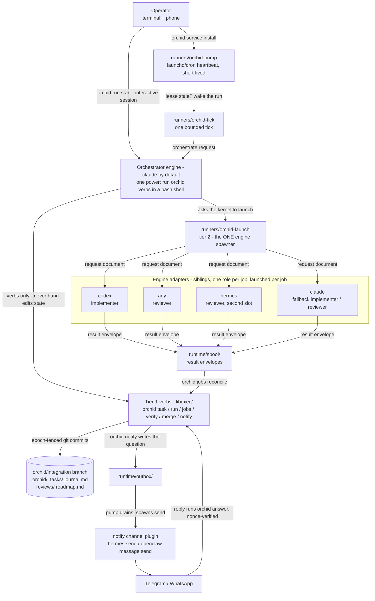
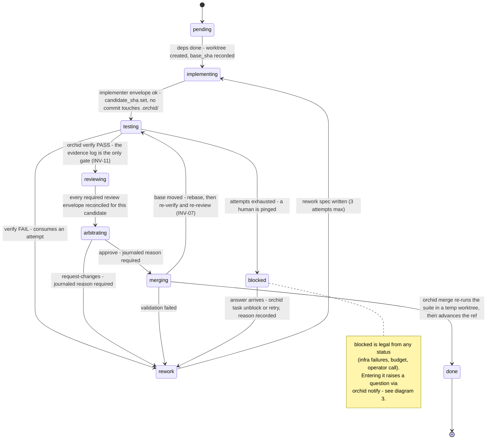
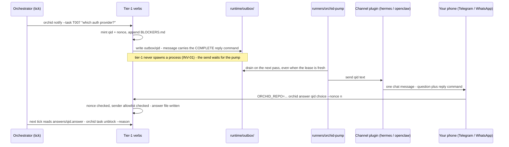
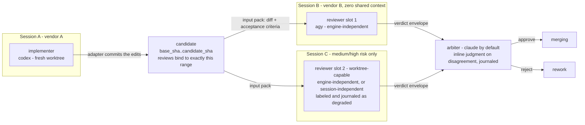
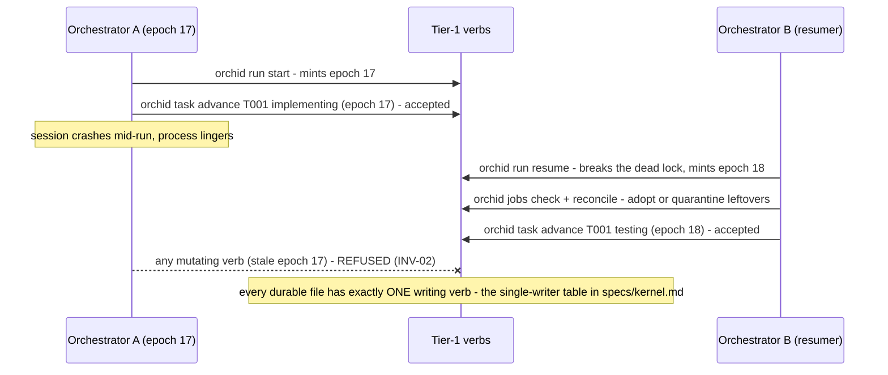

# Orchid architecture, in five diagrams

Five pictures, each proving one load-bearing property of the system. Every
box, edge, and label below is checked against the shipped code — verb names
from `libexec/`, runner names from `runners/`, file paths from
[specs/kernel.md](./specs/kernel.md)'s run-state layout, role defaults from
`orchid.config.example`. The prose after each diagram names the property it
demonstrates and the spec/invariant that guarantees it.

The state machine's normative source is [PROTOCOL.md](../PROTOCOL.md) (the
tick procedure) and [specs/kernel.md](./specs/kernel.md)'s canonical
transition table; the launch/trust rules are
[specs/plugins.md](./specs/plugins.md); the live-proven claims cite
[dogfood-notes.md](./dogfood-notes.md) by F-number.

## 1. Who runs whom

<!-- Diagram grounding: docs/specs/kernel.md "Architecture" (tier split,
     normative process model, INV-01/INV-06) and PROTOCOL.md (the tick).
     Role labels are the tested defaults from orchid.config.example. -->

**What this proves: one-way launch topology in Orchid's source.** Every
implemented edge into an engine adapter originates at a tier-2 runner, and
the adapter contract returns a file envelope (plus implementer commits in
its task worktree). INV-01/INV-06 statically test those Orchid-owned launch
sites. They do not inspect or jail every subprocess a shell-capable engine
might invoke; the diagram is not OS containment.

**Who drives those edges.** Since v1.1 the routine pass is deterministic
shell, not a model: `orchid drive` (`runners/orchid-drive`) executes THE
TICK's mechanical steps — lease, reconcile/check/gc, dispatch, verify, review
routing, unambiguous approval, one merge, status — deciding only on
structured fields and mutating durable state only through named verbs
(INV-13). It stops at a named judgment boundary and exits 16 rather than
guessing; `orchid run boundary set|clear|show` owns that record. The pump
runs the driver first and wakes an LLM orchestrator only when the driver
exits exactly 16 AND the boundary reads back through its verb. When one is
woken, an adapter that declares `command_surface=brokered` confines it to
`runners/orchid-orchestrator-command`, a default-deny argument-validating
broker admitting judgment-only forms — a real command allowlist for that
adapter, though still not a filesystem jail or network namespace. Adapters
that cannot enforce one declare `command_surface=soft` and say so on every
tick.

## 2. The task lifecycle

<!-- Source of truth: PROTOCOL.md "THE TICK - 3. State-machine walk" (the
     feature archetype's walk) and docs/specs/kernel.md "Task lifecycle"
     (the canonical transition table). Every state and edge below appears
     in that table; none is invented here. -->

**What this proves: every transition is evidence-gated, and the state IS
the git branch.** `testing → reviewing` is refused without a passing
`orchid verify` evidence log bound to the current `candidate_sha` (INV-11);
`reviewing → arbitrating` is refused until the kernel counts enough
reconciled review envelopes for the task's risk tier; `merging → done`
re-runs the whole suite in a temp worktree before advancing the integration
ref, and a moved base forces re-verify plus re-review (INV-07). Every
reason-bearing transition journals its why before the state change (INV-08),
and the state itself is `tasks/<id>.md` frontmatter committed on the
`orchid/integration` branch — which is why a crash anywhere loses at most
the current uncommitted tick
([specs/kernel.md](./specs/kernel.md), "Kernel guarantees").

## 3. The blocker round trip

<!-- Grounded in the LIVE-PROVEN flow: docs/dogfood-notes.md F18 (the
     hermes-telegram phone round trip), docs/engines/openclaw.md "The
     OUTBOX pattern", and PROTOCOL.md "4. Blockers". -->

**What this proves: bounded autonomy with an authenticated human edge.**
The run never waits on a socket or holds a daemon open: the question is a
file in `runtime/outbox/`, drained by the next short-lived pump pass
([engines/openclaw.md](./engines/openclaw.md), "The OUTBOX pattern" —
tier-1 `orchid notify` only ever writes, per INV-01). The reply is refused
unless it presents the question's nonce, and — once `answer_allowlist` is
configured — unless the sender is allowlisted
([specs/plugins.md](./specs/plugins.md), threat model, "inbound answers").
The whole loop, phone included, is live-proven:
[dogfood-notes.md](./dogfood-notes.md) F18 round-tripped a real Telegram
reply on the first attempt once the message carried the complete command.

## 4. Dual review: nobody grades their own homework

<!-- Grounded in docs/specs/kernel.md "Independence" (session vs engine
     independence, risk-tier routing, degraded independence) and
     PROTOCOL.md's risk-tiered review policy (jobs review-plan, per-slot
     launches). Tested-default engines from orchid.config.example. -->

**What this proves: structural independence, not politeness.** The
implementer and its reviewers never share a session: each reviewer is a
separate kernel-launched job that receives only its input pack — the diff,
acceptance criteria, repo context — never the implementer's conversation,
which died with its session by design ([specs/kernel.md](./specs/kernel.md),
"Memory & resumption"). Independence is enforced by the resolver against
the task's recorded `implementer_engine_id`, in two grades: *engine
independence* (different vendor) preferred, *session independence* (same
vendor, fresh session) accepted at `medium` risk only when labeled and
journaled — and `high` risk queues rather than accept the weaker guarantee.
LLM evaluators measurably favor their own generations
([research.md](./research.md)); this topology is the countermeasure.

## 5. Epoch fencing: two writers, one survivor

<!-- Grounded in docs/specs/kernel.md's normative process model (epochs,
     lease, single-writer table) and INV-02; the crash-resume walk is
     PROTOCOL.md "RESUME". -->

**What this proves: crash-anywhere resumability without split-brain.**
Every mutating verb carries the epoch minted at `orchid run start|resume`;
a verb bearing a stale epoch refuses to run, so a zombie session from
before a crash can never mutate state (INV-02) — the newer epoch wins, the
older is fenced out. Layered under that, the single-writer rule gives every
durable file exactly one writing verb ([specs/kernel.md](./specs/kernel.md),
"Single-writer rule"). The pump's lease-staleness check avoids the ordinary
overlap case; if a delayed-but-live session crosses the stale threshold,
epoch fencing makes its next stale verb refuse after the headless tick
mints a newer epoch (PROTOCOL.md, HEADLESS OPERATION). Kill anything, any
time: the next
`orchid run resume` reconciles jobs first, then picks up the walk from
committed files.

## See also

- [PROTOCOL.md](../PROTOCOL.md) — the tick procedure every front-end
  executes; the normative walk behind diagram 2.
- [specs/kernel.md](./specs/kernel.md) — tiers, transition table,
  invariants INV-01..INV-14, command surfaces, judgment boundaries.
- [specs/plugins.md](./specs/plugins.md) — adapter contract, trust model,
  notify channels.
- [frontends.md](./frontends.md) — which agent products can drive the
  orchestrator seat, tested vs untested.
- [dogfood-notes.md](./dogfood-notes.md) — the live record every
  "proven" claim above cites.
