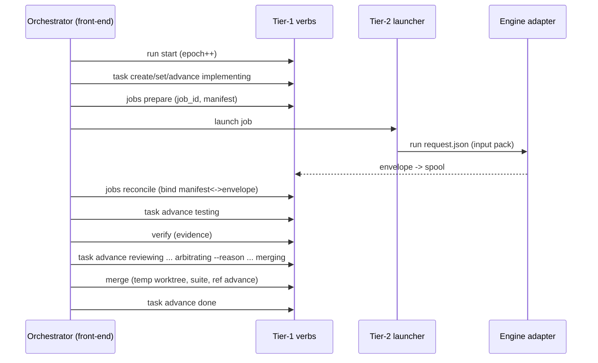

# Orchid v0 Plan A — Kernel Implementation Plan

> **For agentic workers:** REQUIRED SUB-SKILL: Use superpowers:subagent-driven-development (recommended) or superpowers:executing-plans to implement this plan task-by-task. Steps use checkbox (`- [ ]`) syntax for tracking.

**Goal:** Build and prove orchid's deterministic kernel — the four-document spec split, CLI dispatcher, layered config, lock/epoch/lease fencing, the canonical task state machine with kernel-enforced reasons, the decision journal with capsules, the role resolver, doctor/init — with conformance tests named INV-xx per the spec.

**Architecture:** Per `docs/specs/2026-07-24-orchid-design.md` (v5+r5). Tier-1 bash verbs under `libexec/` (deterministic state transitions only), dispatched by `bin/orchid`. Durable state in `.orchid/` on an integration branch; volatile state in gitignored `.orchid/runtime/`. Plan B adds tier-2 runners, engines, packs, verify/merge, and the loop.

**Tech Stack:** bash 3.2-compatible, `jq`, git. Plain-bash test harness, zero test dependencies.

## Global Constraints

- Commit messages: NO AI co-author trailers (repo convention).
- No personal paths in committed files; `$HOME`/`PATH`/env only; config parsed, never sourced.
- Every script: `#!/usr/bin/env bash` + `set -euo pipefail`. Bash 3.2: no associative arrays, no `${var,,}`, no `readarray`.
- `libexec/` scripts: no LLM invocation, no network, no long-lived process spawning (INV-01).
- All durable writes atomic (temp + `mv`); every judgment-bearing transition requires `--reason` and journals atomically (INV-08).
- Conformance tests are named `tests/inv/test_INV-XX_*.sh` and referenced by ID.

---

### Task 1: Split the spec into four documents

**Files:**
- Create: `docs/specs/kernel.md`, `docs/specs/plugins.md`, `docs/specs/operations.md`, `docs/specs/roadmap.md`
- Modify: `docs/specs/2026-07-24-orchid-design.md` (becomes a 1-page overview + index)
- Delete: `docs/plans/2026-07-24-v0-vertical-slice.md` (superseded by Plans A/B)

**Interfaces:**
- Produces: the normative doc set every later task cites. Section routing rule: *if removing a section would not change conformance, it leaves kernel.md.*

- [ ] **Step 1: Create the four documents by moving (not rewriting) sections**

Routing table — move each section of the monolith verbatim, adjusting only cross-references:

| Destination | Sections |
|---|---|
| `kernel.md` | Purpose (first paragraph + honesty paragraph + Platforms), Architecture (tree, determinism boundary, process model, ownership table), Run state, Locking & lease, Preflight, Task lifecycle (canonical table + all rules), Memory & resumption, Stuck-agent detection, Guardrails, Execution policy, Glossary, Kernel guarantees, Conformance invariants |
| `plugins.md` | Plugin architecture (trust model, extension points, request/envelope/input pack, manifest, capability model, archetype meta-contract, hooks), Engine availability & failover, Threat model |
| `operations.md` | Installation & configuration, Operator walkthrough, Remote interaction |
| `roadmap.md` | Delivery stages, Distribution (README/docs/ecosystem/research grounding), Verification findings + review history, Future |

- [ ] **Step 2: Add the two sequence diagrams to kernel.md** (Mermaid, renders on GitHub)

````markdown
## Sequence: happy path (one task)


## Sequence: crash → resume → reconcile → fence
```mermaid
sequenceDiagram
  participant O2 as New orchestrator
  participant K as Tier-1 verbs
  participant Z as Zombie process (old epoch)
  O2->>K: run resume (break stale lock if owner dead; epoch++)
  O2->>K: jobs check (identify dead/live by pgid+start-time)
  O2->>K: jobs reconcile (quarantine mismatches)
  Z--xK: any verb with stale ORCHID_EPOCH -> REFUSED (INV-02)
  O2->>K: status -> active set -> decision capsules
  O2->>O2: tick normally
```
````

- [ ] **Step 3: Reduce the monolith to an overview** — keep title, Status, Purpose/Positioning paragraphs, and an index table linking the four docs with one-line descriptions. Add: "The four documents below are normative; this page is orientation."

- [ ] **Step 4: Verify no content was lost**

Run: `for t in "INV-01" "prose firewall" "rebase_rereview_required" "plugins.lock" "15-minute" "owner.json"; do grep -rl "$t" docs/specs/ >/dev/null || echo "MISSING: $t"; done`
Expected: no MISSING lines.

- [ ] **Step 5: Commit**

```bash
git rm -q docs/plans/2026-07-24-v0-vertical-slice.md
git add docs && git commit -m "docs: split spec into kernel/plugins/operations/roadmap; add sequence diagrams"
```

---

### Task 2: Repo scaffold, dispatcher, test harness, private GitHub repo

**Files:**
- Create: `bin/orchid`, `tests/run.sh`, `tests/helpers.sh`, `tests/test_dispatcher.sh`, `.gitignore`

**Interfaces:**
- Produces: `orchid <verb>` → `libexec/orchid-<verb>` with `ORCHID_ROOT` exported; harness (`assert_eq`, `assert_match`, `fail`, `$WORK` sandbox, `$ORCHID_BIN`); `tests/run.sh` runs `tests/test_*.sh` AND `tests/inv/test_*.sh`.

- [ ] **Step 1: Write the failing test**

```bash
# tests/test_dispatcher.sh
#!/usr/bin/env bash
source "$(dirname "$0")/helpers.sh"
out="$("$ORCHID_BIN" help)"
assert_match "usage: orchid" "$out" "help prints usage"
rc=0; "$ORCHID_BIN" no-such-verb 2>/dev/null || rc=$?
assert_eq "2" "$rc" "unknown verb exits 2"
```

```bash
# tests/helpers.sh
#!/usr/bin/env bash
set -uo pipefail
REPO_ROOT="$(cd "$(dirname "${BASH_SOURCE[0]}")/.." && pwd)"
ORCHID_BIN="$REPO_ROOT/bin/orchid"
FAILS=0
fail()        { echo "  FAIL: $*"; FAILS=$((FAILS+1)); }
assert_eq()   { [ "$1" = "$2" ] || fail "$3 (expected '$1', got '$2')"; }
assert_match(){ echo "$2" | grep -Eq "$1" || fail "$3 (no match '$1')"; }
WORK="$(mktemp -d)"; trap 'rm -rf "$WORK"; exit $((FAILS>0))' EXIT
```

```bash
# tests/run.sh
#!/usr/bin/env bash
set -u
rc=0
for t in "$(dirname "$0")"/test_*.sh "$(dirname "$0")"/inv/test_*.sh; do
  [ -e "$t" ] || continue
  echo "== $t"; bash "$t" || rc=1
done
exit $rc
```

- [ ] **Step 2: Run to verify failure** — `bash tests/run.sh` → FAIL (no bin/orchid).

- [ ] **Step 3: Implement dispatcher + gitignore**

```bash
# bin/orchid
#!/usr/bin/env bash
set -euo pipefail
self="$0"
while [ -L "$self" ]; do
  t="$(readlink "$self")"
  case "$t" in /*) self="$t" ;; *) self="$(dirname "$self")/$t" ;; esac
done
ORCHID_ROOT="$(cd "$(dirname "$self")/.." && pwd)"; export ORCHID_ROOT
cmd="${1:-help}"; [ $# -gt 0 ] && shift
if [ "$cmd" = help ] || [ "$cmd" = -h ] || [ "$cmd" = --help ]; then
  echo "usage: orchid <command> [args]"; echo "commands:"
  for f in "$ORCHID_ROOT"/libexec/orchid-*; do [ -e "$f" ] && echo "  ${f##*/orchid-}"; done
  exit 0
fi
exe="$ORCHID_ROOT/libexec/orchid-$cmd"
[ -x "$exe" ] || { echo "orchid: unknown command '$cmd'" >&2; exit 2; }
exec "$exe" "$@"
```

```gitignore
.orchid/runtime/
```

Run: `chmod +x bin/orchid tests/*.sh && mkdir -p libexec tests/inv`

- [ ] **Step 4: Run to verify pass** — `bash tests/run.sh` → PASS.

- [ ] **Step 5: Create the private repo and push**

```bash
git add -A && git commit -m "v0a: dispatcher and test harness"
gh repo create orchid --private --source . --push
gh repo view orchid --json visibility   # expect PRIVATE
```

---

### Task 3: lib/common.sh — atomic writes, layered config, lock with identity, epochs

**Files:**
- Create: `lib/common.sh`, `tests/test_common.sh`, `tests/inv/test_INV-02_epoch_fencing.sh` (stub asserting helper exists; full INV-02 in Task 5)

**Interfaces:**
- Produces:
  - `orchid_die`, `atomic_write <dest>`, `with_timeout <s> <cmd…>` (124 on timeout)
  - `orchid_state <repo>`, `orchid_runtime <repo>` (creates)
  - `config_get <repo> <key> [default]` — precedence `ORCHID_<KEY_UPPercased_dots_to__>` env > `<repo>/orchid.config` > `$HOME/.orchid/config` > default; `config_provenance <repo> <key>` prints `env|repo|user|default`
  - `lock_acquire <repo>` / `lock_release <repo>` — mkdir lock; writes `owner.json` (pid, pid_start, epoch, hostname, created mtime); acquire auto-BREAKS a lock only if owner not verifiably alive (pid dead OR pid_start mismatch OR foreign hostname) AND mtime age > `lock_break_s` (default 900); breaking prints `lock-broken` (caller journals)
  - `epoch_current <repo>` (reads `runtime/epoch`), `epoch_require <repo>` (dies unless `$ORCHID_EPOCH` == current)

- [ ] **Step 1: Write the failing test**

```bash
# tests/test_common.sh
#!/usr/bin/env bash
source "$(dirname "$0")/helpers.sh"
source "$REPO_ROOT/lib/common.sh"
export HOME="$WORK/home"; mkdir -p "$HOME/.orchid"

echo hi | atomic_write "$WORK/f"; assert_eq hi "$(cat "$WORK/f")" "atomic write"

# layered config
mkdir -p "$WORK/repo"; cd "$WORK/repo"; git init -q .
printf 'role.implementer=codex\n' > "$HOME/.orchid/config"
assert_eq codex "$(config_get "$WORK/repo" role.implementer)" "user layer"
printf 'role.implementer=claude\n' > "$WORK/repo/orchid.config"
assert_eq claude "$(config_get "$WORK/repo" role.implementer)" "repo overrides user"
ORCHID_ROLE_IMPLEMENTER=agy \
  assert_eq agy "$(ORCHID_ROLE_IMPLEMENTER=agy config_get "$WORK/repo" role.implementer)" "env overrides repo"
assert_eq repo "$(config_provenance "$WORK/repo" role.implementer)" "provenance"
printf 'evil=$(touch %s/pwned)\n' "$WORK" >> "$WORK/repo/orchid.config"
config_get "$WORK/repo" evil >/dev/null; [ ! -e "$WORK/pwned" ] || fail "never sourced"

# lock: acquire, contend, identity-guarded break
mkdir -p "$WORK/repo/.orchid"
lock_acquire "$WORK/repo" || fail "first acquire"
if lock_acquire "$WORK/repo" 2>/dev/null; then fail "second acquire must fail (live owner)"; fi
lock_release "$WORK/repo"
# dead-owner break: fake owner.json with dead pid and old mtime
lock_acquire "$WORK/repo"; rt="$WORK/repo/.orchid/runtime"
jq -n '{pid: 999999, pid_start: "x", epoch: 1, hostname: "'"$(hostname)"'"}' > "$rt/lock/owner.json"
touch -t 202001010000 "$rt/lock" "$rt/lock/owner.json"
out="$(ORCHID_LOCK_BREAK_S=1 lock_acquire "$WORK/repo")" || fail "break stale dead lock"
assert_match "lock-broken" "$out" "break reported"
lock_release "$WORK/repo"

# epochs
echo 3 > "$rt/epoch"
assert_eq 3 "$(epoch_current "$WORK/repo")" "epoch read"
( export ORCHID_EPOCH=2; if epoch_require "$WORK/repo" 2>/dev/null; then exit 1; fi ) || fail "stale epoch refused"
( export ORCHID_EPOCH=3; epoch_require "$WORK/repo" ) || fail "current epoch accepted"
```

- [ ] **Step 2: Run to verify failure** — FAIL (no lib/common.sh).

- [ ] **Step 3: Implement**

```bash
# lib/common.sh
#!/usr/bin/env bash

orchid_die() { echo "orchid: $*" >&2; exit 1; }
atomic_write() { local d="$1" t; t="$(mktemp "${d}.tmp.XXXXXX")"; cat >"$t"; mv "$t" "$d"; }
orchid_state()   { echo "$1/.orchid"; }
orchid_runtime() { local r="$1/.orchid/runtime"; mkdir -p "$r"; echo "$r"; }

with_timeout() {
  local secs="$1"; shift
  "$@" & local pid=$!
  ( sleep "$secs"; kill "$pid" 2>/dev/null ) & local w=$!
  local rc=0; wait "$pid" 2>/dev/null || rc=$?
  if kill -0 "$w" 2>/dev/null; then kill "$w" 2>/dev/null; wait "$w" 2>/dev/null; return "$rc"; fi
  return 124
}

_cfg_env_name() { echo "ORCHID_$(echo "$1" | tr 'a-z.' 'A-Z_')"; }
_cfg_file_get() { [ -f "$1" ] && grep -E "^$2=" "$1" | head -n1 | cut -d= -f2- || true; }
config_get() {
  local repo="$1" key="$2" def="${3:-}" v env
  env="$(_cfg_env_name "$key")"
  eval "v=\${$env:-}"; [ -n "$v" ] && { echo "$v"; return; }
  v="$(_cfg_file_get "$repo/orchid.config" "$key")"; [ -n "$v" ] && { echo "$v"; return; }
  v="$(_cfg_file_get "$HOME/.orchid/config" "$key")"; [ -n "$v" ] && { echo "$v"; return; }
  echo "$def"
}
config_provenance() {
  local repo="$1" key="$2" env v
  env="$(_cfg_env_name "$key")"; eval "v=\${$env:-}"
  [ -n "$v" ] && { echo env; return; }
  [ -n "$(_cfg_file_get "$repo/orchid.config" "$key")" ] && { echo repo; return; }
  [ -n "$(_cfg_file_get "$HOME/.orchid/config" "$key")" ] && { echo user; return; }
  echo default
}

_pid_start() { ps -o lstart= -p "$1" 2>/dev/null | tr -d ' ' || true; }
lock_acquire() {
  local repo="$1" rt lock brk
  rt="$(orchid_runtime "$repo")"; lock="$rt/lock"
  brk="${ORCHID_LOCK_BREAK_S:-$(config_get "$repo" lock_break_s 900)}"
  if ! mkdir "$lock" 2>/dev/null; then
    local pid host pstart age now mt
    pid="$(jq -r .pid "$lock/owner.json" 2>/dev/null || echo 0)"
    host="$(jq -r .hostname "$lock/owner.json" 2>/dev/null || echo '?')"
    pstart="$(jq -r .pid_start "$lock/owner.json" 2>/dev/null || echo '?')"
    now="$(date +%s)"; mt="$(stat -f %m "$lock" 2>/dev/null || stat -c %Y "$lock")"
    age=$(( now - mt ))
    local alive=1
    if [ "$host" != "$(hostname)" ]; then alive=0
    elif ! kill -0 "$pid" 2>/dev/null; then alive=0
    elif [ "$(_pid_start "$pid")" != "$pstart" ]; then alive=0; fi
    if [ "$alive" -eq 0 ] && [ "$age" -gt "$brk" ]; then
      rm -rf "$lock"; mkdir "$lock" || return 1
      echo "lock-broken (owner pid $pid dead/foreign, age ${age}s)"
    else
      echo "orchid: lock held by pid $pid on $host" >&2; return 1
    fi
  fi
  jq -n --arg p "$$" --arg s "$(_pid_start "$$")" --arg h "$(hostname)" \
    --arg e "$(epoch_current "$repo")" \
    '{pid:($p|tonumber), pid_start:$s, hostname:$h, epoch:($e|tonumber? // 0)}' \
    > "$lock/owner.json"
}
lock_release() { rm -rf "$(orchid_runtime "$1")/lock"; }

epoch_current() { cat "$(orchid_runtime "$1")/epoch" 2>/dev/null || echo 0; }
epoch_require() {
  local cur; cur="$(epoch_current "$1")"
  [ "${ORCHID_EPOCH:-}" = "$cur" ] || orchid_die "stale epoch '${ORCHID_EPOCH:-unset}' (current $cur) — refused (INV-02)"
}
```

- [ ] **Step 4: Run to verify pass** — PASS.

- [ ] **Step 5: Commit** — `git add lib tests && git commit -m "v0a: common lib — layered config with provenance, identity-guarded lock, epochs"`

---

### Task 4: lib/frontmatter.sh

**Files:** Create: `lib/frontmatter.sh`, `tests/test_frontmatter.sh`

**Interfaces:** `fm_get <file> <key>`, `fm_set <file> <key> <value>` (atomic, adds if absent). Format: `key: value` lines between the first two `---` lines.

- [ ] **Step 1: Test** (create task file fixture; assert get/set/add/body-preserved — identical shape to the proven round-1 test):

```bash
# tests/test_frontmatter.sh
#!/usr/bin/env bash
source "$(dirname "$0")/helpers.sh"
source "$REPO_ROOT/lib/common.sh"; source "$REPO_ROOT/lib/frontmatter.sh"
printf -- '---\nid: T001\nstatus: pending\n---\nBody.\n' > "$WORK/T001.md"
assert_eq pending "$(fm_get "$WORK/T001.md" status)" "get"
fm_set "$WORK/T001.md" status implementing
assert_eq implementing "$(fm_get "$WORK/T001.md" status)" "set"
fm_set "$WORK/T001.md" branch task/T001
assert_eq task/T001 "$(fm_get "$WORK/T001.md" branch)" "add"
assert_match "Body." "$(cat "$WORK/T001.md")" "body preserved"
```

- [ ] **Step 2: Run → FAIL.**
- [ ] **Step 3: Implement**

```bash
# lib/frontmatter.sh
#!/usr/bin/env bash
fm_get() {
  awk -v k="$2" '/^---$/{n++;next} n==1 && index($0,k": ")==1{print substr($0,length(k)+3);exit} n>=2{exit}' "$1"
}
fm_set() {
  local f="$1" k="$2" v="$3"
  awk -v k="$k" -v v="$v" '
    /^---$/ { n++; if (n==2 && !done) { print k ": " v; done=1 }; print; next }
    n==1 && index($0,k": ")==1 { print k ": " v; done=1; next }
    { print }' "$f" | atomic_write "$f"
}
```

- [ ] **Step 4: Run → PASS.**
- [ ] **Step 5: Commit** — `git add lib/frontmatter.sh tests/test_frontmatter.sh && git commit -m "v0a: frontmatter lib"`

---

### Task 5: `orchid run` — start/resume, epochs, fencing (INV-02)

**Files:** Create: `libexec/orchid-run`, `tests/test_run.sh`, `tests/inv/test_INV-02_epoch_fencing.sh`

**Interfaces:**
- `orchid run start` — requires initialized state; increments `runtime/epoch`; writes `runtime/lease.json` (`{epoch, refreshed_at}`); prints `epoch: N` (front-end exports `ORCHID_EPOCH=N`).
- `orchid run resume` — breaks stale lock via `lock_acquire` semantics, increments epoch (fencing), refreshes lease, prints `epoch: N`.
- `orchid run refresh-lease` — updates `refreshed_at` (called each tick).
- Consumed by every mutating verb: they call `epoch_require`.

- [ ] **Step 1: Tests**

```bash
# tests/test_run.sh
#!/usr/bin/env bash
source "$(dirname "$0")/helpers.sh"
cd "$WORK"; git init -q .; git commit -q --allow-empty -m root
mkdir -p .orchid; export ORCHID_REPO="$WORK" HOME="$WORK/home"; mkdir -p "$HOME"
e1="$("$ORCHID_BIN" run start | sed 's/epoch: //')"
e2="$("$ORCHID_BIN" run resume | sed 's/epoch: //')"
[ "$e2" -gt "$e1" ] || fail "resume increments epoch ($e1 -> $e2)"
[ -f .orchid/runtime/lease.json ] || fail "lease written"
```

```bash
# tests/inv/test_INV-02_epoch_fencing.sh
#!/usr/bin/env bash
source "$(dirname "$0")/../helpers.sh"
cd "$WORK"; git init -q .; git commit -q --allow-empty -m root
mkdir -p .orchid/tasks; export ORCHID_REPO="$WORK" HOME="$WORK/home"; mkdir -p "$HOME"
cur="$("$ORCHID_BIN" run start | sed 's/epoch: //')"
export ORCHID_EPOCH="$cur"
"$ORCHID_BIN" task create T001 demo || fail "current epoch mutates"
"$ORCHID_BIN" run resume >/dev/null      # epoch moves on; we are now stale
rc=0; "$ORCHID_BIN" task set T001 title X 2>/dev/null || rc=$?
[ "$rc" -ne 0 ] || fail "INV-02: stale epoch must not mutate durable state"
```

- [ ] **Step 2: Run → FAIL** (no run verb; task verb arrives Task 6 — INV-02 test will fully pass after Task 6; that ordering is expected and noted).

- [ ] **Step 3: Implement**

```bash
# libexec/orchid-run
#!/usr/bin/env bash
set -euo pipefail
source "$ORCHID_ROOT/lib/common.sh"
repo="${ORCHID_REPO:-$PWD}"; rt="$(orchid_runtime "$repo")"
sub="${1:-}"; shift || true
case "$sub" in
  start|resume)
    lock_acquire "$repo" >/dev/null || orchid_die "cannot acquire lock"
    e=$(( $(epoch_current "$repo") + 1 ))
    echo "$e" | atomic_write "$rt/epoch"
    jq -n --arg e "$e" --arg t "$(date -u +%Y-%m-%dT%H:%M:%SZ)" \
      '{epoch:($e|tonumber), refreshed_at:$t}' | atomic_write "$rt/lease.json"
    lock_release "$repo"
    echo "epoch: $e"
    ;;
  refresh-lease)
    e="$(epoch_current "$repo")"
    jq -n --arg e "$e" --arg t "$(date -u +%Y-%m-%dT%H:%M:%SZ)" \
      '{epoch:($e|tonumber), refreshed_at:$t}' | atomic_write "$rt/lease.json"
    ;;
  *) orchid_die "usage: orchid run start|resume|refresh-lease" ;;
esac
```

Run: `chmod +x libexec/orchid-run`

- [ ] **Step 4: Run tests → test_run.sh PASS** (INV-02 completes after Task 6).
- [ ] **Step 5: Commit** — `git add libexec/orchid-run tests && git commit -m "v0a: orchid run — epochs, lease, fencing"`

---

### Task 6: `orchid task` — canonical state machine, enforced reasons, journal integration (INV-04, INV-08)

**Files:** Create: `libexec/orchid-task`, `libexec/orchid-journal`, `templates/task.md`, `tests/test_task.sh`, `tests/inv/test_INV-08_reasons.sh`, `tests/inv/test_INV-04_state_guard.sh`

**Interfaces:**
- `orchid task create <id> <title>` (engine from `config_get role.implementer codex`), `show`, `list`, `set <id> <key> <val>` (`risk_tier` only upward: low<medium<high, requires `--reason`), `advance <id> <state> [--reason "..."] [--waive-attempt]`, `unblock <id> --reason`, `retry <id> --reason`.
- Transition table exactly per kernel.md canonical table; illegal → exit 3. `--reason` REQUIRED for: advance to `merging`, `blocked`, `rework`-from-`arbitrating`; `set risk_tier`; `unblock`; `retry`. Reasons journal atomically with kind derived from context (`arbitration`, `risk_change`, `intervention`); `--waive-attempt` requires `--reason` (kind `attempt_waiver`).
- Entry to `testing` REFUSES while any commit in `base_sha..candidate_sha` touches `.orchid/` (INV-04).
- All mutations call `epoch_require`.
- `orchid journal add --task <id> --kind <k> <text>` (actor derived: `${ORCHID_ACTOR:-operator}` + epoch — callers never pass `--by`), `tail [-n N]`, `show --task <id>` (reads `runtime/journal-index/<id>` capsule, falling back to grep).

- [ ] **Step 1: Tests**

```bash
# tests/test_task.sh
#!/usr/bin/env bash
source "$(dirname "$0")/helpers.sh"
cd "$WORK"; git init -q .; git commit -q --allow-empty -m root
mkdir -p .orchid/tasks; export ORCHID_REPO="$WORK" HOME="$WORK/home"; mkdir -p "$HOME"
export ORCHID_EPOCH="$("$ORCHID_BIN" run start | sed 's/epoch: //')"

"$ORCHID_BIN" task create T001 "demo"
assert_eq pending "$(fm() { "$ORCHID_BIN" task show T001 | grep "^status: " | cut -d' ' -f2; }; fm)" "created pending"
"$ORCHID_BIN" task advance T001 implementing
rc=0; "$ORCHID_BIN" task advance T001 done 2>/dev/null || rc=$?
assert_eq 3 "$rc" "illegal transition exits 3"

# journal + reasons
rc=0; "$ORCHID_BIN" task advance T001 blocked 2>/dev/null || rc=$?
[ "$rc" -ne 0 ] || fail "blocked without --reason must fail"
"$ORCHID_BIN" task advance T001 blocked --reason "demo blocker"
assert_match "demo blocker" "$(cat .orchid/journal.md)" "reason journaled atomically"
"$ORCHID_BIN" task unblock T001 --reason "guidance given"
assert_eq rework "$("$ORCHID_BIN" task show T001 | grep '^status: ' | cut -d' ' -f2)" "unblock -> rework"

# risk monotonicity
"$ORCHID_BIN" task set T001 risk_tier high --reason "touches auth"
rc=0; "$ORCHID_BIN" task set T001 risk_tier low --reason x 2>/dev/null || rc=$?
[ "$rc" -ne 0 ] || fail "risk downgrade must be refused"
```

```bash
# tests/inv/test_INV-08_reasons.sh
#!/usr/bin/env bash
source "$(dirname "$0")/../helpers.sh"
cd "$WORK"; git init -q .; git commit -q --allow-empty -m root
mkdir -p .orchid/tasks; export ORCHID_REPO="$WORK" HOME="$WORK/home"; mkdir -p "$HOME"
export ORCHID_EPOCH="$("$ORCHID_BIN" run start | sed 's/epoch: //')"
"$ORCHID_BIN" task create T001 demo
for s in implementing testing reviewing arbitrating; do "$ORCHID_BIN" task advance T001 "$s" >/dev/null; done
rc=0; "$ORCHID_BIN" task advance T001 merging 2>/dev/null || rc=$?
[ "$rc" -ne 0 ] || fail "INV-08: merging without --reason"
"$ORCHID_BIN" task advance T001 merging --reason "both reviewers approve"
grep -q "arbitration" .orchid/journal.md || fail "INV-08: arbitration kind journaled"
grep -q '"by": *"operator' .orchid/journal.md 2>/dev/null || grep -q "(operator" .orchid/journal.md || fail "INV-08: actor kernel-derived"
```

```bash
# tests/inv/test_INV-04_state_guard.sh
#!/usr/bin/env bash
source "$(dirname "$0")/../helpers.sh"
cd "$WORK"; git init -q .; echo a > a.txt; git add a.txt; git commit -q -m base
mkdir -p .orchid/tasks; git add .orchid 2>/dev/null || true
export ORCHID_REPO="$WORK" HOME="$WORK/home"; mkdir -p "$HOME"
export ORCHID_EPOCH="$("$ORCHID_BIN" run start | sed 's/epoch: //')"
"$ORCHID_BIN" task create T001 demo
base="$(git rev-parse HEAD)"
git checkout -q -b task/T001
mkdir -p .orchid/tasks && echo hacked > .orchid/tasks/EVIL.md
git add .orchid && git commit -q -m "touch state"
cand="$(git rev-parse HEAD)"; git checkout -q -
"$ORCHID_BIN" task set T001 base_sha "$base"
"$ORCHID_BIN" task set T001 candidate_sha "$cand"
"$ORCHID_BIN" task advance T001 implementing >/dev/null
rc=0; "$ORCHID_BIN" task advance T001 testing 2>/dev/null || rc=$?
[ "$rc" -ne 0 ] || fail "INV-04: commit touching .orchid/ must block testing"
```

- [ ] **Step 2: Run → FAIL.**

- [ ] **Step 3: Implement** (template gains v5 fields; task verb ~140 lines)

```markdown
<!-- templates/task.md -->
---
schema: 1
id: __ID__
title: __TITLE__
status: pending
archetype: feature
scaffold: false
branch: task/__ID__
worktree:
run_id:
depends_on:
attempts: 0
infra_failures: 0
session_id:
implementer_engine_id:
base_sha:
candidate_sha:
risk_tier: medium
blocking_severity: medium
stop_condition: report at most 8 findings at or above medium severity; no style nits; one pass only
engine: __ENGINE__
effort: medium
acceptance_criteria:
verification_commands:
resources:
exclusive: false
wallclock_budget_s: 28800
started_at:
created: __DATE__
updated: __DATE__
---

(Task spec: goal, constraints, acceptance criteria. Rework history appended below.)
```

```bash
# libexec/orchid-journal
#!/usr/bin/env bash
set -euo pipefail
source "$ORCHID_ROOT/lib/common.sh"
repo="${ORCHID_REPO:-$PWD}"; state="$(orchid_state "$repo")"; rt="$(orchid_runtime "$repo")"
sub="${1:-}"; shift || true
case "$sub" in
  add)
    task=""; kind="note"
    while [ $# -gt 0 ]; do case "$1" in
      --task) task="$2"; shift 2;; --kind) kind="$2"; shift 2;; *) break;; esac; done
    text="$*"
    actor="${ORCHID_ACTOR:-operator}"; e="$(epoch_current "$repo")"
    entry="## $(date -u +%Y-%m-%dT%H:%M:%SZ) ${task:-run} $kind ($actor e$e)"
    { [ -f "$state/journal.md" ] && cat "$state/journal.md"; echo; echo "$entry"; echo "$text"; } \
      | atomic_write "$state/journal.md"
    if [ -n "$task" ]; then
      mkdir -p "$rt/journal-index"
      { [ -f "$rt/journal-index/$task" ] && tail -n 40 "$rt/journal-index/$task"; echo "$entry"; echo "$text"; } \
        | atomic_write "$rt/journal-index/$task"
    fi ;;
  tail) n=20; [ "${1:-}" = "-n" ] && n="$2"; tail -n $(( n * 4 )) "$state/journal.md" 2>/dev/null || true ;;
  show)
    [ "${1:-}" = "--task" ] || orchid_die "usage: journal show --task <id>"
    cat "$rt/journal-index/$2" 2>/dev/null || grep -A2 " $2 " "$state/journal.md" 2>/dev/null || true ;;
  *) orchid_die "usage: orchid journal add|tail|show" ;;
esac
```

```bash
# libexec/orchid-task
#!/usr/bin/env bash
set -euo pipefail
source "$ORCHID_ROOT/lib/common.sh"; source "$ORCHID_ROOT/lib/frontmatter.sh"
repo="${ORCHID_REPO:-$PWD}"; state="$(orchid_state "$repo")"; tasks="$state/tasks"
sub="${1:-}"; shift || true
tf() { echo "$tasks/$1.md"; }
now() { date -u +%Y-%m-%dT%H:%M:%SZ; }
journal() { ORCHID_REPO="$repo" "$ORCHID_ROOT/bin/orchid" journal add "$@"; }

legal() { case "$1:$2" in
  pending:implementing|implementing:testing|testing:reviewing|testing:rework|\
  reviewing:arbitrating|arbitrating:merging|arbitrating:rework|\
  merging:done|merging:rework|merging:testing|rework:implementing) return 0;;
  *:blocked) return 0;; *) return 1;; esac; }

needs_reason() { case "$1:$2" in
  *:merging|*:blocked|arbitrating:rework) return 0;; *) return 1;; esac; }

rank() { case "$1" in low) echo 0;; medium) echo 1;; high) echo 2;; *) echo -1;; esac; }

case "$sub" in
  create)
    epoch_require "$repo"; id="$1"; title="$2"; mkdir -p "$tasks"
    [ ! -f "$(tf "$id")" ] || orchid_die "task $id exists"
    sed -e "s|__ID__|$id|g" -e "s|__TITLE__|$title|g" \
        -e "s|__ENGINE__|$(config_get "$repo" role.implementer codex)|g" \
        -e "s|__DATE__|$(now)|g" \
      "$ORCHID_ROOT/templates/task.md" | atomic_write "$(tf "$id")" ;;
  show) cat "$(tf "$1")" ;;
  list) for f in "$tasks"/*.md; do [ -e "$f" ] || continue
        printf '%s\t%s\t%s\n' "$(fm_get "$f" id)" "$(fm_get "$f" status)" "$(fm_get "$f" title)"; done ;;
  set)
    epoch_require "$repo"; id="$1"; key="$2"; val="$3"; shift 3 || true
    if [ "$key" = risk_tier ]; then
      reason=""; [ "${1:-}" = "--reason" ] && reason="$2"
      [ -n "$reason" ] || orchid_die "risk_tier requires --reason (INV-08)"
      old="$(fm_get "$(tf "$id")" risk_tier)"
      [ "$(rank "$val")" -ge "$(rank "$old")" ] || orchid_die "risk_tier is monotonic ($old -> $val refused)"
      journal --task "$id" --kind risk_change "$old -> $val: $reason"
    fi
    fm_set "$(tf "$id")" "$key" "$val"; fm_set "$(tf "$id")" updated "$(now)" ;;
  advance)
    epoch_require "$repo"; id="$1"; to="$2"; shift 2
    reason=""; waive=0
    while [ $# -gt 0 ]; do case "$1" in
      --reason) reason="$2"; shift 2;; --waive-attempt) waive=1; shift;; *) shift;; esac; done
    f="$(tf "$id")"; [ -f "$f" ] || orchid_die "no task $id"
    from="$(fm_get "$f" status)"
    legal "$from" "$to" || { echo "orchid: illegal $from -> $to" >&2; exit 3; }
    if needs_reason "$from" "$to"; then
      [ -n "$reason" ] || orchid_die "$from -> $to requires --reason (INV-08)"
    fi
    if [ "$to" = testing ]; then
      b="$(fm_get "$f" base_sha)"; c="$(fm_get "$f" candidate_sha)"
      if [ -n "$b" ] && [ -n "$c" ] && \
         git -C "$repo" log --format=%H --name-only "$b..$c" 2>/dev/null | grep -q '^\.orchid/'; then
        orchid_die "commits touch .orchid/ — entry to testing refused (INV-04)"
      fi
    fi
    if [ "$to" = rework ] && [ "$from" != merging ]; then
      if [ "$waive" -eq 1 ]; then
        [ -n "$reason" ] || orchid_die "--waive-attempt requires --reason"
        journal --task "$id" --kind attempt_waiver "$reason"
      else
        fm_set "$f" attempts "$(( $(fm_get "$f" attempts) + 1 ))"
      fi
    fi
    if [ -n "$reason" ]; then
      kind=intervention
      [ "$from" = arbitrating ] && kind=arbitration
      [ "$to" = blocked ] && kind=blocker
      journal --task "$id" --kind "$kind" "$from -> $to: $reason"
    fi
    fm_set "$f" status "$to"; fm_set "$f" updated "$(now)"
    echo "$id: $from -> $to" ;;
  unblock)
    epoch_require "$repo"; id="$1"; shift
    [ "${1:-}" = "--reason" ] && reason="$2" || orchid_die "unblock requires --reason"
    [ "$(fm_get "$(tf "$id")" status)" = blocked ] || orchid_die "$id is not blocked"
    printf '\n**Operator guidance (%s):** %s\n' "$(now)" "$reason" >> "$(tf "$id")"
    journal --task "$id" --kind intervention "unblock: $reason"
    fm_set "$(tf "$id")" status rework; fm_set "$(tf "$id")" updated "$(now)"
    echo "$id: blocked -> rework" ;;
  retry)
    epoch_require "$repo"; id="$1"; shift
    [ "${1:-}" = "--reason" ] && reason="$2" || orchid_die "retry requires --reason"
    journal --task "$id" --kind intervention "retry: $reason"
    fm_set "$(tf "$id")" status rework; fm_set "$(tf "$id")" updated "$(now)"
    echo "$id: -> rework" ;;
  *) orchid_die "usage: orchid task create|show|list|set|advance|unblock|retry" ;;
esac
```

Run: `chmod +x libexec/orchid-task libexec/orchid-journal`

- [ ] **Step 4: Run full suite → PASS, including `tests/inv/test_INV-02` now.**
- [ ] **Step 5: Commit** — `git add libexec templates tests && git commit -m "v0a: task state machine with enforced reasons, journal, capsules (INV-02/04/08)"`

---

### Task 7: `orchid config` + role resolver (INV-05)

**Files:** Create: `libexec/orchid-config`, `lib/resolver.sh`, `tests/test_config_resolver.sh`, `tests/inv/test_INV-05_no_name_branching.sh`

**Interfaces:**
- `orchid config list` — every known key (from `lib/config-keys.txt`, the single source of truth): `key<TAB>value<TAB>provenance`.
- `resolve_role <repo> <role>` (lib/resolver.sh) — returns engine name from `role.<role>` config (primary of a `primary,secondary` pair); `resolve_engine_exe <name>` — searches `$ORCHID_ENGINES_DIR` (test override) → `<repo>/.orchid/plugins/engines` (SKIPPED unless trusted — v0: always skipped, with a warning) → `~/.orchid/plugins/engines` → `$ORCHID_ROOT/plugins/engines`, accepting `<name>/run`; duplicate name across trusted dirs → error (INV-10 seed).
- INV-05 test: configure a fake engine for every role; grep kernel sources for engine-name literals.

- [ ] **Step 1: Tests**

```bash
# tests/test_config_resolver.sh
#!/usr/bin/env bash
source "$(dirname "$0")/helpers.sh"
source "$REPO_ROOT/lib/common.sh"; source "$REPO_ROOT/lib/resolver.sh"
cd "$WORK"; git init -q .; export ORCHID_REPO="$WORK" HOME="$WORK/home"; mkdir -p "$HOME/.orchid"
printf 'role.implementer=fake\n' > orchid.config
assert_eq fake "$(resolve_role "$WORK" implementer)" "role from repo config"
mkdir -p "$WORK/eng/fake"; printf '#!/usr/bin/env bash\n' > "$WORK/eng/fake/run"; chmod +x "$WORK/eng/fake/run"
ORCHID_ENGINES_DIR="$WORK/eng" out="$(ORCHID_ENGINES_DIR="$WORK/eng" resolve_engine_exe fake)" || fail "resolve exe"
assert_match "fake/run" "$out" "exe path"
assert_match "role.implementer	fake	repo" "$("$ORCHID_BIN" config list)" "config list provenance"
```

```bash
# tests/inv/test_INV-05_no_name_branching.sh
#!/usr/bin/env bash
source "$(dirname "$0")/../helpers.sh"
# Kernel never branches on plugin names: engine literals may appear only in
# defaults inside config lookups, never in conditionals.
if grep -nE 'if .*(codex|agy|claude)|case .*(codex|agy|claude)' "$REPO_ROOT"/libexec/* "$REPO_ROOT"/lib/*.sh \
   | grep -v 'config_get.*role\.'; then
  fail "INV-05: kernel branches on an engine name"
fi
```

- [ ] **Step 2: Run → FAIL.**

- [ ] **Step 3: Implement**

```bash
# lib/resolver.sh
#!/usr/bin/env bash
resolve_role() {  # repo role -> primary engine name
  local v; v="$(config_get "$1" "role.$2")"
  [ -n "$v" ] || case "$2" in
    orchestrator) v=claude;; implementer) v=codex;; reviewer) v=agy;;
    arbiter) v=claude;; plan_critic) v=codex;; esac
  echo "${v%%,*}"
}
resolve_engine_exe() {  # name -> executable path (search path; dup = error)
  local name="$1" d found=""
  for d in "${ORCHID_ENGINES_DIR:-}" "$HOME/.orchid/plugins/engines" "$ORCHID_ROOT/plugins/engines"; do
    [ -n "$d" ] || continue
    if [ -x "$d/$name/run" ]; then
      [ -z "$found" ] || { echo "orchid: duplicate engine '$name' ($found vs $d) (INV-10)" >&2; return 1; }
      found="$d/$name/run"
    fi
  done
  [ -n "$found" ] || return 1
  echo "$found"
}
```

```bash
# libexec/orchid-config
#!/usr/bin/env bash
set -euo pipefail
source "$ORCHID_ROOT/lib/common.sh"
repo="${ORCHID_REPO:-$PWD}"
[ "${1:-list}" = list ] || orchid_die "usage: orchid config list"
while IFS= read -r key; do
  [ -n "$key" ] || continue
  printf '%s\t%s\t%s\n' "$key" "$(config_get "$repo" "$key")" "$(config_provenance "$repo" "$key")"
done < "$ORCHID_ROOT/lib/config-keys.txt"
```

```
# lib/config-keys.txt
integration_branch
verify
role.orchestrator
role.implementer
role.reviewer
role.arbiter
role.plan_critic
lock_break_s
stall_minutes
timeout_minutes
agy_max_bytes
pack_budget_bytes
```

Run: `chmod +x libexec/orchid-config`

- [ ] **Step 4: Run → PASS.**
- [ ] **Step 5: Commit** — `git add lib libexec/orchid-config tests && git commit -m "v0a: layered config verb and role resolver (INV-05, INV-10 seed)"`

---

### Task 8: `orchid init` + `orchid doctor`

**Files:** Create: `libexec/orchid-init`, `libexec/orchid-doctor`, `orchid.config.example`, `tests/test_init_doctor.sh`

**Interfaces:**
- `orchid init` — integration branch from HEAD (`integration_branch`, default `orchid/integration`), `.orchid/` skeleton (tasks/, reviews/, BLOCKERS.md, roadmap.md `run_status: planning`, requirements placeholder, baseline.md, journal.md), runtime gitignored, committed on the integration branch, prior branch restored.
- `orchid doctor` — read-only: git repo, jq, worktree support, engine resolution PER ROLE via `resolve_role`+`resolve_engine_exe` (reports `role -> engine (path) [unverified]` for non-defaults), verify command configured, integration branch creatable/exists, plugin discovery report incl. repo-local-plugins-disabled warning if `<repo>/.orchid/plugins` exists. Exit 1 on any FAIL.

- [ ] **Step 1: Test**

```bash
# tests/test_init_doctor.sh
#!/usr/bin/env bash
source "$(dirname "$0")/helpers.sh"
cd "$WORK"; git init -q .; git commit -q --allow-empty -m root
export ORCHID_REPO="$WORK" HOME="$WORK/home"; mkdir -p "$HOME/.orchid"
printf 'verify=true\n' > orchid.config
mkdir -p "$WORK/eng/fake"; printf '#!/usr/bin/env bash\n' > "$WORK/eng/fake/run"; chmod +x "$WORK/eng/fake/run"
printf 'role.orchestrator=fake\nrole.implementer=fake\nrole.reviewer=fake\nrole.arbiter=fake\nrole.plan_critic=fake\n' >> orchid.config

ORCHID_ENGINES_DIR="$WORK/eng" "$ORCHID_BIN" doctor || fail "doctor passes with resolvable fake engines"
mkdir -p .orchid/plugins/engines/evil
out="$(ORCHID_ENGINES_DIR="$WORK/eng" "$ORCHID_BIN" doctor)" || true
assert_match "repo-local plugins.*disabled" "$out" "repo-local plugin warning"

"$ORCHID_BIN" init
git rev-parse --verify -q orchid/integration >/dev/null || fail "integration branch"
git show orchid/integration:.orchid/roadmap.md | grep -q "run_status: planning" || fail "roadmap committed with run_status"
rc=0; printf 'role.implementer=missing-engine\n' >> orchid.config
ORCHID_ENGINES_DIR="$WORK/eng" "$ORCHID_BIN" doctor >/dev/null 2>&1 || rc=$?
assert_eq 1 "$rc" "doctor fails on unresolvable role"
```

- [ ] **Step 2: Run → FAIL.**

- [ ] **Step 3: Implement**

```bash
# libexec/orchid-doctor
#!/usr/bin/env bash
set -euo pipefail
source "$ORCHID_ROOT/lib/common.sh"; source "$ORCHID_ROOT/lib/resolver.sh"
repo="${ORCHID_REPO:-$PWD}"; fails=0
ok()   { echo "ok: $*"; }
bad()  { echo "FAIL: $*"; fails=$((fails+1)); }
git -C "$repo" rev-parse --git-dir >/dev/null 2>&1 && ok "git repository" || bad "git repository"
command -v jq >/dev/null && ok jq || bad "jq missing"
git -C "$repo" worktree list >/dev/null 2>&1 && ok "worktree support" || bad "worktree support"
[ -n "$(config_get "$repo" verify)" ] && ok "verify command configured" || bad "verify command (set 'verify=' in orchid.config)"
for role in orchestrator implementer reviewer arbiter plan_critic; do
  eng="$(resolve_role "$repo" role 2>/dev/null || true)"; eng="$(resolve_role "$repo" "$role")"
  if exe="$(resolve_engine_exe "$eng" 2>/dev/null)"; then
    tag=""; [ "$(config_provenance "$repo" "role.$role")" != default ] && tag=" [unverified]"
    ok "role $role -> $eng ($exe)$tag"
  else
    bad "role $role -> $eng: no engine plugin on search path (see docs/engines/$eng.md)"
  fi
done
[ -d "$repo/.orchid/plugins" ] && echo "note: repo-local plugins present but DISABLED (no trust store in v0)"
[ "$fails" -eq 0 ] || exit 1
```

```bash
# libexec/orchid-init
#!/usr/bin/env bash
set -euo pipefail
source "$ORCHID_ROOT/lib/common.sh"
repo="${ORCHID_REPO:-$PWD}"
integ="$(config_get "$repo" integration_branch orchid/integration)"
state="$(orchid_state "$repo")"; orchid_runtime "$repo" >/dev/null
cur="$(git -C "$repo" rev-parse --abbrev-ref HEAD)"
git -C "$repo" rev-parse --verify -q "$integ" >/dev/null && orchid_die "branch $integ exists"
git -C "$repo" branch "$integ" HEAD
mkdir -p "$state/tasks" "$state/reviews"
printf -- '---\nrun_status: planning\nrun_id: r-001\n---\n# Roadmap\n' > "$state/roadmap.md"
echo "# Requirements (author by hand, then: orchid requirements import <file>)" > "$state/requirements.md"
echo "# Blockers" > "$state/BLOCKERS.md"
echo "# Baseline" > "$state/baseline.md"
echo "# Journal" > "$state/journal.md"
grep -q '^\.orchid/runtime/$' "$repo/.gitignore" 2>/dev/null || echo ".orchid/runtime/" >> "$repo/.gitignore"
git -C "$repo" checkout -q "$integ"
git -C "$repo" add .orchid .gitignore && git -C "$repo" commit -q -m "orchid: initialize run state" || true
git -C "$repo" checkout -q "$cur"
echo "initialized: $integ"
```

```
# orchid.config.example
integration_branch=orchid/integration
verify=npm test
# Roles are configuration — see docs/configuration.md. Tested defaults:
role.orchestrator=claude
role.implementer=codex
role.reviewer=agy
role.arbiter=claude
role.plan_critic=codex
pack_budget_bytes=65536
```

Run: `chmod +x libexec/orchid-init libexec/orchid-doctor`

- [ ] **Step 4: Run → PASS.**
- [ ] **Step 5: Commit** — `git add libexec orchid.config.example tests && git commit -m "v0a: init and resolver-driven doctor"`

---

### Task 9: `orchid status` with `--explain`

**Files:** Create: `libexec/orchid-status`, `tests/test_status.sh`

**Interfaces:** `orchid status` — run_status (roadmap frontmatter), task table, jobs (delegates to `orchid jobs check` when it exists — Plan B; prints `(jobs: plan B)` until then), open questions. `orchid status --explain` — per non-terminal task prints the blocking predicate by name: `waiting-deps <ids>`, `awaiting-implementer-envelope`, `awaiting-review-envelopes`, `rebase-pending`, `blocked (see journal)`, `ready-to-dispatch`.

- [ ] **Step 1: Test**

```bash
# tests/test_status.sh
#!/usr/bin/env bash
source "$(dirname "$0")/helpers.sh"
cd "$WORK"; git init -q .; git commit -q --allow-empty -m root
export ORCHID_REPO="$WORK" HOME="$WORK/home"; mkdir -p "$HOME"
printf 'verify=true\n' > orchid.config
"$ORCHID_BIN" init >/dev/null
export ORCHID_EPOCH="$("$ORCHID_BIN" run start | sed 's/epoch: //')"
"$ORCHID_BIN" task create T001 demo
"$ORCHID_BIN" task create T002 dep
"$ORCHID_BIN" task set T002 depends_on T001
assert_match "run_status: planning" "$("$ORCHID_BIN" status)" "run status shown"
assert_match "T001	pending" "$("$ORCHID_BIN" status)" "task table"
assert_match "T002.*waiting-deps T001" "$("$ORCHID_BIN" status --explain)" "explain names predicate"
assert_match "T001.*ready-to-dispatch" "$("$ORCHID_BIN" status --explain)" "explain ready"
```

- [ ] **Step 2: Run → FAIL.**
- [ ] **Step 3: Implement**

```bash
# libexec/orchid-status
#!/usr/bin/env bash
set -euo pipefail
source "$ORCHID_ROOT/lib/common.sh"; source "$ORCHID_ROOT/lib/frontmatter.sh"
repo="${ORCHID_REPO:-$PWD}"; state="$(orchid_state "$repo")"
explain=0; [ "${1:-}" = "--explain" ] && explain=1
echo "run_status: $(fm_get "$state/roadmap.md" run_status)"
echo "== tasks"
for f in "$state/tasks"/*.md; do
  [ -e "$f" ] || continue
  id="$(fm_get "$f" id)"; st="$(fm_get "$f" status)"
  line="$(printf '%s\t%s\t%s' "$id" "$st" "$(fm_get "$f" title)")"
  if [ "$explain" -eq 1 ]; then
    why=""
    case "$st" in
      pending)
        deps="$(fm_get "$f" depends_on)"; unmet=""
        for d in $deps; do
          [ "$(fm_get "$state/tasks/$d.md" status 2>/dev/null)" = done ] || unmet="$unmet $d"
        done
        if [ -n "$unmet" ]; then why="waiting-deps$unmet"; else why="ready-to-dispatch"; fi ;;
      implementing) why="awaiting-implementer-envelope" ;;
      testing)      why="awaiting-verify (or rebase-pending)" ;;
      reviewing)    why="awaiting-review-envelopes" ;;
      arbitrating)  why="awaiting-arbitration" ;;
      merging)      why="awaiting-merge" ;;
      blocked)      why="blocked (see: orchid journal show --task $id)" ;;
      done)         why="-" ;;
      rework)       why="awaiting-rework-dispatch" ;;
    esac
    line="$line	$why"
  fi
  echo "$line"
done
echo "== jobs"
"$ORCHID_ROOT/bin/orchid" jobs check 2>/dev/null || echo "(jobs: plan B)"
```

Run: `chmod +x libexec/orchid-status`

- [ ] **Step 4: Run → PASS.**
- [ ] **Step 5: Commit** — `git add libexec/orchid-status tests/test_status.sh && git commit -m "v0a: status with --explain scheduler predicates"`

---

### Task 10: INV-01 static conformance + full-suite gate

**Files:** Create: `tests/inv/test_INV-01_no_spawn_in_tier1.sh`

- [ ] **Step 1: Write the test**

```bash
# tests/inv/test_INV-01_no_spawn_in_tier1.sh
#!/usr/bin/env bash
source "$(dirname "$0")/../helpers.sh"
# Tier-1 verbs must not background/detach processes or invoke engine CLIs.
if grep -nE '(&[[:space:]]*$|nohup|setsid|disown)' "$REPO_ROOT"/libexec/*; then
  fail "INV-01: tier-1 verb spawns/detaches a process"
fi
if grep -nE '\b(codex|agy|claude) (exec|-p)\b' "$REPO_ROOT"/libexec/*; then
  fail "INV-01: tier-1 verb invokes an engine CLI"
fi
```

- [ ] **Step 2: Run full suite** — `bash tests/run.sh` → PASS (all tests + INV-01/02/04/05/08).
- [ ] **Step 3: Commit + push**

```bash
git add tests/inv && git commit -m "v0a: INV-01 static conformance; kernel suite green"
git push
```

---

## Plan B outline (written after Plan A executes; separate document)

Jobs `prepare/check/reconcile` + `runners/orchid-launch` (request documents, job_id binding, INV-03/06) → input packs with budgets (INV-12) → engine adapters `plugins/engines/{codex,agy,claude}/run` (+DRYRUN, envelope union, INV-10 full) → `orchid verify` (evidence; INV-11) → `orchid merge` (exit 0/1/5, rebase→testing; INV-07) → `orchid requirements import` / `plan apply` / `run advance/accept` → notify/answer inbox → PROTOCOL.md + skills + install.sh → E2E lifecycle with stub engines (single-reviewer v0 policy) → crash/fence E2E → webBooks dogfood with real engines → dogfood notes feeding v1 planning.

## Self-review notes

- **Spec coverage (kernel scope):** doc split (T1), dispatcher/harness/private repo (T2), config layers + lock identity + epochs (T3), frontmatter (T4), run/epoch/lease/fencing (T5), canonical state machine + reasons + journal + capsules + risk monotonicity + `.orchid` guard (T6), config verb + resolver + INV-05 (T7), init/doctor with per-role resolution (T8), status --explain (T9), INV-01 gate (T10). Deferred to Plan B: everything effectful (launcher/engines/packs/verify/merge), requirements/plan/accept verbs, notify/answer, protocol/skills/install, E2E, dogfood.
- **Placeholder scan:** none; every step has runnable code.
- **Type consistency:** exit codes (2 unknown verb, 3 illegal transition), `--reason`/`--waive-attempt` flags, `ORCHID_EPOCH`, `role.<id>` keys, and journal kinds match the spec's canonical table and decision matrix.
