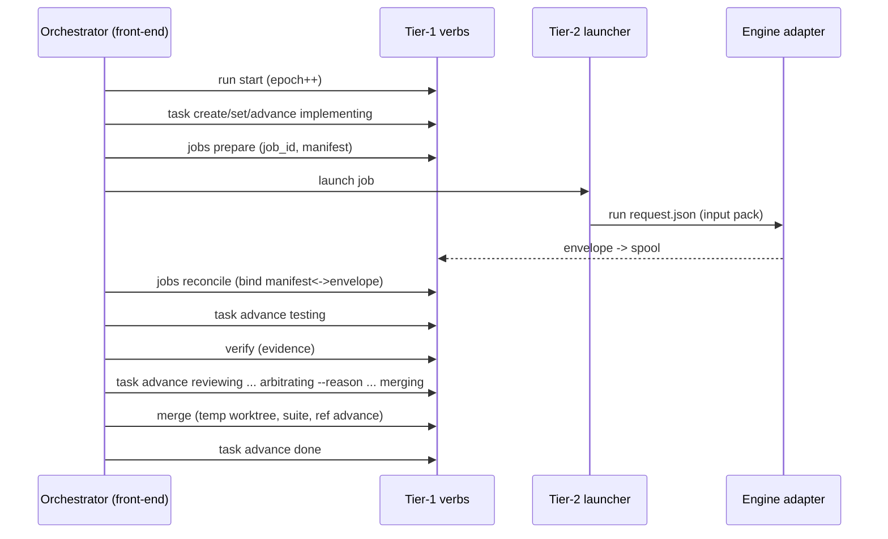

# Orchid — Kernel Specification

*Normative. One of four documents split from the design spec; see [2026-07-24-orchid-design.md](./2026-07-24-orchid-design.md) for the index and orientation.*

## Purpose

Orchid is a multi-agent orchestrator for people who hold subscriptions to
several AI coding CLIs and want them working together on large, long-running
tasks. **Roles — orchestrator, implementer, reviewer, arbiter, plan_critic,
and future custom roles — are pure configuration**; any engine whose declared
capabilities satisfy a role's requirements can hold it. The shipped defaults
reflect the author's subscriptions (Claude Code orchestrates/arbitrates,
Codex implements, Antigravity and a fresh Codex session review), but nothing
in the architecture privileges them.

Honestly stated, the kernel is a small **file-based workflow scheduler**:
deterministic CLI verbs plus stateless LLM ticks over git state. Design
principles: no daemon, no dashboard, no terminal emulation, no persistent
runtime process. Engines are driven through their first-party headless modes,
so billing stays on each vendor's subscription. All durable state is files in
git — sessions are disposable; the files are the truth.

**Platforms:** macOS and Linux (bash 3.2+, git, jq); Windows via WSL2.

## Architecture

Two locations; strict split between tooling (global) and run state (per
target repo).

### Tool repo layout

```
PROTOCOL.md                 # engine-neutral tick procedure — KERNEL-OWNED,
                            #   written in CLI verbs; plugins never edit it
skills/                     # the CLAUDE front-end for the orchestrator role —
  orchid/SKILL.md           #   one of several front-ends, not the architecture.
  orchid-plan/SKILL.md      #   Front-ends are a CONVENTION (anything that
  orchid-resume/SKILL.md    #   executes PROTOCOL.md via verbs), not a
  orchid-review/SKILL.md    #   discovered plugin kind. (review skill: v1)
bin/
  orchid                    # THE CLI: git-style dispatcher
libexec/                    # TIER 1 — deterministic verbs: state transitions
  orchid-doctor             #   only. Never invoke an LLM, never block on the
  orchid-init               #   network, never spawn long-lived processes.
  orchid-start              #   one-command existing-repo setup (v1.1): it only
                            #   SEQUENCES doctor/init/worktree/requirements
                            #   import, refusing with an exact recovery
                            #   anything it cannot do safely; every verb it
                            #   composes stays callable on its own
  orchid-run                #   start/resume/advance/accept/new — epochs, runs
  orchid-task               #   create/show/list/set/advance/arbitrate/
                            #   unblock/retry/reverify/infra-fail
  orchid-requirements       #   import (operator-owned exception)
  orchid-plan               #   apply/refresh-context (atomic transactions)
  orchid-verify             #   deterministic verification + evidence
  orchid-merge              #   transactional merge (never triggers reviews)
  orchid-jobs               #   prepare/check/reconcile (NOT launch — tier 2)
  orchid-plugins            #   list/validate/trust (v1-m1); lifecycle (v1-m3)
  orchid-journal            #   add/tail/show — decision journal
  orchid-lessons            #   add/update/retire/consolidate (v1)
  orchid-config             #   list effective config with per-key provenance;
                            #   commit <reason> (v1-m4 — SHIPPED): the safe
                            #   operator path for landing an orchid.config
                            #   edit onto the integration branch, via the same
                            #   temp-worktree CAS transaction as plan apply
  orchid-status             #   task + run-level status; --explain prints WHY
                            #   the scheduler did/didn't act (blocked
                            #   predicates by name: waiting-for-independent-
                            #   reviewer, exclusive-overlap, rebase-pending,
                            #   lease-not-stale…) — the "why did nothing
                            #   happen?" surface
  orchid-notify             #   user questions out
  orchid-answer             #   user answers in (idempotent inbox)
  orchid-trust              #   unattended <repo>/show/revoke — the machine-
                            #   local acknowledgement the headless seats
                            #   require; never inferred, never in-repo
  orchid-version            #   prints the installed version
  orchid-drive              #   bare TIER HANDOFFS: argument-free dispatch to
  orchid-service            #   runners/orchid-drive and runners/orchid-service
                            #   respectively. Both are directly executable
                            #   entry surfaces, so each resolves its own
                            #   installed location rather than trusting an
                            #   inherited ORCHID_ROOT. The effectful work
                            #   (long-lived processes, launchd/crontab) lives
                            #   in tier 2, which is why these two are handoffs
                            #   and not implementations.
runners/                    # TIER 2 — effectful: launch processes.
  orchid-launch             #   the kernel launcher: spawns engine adapters
  orchid-tick  orchid-pump  #   headless tick; LLM-free heartbeat
                            #   (v1-m2 — SHIPPED); the pump also drains the
                            #   notify outbox each pass (v1-m4 — SHIPPED)
  orchid-service            #   install/uninstall/status: schedules the pump
                            #   via the host's own scheduler (launchd/cron)
                            #   (v1-m4 — SHIPPED)
plugins/                    # TIER 3 — the BUILT-IN plugin set, discovered via
  engines/codex/            #   the same path and contracts as third-party
  engines/agy/              #   plugins. Engine adapters write ONLY to the
  engines/claude/           #   runtime spool, never durable state.
  archetypes/feature/
templates/  install.sh  docs/specs/  docs/extending/  README.md  LICENSE
```

**The determinism boundary (hard rule, tier 1 only):** `libexec/` verbs are
deterministic plumbing — state transitions over files: no LLM calls, no
daemon, no database, no message routing, and — round-4 fix — **no spawning
of long-lived processes.** `orchid jobs launch` is therefore reclassified:
the CLI keeps the ergonomic entry point, but it delegates to the tier-2
launcher (`runners/orchid-launch`), and is documented as effectful. Tier-1
`orchid jobs` retains only `prepare` (mint job_id, write manifest), `check`,
and `reconcile`.

**The normative process model (who runs, who authorizes):**

1. A run has a monotonic **epoch**. `orchid run start|resume` (tier 1)
   increments the epoch, fences out stale processes, and records the
   orchestrating front-end.
2. The orchestrating engine is either operator-started (the interactive
   session — the ONE process the kernel does not launch; this privilege
   exception is explicit, and its authority derives from holding the
   current lease, not from how it was started) or kernel-launched by the
   pump (`orchid-tick`).
3. The orchestrator holds the **lease** (identity + epoch, refreshed per
   turn). `orchid run release-lease` (v1-m4 — SHIPPED, epoch-fenced): the
   clean-session-exit affordance, called at the end of PROTOCOL.md's
   COMPLETION — writes `released: true` into `lease.json`, which both `run
   new`'s freshness guard and the pump's staleness check treat as
   immediately stale regardless of `refreshed_at`'s own age, closing the
   incident where a session's own final tick otherwise left `run new`/the
   pump blocked for up to `pump_stale_s`. `orchid run start|resume` takes the mkdir lock only transiently —
   just long enough to fence a new epoch and refresh the lease — it does
   not hold the lock for the run's duration. Individual verb invocations
   are separate short-lived processes: each validates `ORCHID_EPOCH`
   (passed by the orchestrator, minted at `run start/resume`). In v0,
   mutating verbs are fenced by epoch, not serialized by a lock, and rely
   on a single orchestrator running at a time; a verb bearing a stale
   epoch refuses to run — fencing, so a zombie orchestrator from before a
   crash can never mutate state. Per-verb transactional locking (each verb
   taking its own lock for its own transaction) is a Plan B deliverable,
   arriving alongside the tick loop.
4. Every engine launch site implemented by Orchid lives in a tier-2 runner,
   which writes the manifest via tier-1 `jobs prepare` first. This is a
   source-level topology invariant, not a jail around a shell-capable engine
   process.

**Single-writer rule with a complete ownership table** — every durable file
has exactly one writing verb; anything not listed is read-only for everyone:

| File | Sole writer (verb) |
|---|---|
| `tasks/*.md` | `orchid task create/set/advance/unblock/retry/reverify/handoff/prereq-ack/infra-fail` |
| `roadmap.md` | `orchid plan apply` (atomic roadmap+tasks transaction), `orchid run advance/accept` (run_status) — `plan apply` runs the carry-forward cross-check first and refuses in EVERY `run_status` while an item is unconsidered, and `run advance` does the same on every edge out of `planning`, so neither a mid-run revision nor a reordering carries an item past it (PROTOCOL.md PLANNING) |
| `requirements.md` | `orchid requirements import <file>` — the operator-owned EXCEPTION: authored by hand anywhere, imported by verb, immutable after plan |
| `orchid.config` (as committed on the integration branch) | `orchid config commit --reason "..."` (v1-m4 — SHIPPED) — operator-owned like `requirements.md`: authored by hand anywhere, but landed onto the integration branch only through this verb, never a direct hand-commit into a (possibly stale) checkout |
| `context.md` | `orchid plan apply` / `orchid plan refresh-context` |
| `journal.md` | `orchid journal add` (also auto-written by reason-bearing verbs) |
| `lessons.md` | `orchid lessons add/update/retire/consolidate` |
| `baseline.md` | `orchid init` |
| `reviews/*` | `orchid jobs reconcile` (envelopes, including hook-point envelopes filed as `<task>-a<n>-hook-<point>.json`, and the plan-critique envelopes filed as `plan-a<n>-plan_critic.json`), `orchid verify`/`orchid merge` (evidence), `orchid run accept` (acceptance), `orchid jobs review-plan --pin\|--repin\|--adopt-evidence` (the pinned reviewer-slot plan, `<task>-a<n>.review-plan.json` — see "Independence") |
| `plugins.lock` | `orchid plugins lock` |
| `BLOCKERS.md` | `orchid notify` |
| `runs/<run_id>/` | `orchid run new` (archival move of the just-finished run's `tasks/`, `reviews/`, `journal.md`, `roadmap.md`, `BLOCKERS.md` — written once, at rollover, never touched again) |

Task/run schemas are versioned (`schema: 1` in frontmatter) and include the
scheduling and budget fields the loop relies on: `exclusive`, `resources`,
`wallclock_budget_s`, `started_at`, `run_id`. `started_at` is re-stamped on
every dispatch (pending/rework into an active status), so
`wallclock_budget_s` bounds the current ATTEMPT rather than calendar time
since the task's first dispatch — see PROTOCOL.md's `budget-exceeded` bullet.

### Run state: `<target-repo>/.orchid/`

```
# committed (durable, on the integration branch only):
requirements.md  roadmap.md  baseline.md  context.md
tasks/T001.md ...           # frontmatter + body; state machine lives here
reviews/ ...                # envelopes (renamed from spool), verify/merge logs
journal.md                  # v0: append-only decision journal (see Memory)
lessons.md                  # v1: cross-run repo lessons (see Memory)
plugins.lock                # v1: resolved plugin identities for this run
                            #   (id, version, digest, source, contract,
                            #   capability-test result) — a run's behavior
                            #   never silently changes because a plugin did
BLOCKERS.md

# runtime/ (gitignored — machine-local, volatile):
lock/                       # mkdir lock; owner.json (pid, pid_start_time,
                            #   epoch, hostname, created_at). Breaking a lock
                            #   requires BOTH: owner not verifiably alive
                            #   (pid dead, OR pid_start_time mismatch — pid
                            #   reuse guard, OR foreign hostname) AND age >
                            #   60s past lease staleness measured from file
                            #   mtime (single clock; host-sleep gaps only
                            #   ever delay breaking, never hasten it).
                            #   Breaking is itself journaled.
lease.json                  # orchestrator heartbeat lease
jobs/<job_id>.json          # write-ahead manifests, keyed by JOB (not task):
                            #   parallel reviewers never collide
spool/                      # engine result envelopes awaiting reconciliation
exits/<job_id>              # the engine's own exit status, written by the
                            #   launcher's spawn wrapper once the engine is
                            #   gone. Nothing else records it: the launcher
                            #   returns at spawn, so an envelope-less job's
                            #   exit code would otherwise be unrecoverable
engines.json                # availability ledger (per-machine quota state)
answers/  logs/
```

**Bootstrap (existing repo):** `orchid doctor` → `orchid init` creates the
integration branch from the default-branch HEAD and commits `.orchid/` there.
User branches are never touched. **Greenfield (v1):** `orchid init --greenfield`
makes a root commit before any worktree exists (`git worktree add` needs a HEAD);
scaffolding is T001; `orchid doctor --greenfield` skips checks that cannot
apply pre-scaffold. **Scaffold verification:** tasks flagged
`archetype: feature, scaffold: true` may use structural assertions (files
exist, manifest parses, build command exits 0) as `verification_commands` —
resolving the bootstrap paradox of testing a test-runner that doesn't exist
yet.

**Worktree contamination guard:** task worktrees get `.orchid/` appended to
`.git/info/exclude`, implementer prompts forbid touching it, and
`orchid task advance` REFUSES entry to `testing` while any commit in
`base_sha..candidate_sha` touches `.orchid/` paths (the orchestrator strips
such commits and re-verifies). Thus a candidate containing a committed
`.orchid/` change cannot cross this kernel transition; this does not claim
general filesystem containment of the engine process.

## The loop

The orchestrating session executes PROTOCOL.md under the run lock each tick:
reconcile spool → advance tasks → launch by ROLE via the resolver (never by
engine name) up to the concurrency cap (v0: 1; v1-m2 — SHIPPED: 2 +
scheduling rules, `lib/schedule.sh`) → `orchid merge` at most one candidate →
commit durable state → refresh lease → sleep with fallback wakeup. Events
(background-task notifications) are an optimization; reconciliation is the
guarantee; the pump (`runners/orchid-pump`, v1-m2 — SHIPPED) guarantees
ticks outlive the session.

**Scheduling rules (v1-m2 — SHIPPED):** `lib/schedule.sh`'s
`schedule_dispatch_blockers`, the single home for the predicate set,
enforced by `orchid task advance` on dispatch and surfaced read-only by
`orchid status --explain`: dependency-manifest tasks serialize
(`waiting-deps`) — `depends_on` separates ids by **comma or whitespace**, and
`orchid task set <id> depends_on <value>` refuses at write time any id with no
task file, because an unsatisfiable id is otherwise reported as an ordinary
`waiting-deps (<id>)` and reads like a task correctly waiting its turn; the
concurrency cap gates how many tasks may be active at
once (`concurrency-cap`); `exclusive: true` and `resources:` declarations
(ports, dbs) gate parallelism (`exclusive-overlap`, `resource-conflict`) —
worktrees isolate git state only, never caches/ports/servers; unknown test
environments still run `testing`/`merging` serially within a single tick
regardless of the cap (PROTOCOL.md's Preamble).

**Plan phase** (`orchid-plan`): draft roadmap from requirements → the
resolved `role.plan_critic` engine critiques (never the drafting engine) →
revise → loop. **Context pack:** `.orchid/context.md` created at plan time,
injected into every request document; static until explicit
`--refresh-context`.

## Preflight (`orchid doctor`)

Read-only; fails safely. Validates: git topology, worktree support, jq,
plugin discovery report (origin/trust/collisions), every `role.*` binding
resolving to a discovered plugin whose capabilities satisfy the role
descriptor (labeled `unverified` until the v1 capability suite passes it),
engine binaries/auth (cheap no-op probes derived from resolved adapters —
not a separate `engines=` list), explicit verification commands (or
`--greenfield`), integration branch creatable, platform supported, and every
file in `.orchid/tasks/` parsing as a frontmatter document with an `id` — a
zero-byte or frontmatter-less task file is a FAIL naming the path, since a task
destroyed mid-flight (dogfood F34) presents nowhere else as damage.

## Task lifecycle

**Canonical transition table (the single source of state truth — also the
test oracle; per-round-Perplexity fix, all state logic previously spread
across prose sections is normative HERE):**

| From | Trigger verb | Preconditions | Writes | Next |
|---|---|---|---|---|
| pending | `task advance` | deps done; worktree created; base_sha set | frontmatter | implementing |
| implementing | `task advance` | implementer envelope `ok`; the dispatch DELIVERED a candidate (orchestrator-checked before the verb is called — see below); candidate_sha set; no commit touches `.orchid/` | frontmatter | testing |
| testing | `verify` PASS → `task advance` | evidence recorded | evidence log, frontmatter | reviewing |
| testing | `verify` FAIL → `task advance` | failure classified first: candidate → attempts++; handoff/environment/flaky → `task infra-fail` + `--waive-attempt --reason`. If a candidate failure cannot take `testing → rework` because the archetype omits that edge or the edge is refused before charging, `task advance blocked --charge-attempt --reason` preserves the strict charge in one locked transition while stopping for an operator. | frontmatter, journal | rework, or blocked on the charge fallback |
| reviewing | all required review envelopes reconciled → `task advance` | fail-closed envelope checks | frontmatter | arbitrating |
| arbitrating | `task advance --reason` (approve) | findings ≥ blocking_severity resolved | frontmatter, journal | merging |
| arbitrating | `task advance --reason` (reject) | attempts++ unless waived | frontmatter, journal | rework |
| merging | `merge` exit 0 → `task advance` | serialized; base current; temp-worktree suite AND `merge_gate` green | integration ref, evidence, frontmatter | done |
| merging | `merge` exit 1 (`validation_failed`) → `task advance` | — | evidence, frontmatter | rework |
| merging | `merge` exit 1 (`gate_failed`) → `task advance --charge-attempt` | repo-wide `merge_gate` red; integration ref untouched; attempts++ (the ONE merge failure that charges — a red repo-wide gate repeats identically, so an uncharged edge never terminates) | evidence, frontmatter, journal | rework |
| merging | `merge` exit 1 (`gate_failed`, budget spent) → `task advance --charge-attempt` | as above, and the charge reaches `attempt_budget` — further rounds would re-run the same gate against the same repository | evidence, frontmatter, journal | blocked |
| merging | `merge` exit 5 (`rebase_rereview_required`) | rebase done, SHAs updated; reviews invalidated | frontmatter, journal(`rebase_review`) | testing |
| rework | `task advance` | rework spec written into task body | frontmatter | implementing |
| any | `task advance --reason` | attempts exhausted (`rework_max`, default 3) / budget / operator | frontmatter, journal | blocked |
| blocked | `task unblock --reason` | guidance recorded into the task BODY | frontmatter, journal | rework |
| blocked \| rework | `task retry --reason [--attempts N]` | guidance recorded into the task BODY; raises `attempt_budget` to `attempts + N` (N defaults to 1) when the task has no rounds left | frontmatter, journal | rework |
| blocked \| rework | `task reverify --reason` | task worktree CLEAN (`.orchid/` excluded) and its HEAD this task's own — descended from the current `candidate_sha` (or `base_sha` when there is none) and contained in the `branch` the record names; candidate re-stamped from that HEAD, any standing `handoff_ack` withdrawn with it (the new commit is one no operator has acknowledged); stale verify evidence dropped; **no attempt consumed** | frontmatter, journal | testing |
| blocked \| rework | `task advance --reason` (the same edge, taken raw) | the SAME preconditions, enforced on the edge itself — clean worktree, lineage, and `candidate_sha` already equal to its HEAD (this route re-stamps nothing; it refuses and names `task reverify`) | frontmatter, journal | testing |

**Enforcement ownership of the preconditions above:** preconditions marked
deps/worktree/SHAs (deps done, worktree created, base_sha/candidate_sha set)
are ORCHESTRATOR-enforced in v0 — the orchestrator decides when they hold and
supplies the values; the kernel itself enforces legality of the transition
graph, `--reason` presence on reason-bearing edges, risk-tier monotonicity,
the `.orchid/` worktree-contamination guard, evidence recorded (passing
verify log) as the sole gate on `testing` → `reviewing`, and — closing the
last conditional gap — refuses entry to `testing` outright when `base_sha` or
`candidate_sha` is unset, rather than silently skipping the `.orchid/` check.

**The `implementing → testing` DELIVERY precondition is orchestrator-enforced
by necessity, not by preference,** and the table says so rather than claiming a
guarantee no verb provides. The orchestrator reads the task worktree's `HEAD`,
compares it against the sha the round was dispatched to move (the task's
EXISTING `candidate_sha`, or `base_sha` on a first dispatch), and only then
writes that `HEAD` into `candidate_sha` and calls `task advance`. By the time
the verb runs, `candidate_sha` IS the observed `HEAD` and the sha it had to
move off is no longer anywhere in the record — so `task advance` has nothing
left to compare and could not enforce this even if it were asked to. What the
verb itself guarantees at this edge is what it can still see: the edge is
declared by the archetype, `base_sha` and `candidate_sha` are both set, and no
commit in `base_sha..candidate_sha` touches `.orchid/`. That a candidate was
DELIVERED is the orchestrator's word, given at the one moment both shas exist
(PROTOCOL.md, THE TICK's `implementing` arm; the bullet below).

Feature-archetype diagram (other archetypes declare row subsets within
kernel invariants):

```
pending → implementing → testing → reviewing → arbitrating → merging → done
                ↑            │         │            │
                └── rework (≤N) ───────┴────────────┤
                                                    └→ blocked
        rework ──┐                    blocked ──┐
                 └→ testing (reverify)          └→ testing (reverify)
```

N is `rework_max` (config, default 3) unless an operator has granted this one
task a larger `attempt_budget`. The two `reverify` edges consume no attempt:
they re-run verification against a candidate the operator has fixed (or a
suite that failed for reasons that were never the candidate's), instead of
buying a fresh implementation pass to reach the same tree.

- **testing** = `orchid verify <id>`: runs `verification_commands` in the
  task worktree; records evidence (command, cwd, SHA, timestamps, exit
  codes, log digest), including the exec-bit set, missing-build-state set and
  its resolution inventory, and stale-pin result captured before the
  candidate-controlled command starts.
  Sole acceptance authority for tests.

  **The tree that runs must be the tree the evidence names (T031).** The verb
  REFUSES — exit 20, naming both SHAs — when the worktree's HEAD is not the
  task's recorded `candidate_sha`, and refuses again when HEAD moved while
  the suite was running (the header carries `sha:` and `head_after:` for
  exactly that comparison). `sha:` is READ IMMEDIATELY BEFORE the command is
  executed, with nothing between the read and the run but that comparison: it
  is the verb's claim about which tree ran, so a HEAD sampled earlier in the
  verb — before the frontmatter parse, the prestate walk and the temp-file mint
  — would name a different instant than the one the evidence asserts, which is
  the same substitution in miniature. Together the two reads bracket the whole
  execution rather than sampling near it. Refusal is distinct from FAIL: nothing was
  established about the candidate, so the driver stops at a
  `worktree-conflict` boundary instead of spending a rework attempt. A
  refused run's evidence ends in a `refused: ...` line, so INV-11's
  `tail -n1 == "exit: 0"` gate can never admit it. `candidate: none` (no
  candidate recorded yet) is not drift and still runs. This closes the hole
  r-002/T013 walked through: the driver captured `candidate_sha` from a live
  worktree's HEAD, the implementer job was still running and committed again,
  and the verification exercised the newer commit while the evidence — and
  therefore INV-11's gate — named the older one.
- **merging** = `orchid merge <id>`: serialized, transactional, and — round-4
  determinism fix — NEVER triggers reviews itself. If integration HEAD ≠
  `base_sha`, the verb performs the rebase, then exits
  `rebase_rereview_required` (code 5), resetting the task to `testing` with
  updated SHAs. The TICK then relaunches verify and reviews (delta review:
  reviewers receive the range-diff and new base; full re-review if
  non-trivial — the classification is the orchestrator's, journaled with
  kind `rebase_review`). A rebased candidate is UNCONDITIONALLY re-verified;
  a textually clean rebase is not semantically safe against parallel
  changes. On a current base: merge in a temp worktree, run the suite,
  advance the integration ref on pass; `validation_failed` returns that
  exact candidate to rework with logs. **v0 baseline semantics:** the suite
  must pass, full stop; `baseline.md` records pre-existing failures for
  humans. Baseline-aware comparison is post-v1.
  **The repo-wide gate (`merge_gate`, T007, lesson L016).** "The suite" above
  is TWO commands, not one: the task's `verification_commands`, and the
  repository's `merge_gate` if one is configured — both run in that temp
  worktree, against the merged tree. The second exists because the first is
  authored PER TASK, so a repo-wide check added mid-run reaches only the tasks
  written after it and told about it: in r-001 `scripts/ci-local.sh` was named
  by two of eight tasks, and the run-level "the configured ShellCheck gate
  passes" criterion was failing on the integration branch throughout while
  every task's own suite was green. `merge_gate` is read from repo config
  ONLY — deliberately not overridable from task frontmatter the way `verify`
  is, since a floor a task can lower is not a floor. Its status folds into the
  same one the ref advance is already conditional on, so it blocks rather than
  merely reports (`gate_failed` → `rework`, ref untouched); it is skipped when
  the task's own suite has already failed, and NEVER skipped by matching the
  task's command text against the gate's. A gate that runs the repository's
  own suite re-enters this verb through it, so `merge` sets
  `ORCHID_MERGE_GATE_ACTIVE` in the gate command's environment and declines to
  open a second level when it is already set (`scripts/ci-local.sh` sets it
  too, for a direct run); a skip is written into the merge log as
  `gate_status: skipped-nested` and said on stderr, never reported as a pass.
  Because the merge log now records TWO commands, it also records who failed:
  `command_status:` (the task suite) and `gate_exit:` (the gate) in the header,
  with a `== merge_gate: <cmd>` banner marking the boundary in the body. The
  rework brief quotes only the failing command's half — a green suite followed
  by a red gate is the ordinary shape here, and the trailing `exit:` line
  alone cannot tell the two apart.
  **And a red gate is bounded.** `merging → rework` charges no attempt — the
  candidate was independently verified once already, so a conflict or a
  revalidation failure is not a fresh round of the implementer's work. That
  reasoning fails for exactly one merge failure: a red repo-wide gate is a
  statement about the repository, and a repository nobody has touched is red
  again next round, so the uncharged edge gives dispatch → implement → verify
  → review → merge → red gate → rework with no counter moving. So
  `gate_failed`, and only `gate_failed`, takes `task advance --charge-attempt`
  (a kernel-validated opt-in admitted on `merging → rework` and `merging →
  blocked`, never a rule inferred from the reason text — a counter driven by
  string matching is one rewording away from charging a merge conflict), and
  when that charge reaches `schedule_attempt_budget`'s cap the edge is
  `merging → blocked` instead. Merge conflicts, rebase conflicts and
  `validation_failed` keep the exemption untouched. That the candidate is
  often innocent of a gate failure is the reason for the *cap*, not an
  argument against the charge: the alternative is not fairness but an
  unbounded loop re-dispatching implementers against a fault no implementer
  round can clear. `orchid task reverify` (no attempt consumed) and `orchid
  task retry --attempts N` are the recoveries, and the block names both.
  **Consequences of the ref-only advance (m3 ledger, found live):** the
  integration-ref advance above is a bare `git update-ref` — it never touches
  any OTHER checkout of that branch, by design, since it must not write into
  a working tree it does not own. A long-lived checkout of the integration
  branch left open across a merge keeps a stale index/tree, and that has two
  distinct consequences, both now guarded:
  - Committing directly from that stale checkout silently REVERTS the
    just-merged work (the commit's parent is still the pre-merge SHA).
    `orchid doctor` FAILs and `orchid status` warns on the staged-deletion
    signature (`orchid_stale_checkout`), and `orchid config commit` is the
    safe operator path for the one file that legitimately needs committing
    from there.
  - If orchid ITSELF is being run out of that checkout — `bin/orchid`
    resolves `ORCHID_ROOT` from its own location, so the verbs, libs,
    runners and engine adapters all come from its working tree — the run is
    driven by PRE-MERGE code indefinitely while every merge reports success
    (lesson L018, observed live for a full day). Every verb therefore
    REFUSES to run when `ORCHID_ROOT` is a checkout parked on the
    integration branch whose **index** does not match HEAD for the kernel
    paths (`orchid_root_stale`, enforced at `lib/common.sh` source time).
    The INDEX, not the working tree: `git update-ref` moves the branch
    without touching either, so the index left describing the commit the
    branch moved off IS the record of the fall behind — while an operator
    editing kernel files leaves the index alone, which is what keeps orchid
    runnable in the integration checkout it is itself developed in. A
    checkout that fell behind and was then `git reset` is consequently not
    detected by this or any other check; from here it is indistinguishable
    from ordinary editing, and catching it would mean refusing on every
    ordinary edit. Because a `git reset` is also the documented way to clear a
    STAGED-edit refusal, that remedy can silently retire a genuine staleness
    along with the refusal — so docs/troubleshooting.md states the hazard where
    it prescribes the reset, and gives the read-only scan (does the index match
    an ancestor of HEAD for these paths?) that separates the two states while
    the index still holds the evidence.
    Because source time is ahead of every verb — including the
    unattended-trust gate, which may not let orchid touch a repository in any
    way before an acknowledgement is found — the "parked on the integration
    branch" half is answered by READING Git's on-disk `HEAD`, never by
    spawning `git`. Only a root that really is parked there goes on to the
    content comparison, and that root is orchid's own installation.
    Deliberately narrow: a development checkout on any other branch is never
    asked, however dirty, and `.orchid/` is neither inspected nor touched, so
    uncommitted durable run state is never a refusal and never at risk.
    That refusal must not stop the run on its own success, so `orchid merge`
    REFRESHES the one checkout it is itself running from (`$ORCHID_REPO` and
    `$ORCHID_ROOT` resolving to the same directory, parked on the branch just
    advanced) immediately after the CAS, and shields its own remaining
    bookkeeping from the refusal. Otherwise the very next child process —
    `task advance <id> done` — refuses, leaving the branch advanced and the
    task frozen in `merging`. The refresh is gated on `orchid_kernel_clean`:
    a checkout with UNCOMMITTED kernel edits is never refreshed, it gets the
    refusal, because those edits are the operator's to keep — and `orchid
    merge` WARNS on stderr when it declines for that reason, naming the edit,
    since the refusal the operator meets next can only report what it sees and
    cannot know that this edit is why. That warning is gated on the merge
    having actually MOVED a kernel path (`$integ_head..$merged_sha` restricted
    to `ORCHID_KERNEL_PATHS`), not merely on the checkout being dirty: a merge
    of docs, config or tests leaves a dirty checkout exactly as current as it
    found it, and a warning that fires when nothing went stale is the one an
    operator learns to skip past — including on the merge where it matters. This is not the rejected "merge
    refreshes other checkouts" remedy — no checkout the merging process does
    not already own and hold the run lock for is ever written. The advance and
    the refresh are two operations and no ordering of them is atomic to a
    third process, so a window exists in which this checkout holds PRE-MERGE
    code. Verbs started from that root inside it REFUSE — the window is closed
    to execution, which is the only thing that had to close, since a verb
    allowed through it runs exactly the stale kernel this refusal exists for,
    and a verb that waited would still be holding the libraries it already
    sourced. `orchid merge` publishes its identity — pid, process start time
    and hostname, the same triple `lock_acquire` writes — at
    `.orchid/runtime/kernel-refresh` for the length of the window, and that
    marker selects WHICH refusal is printed: "a repair is in flight, nothing
    ran, retry" and exit **75** (`EX_TEMPFAIL`, used nowhere else) while the
    identity matches a live process, the full report otherwise. Liveness is
    the predicate, so nothing has to reap the marker, and the identity is what
    keeps a file left behind by a SIGKILLed merge from being answered for by
    whatever process later inherits its PID. A marker that cannot be believed
    — recycled PID, foreign host, mangled, absent — yields the full report,
    which is never the unsafe answer; writing one can therefore change the
    wording of a refusal and nothing else.
  **The refusal prescribes no repair.** It reports what it observed — the
  branch, the kernel paths whose index entries differ from HEAD, and any
  unstaged modifications as context — states that the cause is not
  determinable from that, and prints only read-only commands for looking.
  An index that differs from HEAD is produced identically by a `update-ref`
  advance and by a `git add` of a kernel edit; two earlier rounds of this
  guard classified the second as the first and prescribed a restore that
  destroys the operator's only copy (dogfood finding F31's family). The
  operator resolves it; `docs/troubleshooting.md` carries the options and
  what each costs.
  **EVERY verb refuses, `doctor` and `status` included, in both causes** —
  including the one where the cause is the operator's own `git add` and
  nothing is stale at all. That is deliberate and is the sharpest cost this
  design carries, so it is stated rather than discovered: orchid cannot tell
  the two causes apart, a `doctor` run out of a checkout that IS stale is
  produced by the stale `doctor`, and an exemption list is how the advisory
  version of this check came to be ignored. `ORCHID_ALLOW_STALE_ROOT=1 orchid
  doctor` is the exemption — per-invocation, visible in the transcript, taken
  with the observation already in front of the operator. `docs/troubleshooting.md`
  says so where someone meeting the refusal will find it, because a refusal an
  operator reads as a broken tool is one they work around.
  The refresh the merge runs names only what the launcher executes —
  `bin lib libexec runners plugins roles skills templates PROTOCOL.md`,
  the single `ORCHID_KERNEL_PATHS` list in `lib/common.sh`. It never reaches
  for `.` : that would restore a pending `orchid.config` along with the
  kernel, and without `':(exclude).orchid'` it clobbers uncommitted
  `.orchid/` run state too.
  **`orchid.config` is a separate step with a separate precondition, not a
  member of that list** (T007). It is not executed but it is READ by every
  verb — `merge_gate` lives in it — so a self-hosted merge that lands a config
  change and leaves this checkout resolving pre-merge values makes the
  repository's own floor inert in the repository that just adopted it, which
  is lesson L016 wearing the clothes of its own fix. So a merge that MOVED
  `orchid.config` between `$integ_head` and the merged commit brings this
  checkout's copy to it — by the same write-tree-then-index order, through the
  same per-write check against the pre-advance base — but **only when that
  copy was byte-equal to HEAD in the working tree and the index both, with no
  untracked file at that path**, established before the advance. Where it was
  not, the operator's edit is left exactly as it is and the merge says so on
  stderr, naming what is pending and that the merged configuration is not the
  live one here; it prescribes no restoring command, and it warns that
  `orchid config commit` lands the bytes on disk, so running it over an
  unreconciled file would drop what the merge just landed. Membership in
  `ORCHID_KERNEL_PATHS` would mean something else entirely and must not be
  confused with this: that a pending config edit makes the checkout stale and
  refuses every verb.
  **The refresh writes the working tree first and the index last**, one path
  at a time, and that order is a safety property rather than an internal
  detail. The guard reads the INDEX, so the index is what makes this checkout
  look current to every other process; it is written only once that path's
  working tree already carries HEAD's bytes (installed by rename, then
  verified against HEAD's blob with `git hash-object`). A refresh killed at any
  instant — SIGKILL, a full disk — therefore leaves every unfinished path with
  an index entry still describing the commit the branch moved off, which is
  the state the refusal fires on: **an interrupted refresh refuses, it never
  permits.** The in-flight marker cannot cover that case by construction — it
  is believed only while its writer is alive, so a merge dying is exactly when
  it stops speaking — which is why the ordering, and not the marker, is what
  closes it. The drift list is the UNION of `diff HEAD` and
  `diff --cached HEAD` over the kernel paths, so a later refresh can finish an
  interrupted one instead of finding the working tree already right and
  declaring victory over an index that is not.
  `git checkout <tree> -- <paths>` is deliberately not the mechanism: it
  cannot drop a file the tree no longer carries (that path stays in the index
  and keeps counting as drift, which is why the automatic refresh clears a
  state a hand-run one-liner can leave standing — docs/troubleshooting.md),
  and the order in which it commits its index and working-tree writes is
  git's internal detail rather than a guarantee this guard may rest on.
  `orchid_kernel_clean` is the caller's PRECONDITION and is re-asked PER
  WRITE, on the line above each one, because it is evaluated before the ref
  advance and cannot speak for the interval since. Every write is preceded by
  the question *would writing here destroy the only copy of something?* — safe
  only when the path has no file, when the file still holds the bytes the
  precondition saw, or when the file already holds HEAD's own bytes. Anything
  else was written in the window and is DECLINED, leaving both those bytes and
  the refusal in place.
  "The bytes the precondition saw" is read from the COMMIT `HEAD` was on when
  `orchid_kernel_clean` passed — `orchid merge` passes it as the refresh's
  base, and already holds it as the expected-old value of its own CAS — and
  NOT from the index, which carries the same bytes and needs nothing passed.
  The index is not a snapshot: `git add` moves it and the working-tree file
  together, so an operator who edits *and stages* a kernel file inside the
  window leaves a file matching its index entry perfectly that is nonetheless
  the only copy of their work. Read against the index that state is
  indistinguishable from an untouched checkout and is overwritten for it; read
  against the base commit it is exactly what it is. The record has to be one
  the racing writer cannot also move, and only a commit is that. A caller with
  no base to offer falls back to the index, which gives the same answer in
  every case but that one; a base that does not resolve makes the comparison
  unanswerable rather than true, so a bad argument yields a refusal and never
  a write.
  This is also what makes the refresh decline to overwrite an UNTRACKED file
  where the branch has since added a tracked one — it matches neither the base
  (which does not carry the path) nor HEAD — while still writing through the
  untracked file whose content already IS HEAD's blob, the state a killed
  refresh leaves behind, where declining would leave a refusal no refresh
  could clear. The collision case is one `orchid_kernel_clean` could never
  cover at all: it is asked before the ref moves, when the collision does not
  yet exist.
  The drift walk is NUL-delimited (`git diff -z`), because
  `--name-only` C-quotes any path holding a space, a quote, a backslash or a
  non-ASCII byte, and a quoted name matches no file — the restore would decline
  over a path it never looked at. An empty list is NOT an early success: a
  `git` that cannot answer prints nothing, so the walk falls through to the
  same both-halves verification that closes the function.
- **Attempt fairness (tier-boundary clean):** `orchid task advance` to
  rework increments `attempts` BY DEFAULT — the deterministic verb never
  judges semantics. The orchestrator may pass `--waive-attempt --reason`
  when the failure signature is disjoint from the prior attempt's (distinct
  forward progress); the waiver is a journaled decision (kind
  `attempt_waiver`). The cap targets repeated identical failures; the
  per-task wall-clock budget is the unconditional backstop.
  A candidate failure for which `testing -> rework` is unavailable or is
  refused before it charges takes the single narrow fallback `task advance
  <id> blocked --charge-attempt --reason "..."`. The flag is admitted on a
  closed set of three edges and no others: `testing -> blocked` here, plus
  `merging -> rework` and `merging -> blocked`, which serve `orchid merge`'s
  `gate_failed` arm alone (the merge-gate paragraph above says why that one
  merge failure opts out of the `merging` exemption). It is mutually exclusive
  with `--waive-attempt`, derives the next attempt number itself, journals
  before mutation, clears any deferred-failure receipt, and increments exactly
  once. This keeps the canonical candidate-FAIL rule true without making
  `attempts` generally writable.
  `infra_failures` NEVER consume attempts, and neither does `task reverify`.
- **The cap is `rework_max` (config, default 3), and an operator can raise
  it for ONE task:** `orchid task retry <id> --reason "..." [--attempts N]`
  records `attempt_budget: <attempts + N>` in that task's frontmatter,
  journal-first, and the driver enforces whichever of the two applies (the
  per-task grant wins). **`N` defaults to 1**, so a bare `retry` of a task
  with no rounds left buys it exactly one — a retry that restored status
  without a round was the trap this replaced. The grant only ever RAISES a
  budget — a grant smaller than the budget already in force (every retry of
  a task still inside its budget, and every repeat of the same bare retry)
  leaves it alone. `attempt_budget`
  is kernel-owned (`task set` refuses it) for the same reason
  `infra_failures` is: it needs a recorded reason, not a bare frontmatter
  write.
  **A grant never winds `attempts` back**, deliberately: `attempts` is the
  attempt NUMBER every per-attempt artifact is keyed on
  (`reviews/<id>-a<attempts+1>-{implementer,reviewer}*.json`, read by `jobs
  prepare`, by both kernel envelope gates in `task advance`, and by the
  driver's own implement-failure predicate). Decrementing it would point the
  next attempt at a previous attempt's envelopes, so a stale non-ok
  implement envelope would read as this attempt's fresh failure. The counter
  is monotonic; the cap is what moves.
- **The failure signature is mechanized, not eyeballed (v1.1).** "Disjoint
  from the prior attempt's" above used to be a judgment a human made by
  re-reading two logs — and could not make at all, because entry to `rework`
  DELETES `reviews/<id>-verify.log` (arming INV-11's gate) while the same
  call journals a reason pointing at it. The pointer dangled the instant it
  was written, so the next attempt arrived with nothing to act on and the run
  produced byte-identical failures attempt after attempt (dogfood finding
  F27; lesson L023). `orchid task advance <id> rework` now COPIES the failing
  evidence first — `reviews/<id>-verify.log`, or `reviews/<id>-merge.log` on
  the `merging → rework` validation path — into `reviews/<id>-r<round>-rework.log`,
  a round-scoped path no evidence gate anywhere accepts (INV-11 reads a
  literal filename; every envelope glob keys on `-a<attempt>-*.json`), and
  records that round's `rework_signature`: a digest of the evidence with its
  volatile header (`date`/`sha`/`candidate`/`cwd`) stripped and the command,
  output and exit code kept. `rework_signature_repeats` counts CONSECUTIVE
  identical signatures. A rework with no failing evidence to capture (a
  rebase conflict, an operator advance) mints no file and leaves the streak
  alone — an absence of evidence about convergence, never a reset of it.
  Three consequences, all deterministic:
  - the next attempt's input pack carries `rework.md` — the previous round's
    output VERBATIM, plus whether it repeated unchanged (docs/specs/plugins.md);
  - a second identical signature routes the next dispatch to a different
    engine in the role's failover chain (a preference: a chain with no other
    eligible entry dispatches as usual and says so);
  - `rework_nonconvergence_max` (config, default 3) consecutive identical
    signatures stop the loop — `blocked`, plus an `operator-decision`
    boundary. An unchanged signature is evidence the loop is not converging,
    not a fresh failure.
  An identical signature still CONSUMES its attempt. The waiver above is for
  a signature that is disjoint — distinct forward progress — and the ≤3 cap
  exists precisely to target repeated identical failures; waiving them would
  make the one shape the budget exists to stop the one shape that never
  spends it.
- **A delivery that delivered nothing is an infra failure, not an attempt.**
  An `ok` implement envelope is the engine's own account of itself; the
  worktree is the only thing that can contradict it. When the envelope
  reconciles `ok` but HEAD is still the `base_sha` of a task that has never
  recorded a candidate, no candidate exists to test, review or arbitrate — the
  `implementing → testing` delivery precondition above simply does not hold.
  The orchestrator refuses the transition, and when the tree is CLEAN as well
  (the bullets below take the cases where it is not, and where a candidate does
  exist) charges `infra_failures` (relaunching the implementer, and reaching
  `blocked` at `infra_max` like any other job-delivery failure). It is
  deliberately not an `attempts` round: nothing was delivered for the attempt
  budget to be judging. **The refusal is durable, not a one-pass
  verdict:** the refused envelope stays on disk as a sibling of every later
  one, so it is recorded in `refused_envelopes` and is never selected again —
  otherwise the same envelope is re-selected once the relaunch moves HEAD (it
  no longer looks like a no-op) or once a newer non-ok sibling is filed (it is
  still the newest `ok` one), and the refused work advances to testing by a
  second door. For the same reason no implement envelope is read at all while
  an implement job for the task is still outstanding.
- **A sha comparison cannot see the tree, and the two no-ops it collapses call
  for opposite handling.** An unmoved HEAD says no candidate exists; it does
  not say the dispatch did nothing. Over a CLEAN tree it did nothing (the case
  above): no commit, no edit, and the recovery is deterministic — spend the
  rung and relaunch the implementer into the worktree it left exactly as it
  found it. Over a DIRTY tree it did the work and failed to commit it, and
  relaunching there hands the next dispatch a tree it did not create: it will
  commit those edits as its own, revert them, or build on top of them, and the
  journal will read whichever it does as the work of a round that never wrote
  them. Discarding real output is not a decision to automate, so that case
  takes no rung, no relaunch and no `refused_envelopes` mark — it raises an
  `operator-decision` boundary naming the uncommitted paths, and both answers
  leave the next pass correct: committed, HEAD is off the floor and the
  envelope is ordinary delivery; discarded, the tree is clean and the refusal
  above applies. A tree that cannot be READ is refused in the same direction (a
  `worktree-conflict` boundary), never folded into the clean case — an
  inspection that answers "clean" when it could not look is the fail-open shape
  the operator hand-off's own tree check exists to close. `.orchid/` is
  excluded throughout, being no part of any candidate.
- **Nor can it see whether a candidate exists, and a round that added nothing
  to one is not a round that delivered nothing.** The sha an unmoved HEAD is
  measured against is the `candidate_sha` where the task has one, so "HEAD is
  still the floor" collapses a task that has produced NOTHING into one whose
  candidate is already on disk and merely gained no commit this round. Where
  the floor is a `candidate_sha` that differs from the recorded `base_sha`, the
  orchestrator itself stamped that sha from a HEAD it read in that worktree, so
  a candidate demonstrably exists and the delivery precondition DOES hold: the
  transition is taken on the existing candidate, nothing is charged, no
  envelope is marked refused, and the journal records which of the two clean
  cases it was. Charging the job-delivery ladder here blocks a task whose
  candidate is sitting right there, and the case arises in ordinary operation:
  a rebase rewrites a task's commits, the orchestrator re-stamps the new HEAD
  as `candidate_sha`, and the next round's implementer truthfully reports that
  the work asked of it is already in place. Advancing is bounded by `attempts`
  downstream — the budget for defects in work that WAS delivered — like any
  other delivered round. Both shas must be on record: with `base_sha` missing,
  nothing proves a candidate exists and the refusal two bullets above stands.
- **Verification failures are classified before they are charged.** An
  attempt budget that counts the harness's bad days is not measuring the
  candidate: a stale package pin the implementer profile cannot re-pin and an
  executable shipped without its mode bit are failures in which the code under
  test is blameless, and each of them spent a rework attempt before this rule
  existed. So were two more shapes that ran through the same wave: a task
  worktree that never received the gitignored dependency tree the integration
  checkout carries (lesson L003), and an assertion that samples a race, which
  in r-002 stranded eight tasks and outspent every real defect in the run
  (lesson L020). The deterministic driver therefore classifies a FAILED
  `orchid verify`, and it can reach four verdicts — `candidate`, which
  charges, and `handoff`, `environment` and `flaky`, which do not.
  There is NO signature surface: a repository cannot declare a failure
  *sentence* that forgives its own rounds. The exec-bit hand-off is recognized
  with no per-repo configuration because the protocol rather than any one
  project names it. The candidate-local pin hand-off is available only when
  the repository explicitly configures `handoff.pin_check` (default `none`);
  a whole-tree release pin must stay in the integration/release gate rather
  than being configured as candidate work.
  Each is proved in two halves, and neither half is worth anything alone. The
  STATE is proved against the world: the driver stats the files the candidate
  ADDED and the ones it MODIFIED whose base recorded mode 755 (a rewrite that
  loses an exec bit is the same hand-off as a new file that never carried
  one); when explicitly configured, it RUNS the repository's candidate-local
  pin freshness check and requires it to REPORT A FILE STALE — a nonzero exit
  alone is not that report, since a check that cannot find the formula or trips
  over metadata the candidate corrupted exits nonzero too and refreshing the
  candidate-local artifact fixes neither; it COMPARES the two checkouts for an
  ignored directory the worktree never received; and it reads a known-flaky
  register that THIS CANDIDATE DID NOT TOUCH, which is what stops an
  implementer quarantining the assertion it is failing. The exec-bit set,
  ignored-directory set, and enabled pin-check result are snapshot evidence
  written by `orchid verify` before the candidate-controlled command runs,
  bound by the log's `sha`, `candidate`, `cwd`, and captured `base_sha` fields
  to the current task candidate, worktree, and pre-run comparison base. They
  are never reconstructed from post-run state:
  doing so lets the command strip a mode bit, remove ignored dependencies, or
  dirty release inputs until the pin check turns stale during its own test and
  create the very state that waives its diagnostic. Missing, malformed, and
  mismatched snapshot fields close all three routes and charge. The missing
  tree's package/command inventory is captured at the same time and is the only
  authority for later resolution attribution; the classifier never reads
  candidate-mutable integration contents after the command. Yarn v1 command
  echoes and its exact exit-127 record remain strict until a command in that
  inventory plus a causal resolution diagnostic attribute them to the absent
  tree; only its exact version/help records are neutral without that proof. A
  failed verification body may include deterministic successful-fixture
  chatter from an old runner that exposes a child's entire buffer after a
  later historical flake.
  The trusted register can name those lines exactly with `FLAKE-CONTEXT:`, but
  they are inert until a causal `FLAKE:` signature matches this body and cannot
  claim any unlisted line. This is closed companion accounting, not a
  failed-child waiver. A recorded exit
  status saying the run STOPPED SHORT (124, 137, 143) was a fifth verdict
  once and is not one now: that status is equally what a candidate which HUNG
  until a timeout reaped it leaves, and what a suite that exits with it
  deliberately leaves, so the provenance was assumed rather than proved. It is
  reported on a charged round instead. The
  failure is then ATTRIBUTED to that artifact: a failing line must name it and
  report its fault (refuse to execute it, call it stale, or fail to resolve
  something that lives INSIDE the absent directory), which proves the state
  blocked this run. Resolution is bound to the diagnostic's subject — syntax
  such as `open` in an ENOENT line is not searched as though it were the thing
  that was missing — after which every failing line NAMING that artifact is part
  of the same cascade (one missing mode bit strands a whole suite, not one
  assertion). NAMING is the whole of the cascade rule, for the absent directory
  as much as for the file: a failing line that merely mentions something living
  inside it — a package name, which is an ordinary word — is not its cascade.
  The path must use its exact repository-relative, `./`-relative, or
  verification-root absolute spelling, with a boundary after it. Thus an
  outstanding `bin/tool` cannot collect a failure on `bin/tool-helper`, on
  `bin/tool/child`, or on the distinct suffix `fixtures/bin/tool`; the ONE
  relaxation is that a path UNDER the absent directory names that directory,
  because there the artifact is a whole tree that is not there and everything
  beneath it is missing with it. Every route that reads an
  authority out of the repository asks git what the candidate changed, and each
  CHARGES when git cannot be asked at all: a missing or unresolvable
  `base_sha`/`candidate_sha` yields the same empty diff as an untouched file,
  and reading that as "untouched" would reopen the pin check and the flaky
  register to a candidate that wrote them. The two routes that read a FILE out
  of the repository take that further, because a diff of two commits is not a
  fact about the file that RAN: the pin check and the register are authorities
  only while each is tracked in `candidate_sha` and the verified worktree
  carries exactly the bytes and mode that commit records, so an unstaged edit,
  a staged-and-uncommitted one, an untracked drop-in, a deletion and a mode
  change each close the route — none of them appears in the diff, and every one
  of them is a file the implementer controls. The flaky register has one
  fail-closed bootstrap for carried worktrees: when the task's captured
  pre-run base and candidate both resolve and both lack the register path, a
  clean tracked copy at integration `HEAD` may supply it, but only while that
  HEAD is still the exact commit captured before candidate-controlled
  verification began. A
  candidate addition has the path in its candidate; a deletion has it in its
  base; moved integration HEAD or dirty integration bytes, mode, or index fail
  the authority check. This lets a post-cut historical-flake entry
  protect old branches without letting a candidate author or remove its own
  amnesty. A non-`candidate` verdict charges `infra_failures` rather than
  `attempts`. The `infra failure #N` intervention reason itself names the class
  and says `attempt not charged`, because an infra cap or recurrence can stop
  before the rework edge; a missing edge gets the same task-scoped note without
  an infra charge. Entering rework with `--waive-attempt` adds an
  `attempt_waiver` entry, and only that successful edge arms the recurrence
  counter. Four properties make this safe rather than a loophole: it forgives
  only on POSITIVE evidence, never on absence of it; every uncertain case (no
  evidence log, no state outstanding, a known fault the failure cannot be
  attributed to) charges and says why; NO ROUND IS EVER WAIVED AS A ROUND —
  attribution is per failing LINE and a round is waived only when every line in
  it is individually claimed, so a stale pin and an absent dependency tree each
  explaining part of a round waive it together while one line neither owns
  charges it with that line quoted, and the arm that once EXEMPTED a round from
  that accounting is precisely how an unrelated ignored directory came to
  waive failures it had no part in; and forgiveness is bounded — by
  `infra_max`, which blocks the task rather than looping forever, and by the
  recurrence guard, which stops a SECOND waived round on the same task, of any
  class, at an operator boundary rather than re-dispatching an implementer that
  cannot clear it. A waived round also
  requires a FRESH implement envelope, since `--waive-attempt` holds
  `attempts` still and the previous round's envelope would otherwise re-verify
  a candidate that never moved.

Frontmatter (`schema: 1`): `id, title, status, archetype, scaffold, branch,
worktree, run_id, depends_on, attempts, attempt_budget, infra_failures,
rework_rounds, rework_signature, rework_signature_repeats, session_id,
implementer_engine_id, base_sha, candidate_sha, refused_envelopes, risk_tier,
blocking_severity, stop_condition, hook_guidance, handoff_ack, engine, effort,
acceptance_criteria, verification_commands, operator_prerequisite,
prerequisite_ack, resources, exclusive,
wallclock_budget_s, started_at, created, updated`. `handoff_ack` (v1.1):
kernel-owned: `orchid task set` refuses it by name, because its only legal
value is the task's current `candidate_sha` and a hand-set field is the one way
this record could lie. `orchid task handoff <id> --ack|--clear --reason "..."`
is the only verb that CREATES one; every other verb that touches it only ever
withdraws it (entry to `rework`, `unblock`, `retry`, and `task reverify` when it
re-stamps the candidate — the commit it adopts is one no operator has
acknowledged, and lineage proves only that the acknowledged work is still
present, not that the commits on top of it need no mechanical steps). Empty
means the
`operator-handoff` boundary is outstanding; equal to `candidate_sha` AND to
`HEAD` of the tree verification would run in, with that tree CLEAN, means the
operator performed that candidate's execution-requiring mechanical steps and a
resumed pass proceeds. The last two comparisons are what keep the rule about a
committed TREE rather than about two fields written together: an ack followed by
one more commit leaves both fields equal and naming a tree that exists nowhere,
and an ack given over uncommitted work leaves all three shas equal and naming a
commit that does not contain it — a pass that read either as done would verify a
commit nobody acknowledged. `--ack` is refused outright over a dirty tree
(`.orchid/` excepted, being no part of the candidate) and from any status other
than `testing`, the one point in the procedure this pause exists at: from
`reviewing`, `arbitrating` or `merging` its advance would move `candidate_sha`
out from under judgments already bound to that exact commit. `--clear` is
restricted by neither, since it only ever withdraws. It is bound to a
candidate, never to a task or a
moment: entry to `rework` and `orchid merge`'s rebase arm both clear it, the
same INV-07 invalidation that drops verify evidence, so a rebased tree never
inherits an acknowledgement made against the tree it replaced. `--ack` also
ADVANCES `candidate_sha` to `HEAD` of the tree `orchid verify` resolves (the
task's `worktree` when set, else the repo) before binding to it — but only to a
commit that DESCENDS from the current candidate and is contained in the task's
`branch`, refusing otherwise in a message naming both shas, since adopting an
unrelated `HEAD` would be a worse mis-binding than the drift the advance
removes — and re-running entry-to-`testing`'s `.orchid/` scan over
`base_sha..HEAD`, refusing on a
hit: a hand-off exists to commit work AFTER the candidate was captured, so
without the advance the record would name a commit that was never the one
verified — the drift lesson L025 records — and it is the one other path that
moves `candidate_sha` past INV-04's gate. Since T031 landed, `orchid verify`
itself compares the two BEFORE running and refuses on a mismatch (exit 20,
naming both shas), so the equality the advance leaves behind is the
precondition for the suite running at all — and it is still what INV-11's
`testing → reviewing` gate reads out of the evidence header afterwards.
`implement_floor` (v1.1): driver-written, and no part of the schema-1 list
above — it is absent from a task file until a round is waived, and inert once
`attempts` moves past the attempt it names. Its value is `a<attempt>:<n>`, the
implement-envelope sibling counter a WAIVED round's next envelope must exceed,
so a waived round cannot re-resolve the envelope of the round it waived.
`verify_fail_pending` (v1.1): driver-written, absent/empty normally. A bound
asynchronous `on_verify_fail` hook defers the failure arm to a later pass, so
the driver records `a<attempt>:<candidate_sha>:<verify-log-sha256>` before it
launches the hook. A matching receipt makes the later pass resume and classify
that exact failed log without rerunning the verifier and overwriting it. A
digest mismatch or missing log charges under the strict default; entry to
rework or a fresh reverify clears the receipt with the evidence it binds.
That advance also expires `prerequisite_ack` below, and it is the expiry an
operator meets by hand: the two acks share a binding rule, so a
prerequisite acknowledged before the hand-off is superseded by it. It is one
of several candidate moves that expire an ack without clearing it (`orchid
merge`'s rebase-reset and `task reverify`'s re-stamp are the others), which
is why the binding is a comparison against the current `candidate_sha` and
not a list of verbs that must each remember to clear the field. The
ordering PROTOCOL.md gives — hand-off first, prerequisite second — is what
avoids paying for that, and it is a convention, not a gate.
`refused_envelopes` (v1.1): the
space-separated basenames of implement envelopes refused as no-op deliveries,
appended by the orchestrator through `orchid task set` (INV-13) at the moment
it refuses one; a basename carries its own attempt (`<id>-a<n>-implementer
[.k].json`), so a mark can never mask a later attempt's envelope.
The three `rework_*` fields (v1.1) are kernel-owned exactly like
`attempts`/`infra_failures` — `orchid task set` refuses them by name, because
the driver's failover and non-convergence stop are judgments read straight
off them, and a hand-written counter could claim a fresh failure signature no
attempt ever produced.
`hook_guidance` (v1-m3):
written by the orchestrator from a bound `hook.on_verify_fail` handler's
`.artifact.guidance` string, via `orchid task set <id> hook_guidance
"..."`, before the rework advance (PROTOCOL.md, THE TICK's `testing` FAIL
arm) — the only frontmatter field a hook handler's own artifact ever
reaches, and only through that ordinary verb, never written directly.
`attempt_budget` (v1.1): empty on a fresh task, meaning "use `rework_max`";
written only by `orchid task retry [--attempts N]` (see Attempt fairness).

**Operator prerequisites (v1.1, dogfood F26 — how a schema task gets its own
migration applied before verify).** A task whose verification depends on a
step taken OUTSIDE the sandbox declares that step in
`operator_prerequisite`; `prerequisite_ack` holds the `candidate_sha` an
operator acknowledged it for. A non-empty declaration whose ack does not
equal the task's current `candidate_sha` — empty, or naming a superseded
candidate — means the tick stops at a `task-prerequisite` judgment boundary
INSTEAD of verifying: `orchid verify` refuses with exit 16 (the
judgment-boundary code, never its own FAIL code 1) before writing any
evidence, and the deterministic driver raises the boundary a step earlier so
no lease work is spent on it either. `orchid task prereq-ack <id> --reason
"..."` is the single writer of the ack, accepts `testing` and `merging`, and
journals the reason; every path into `rework` clears the ack, and redeclaring
the prerequisite clears it too (journaled as `intervention`, like every other
write of the field). The SHA binding is what covers supersession that never
routes through `rework` — the rebase rule below invalidates reviews on any
candidate change, and it invalidates this acknowledgement on the same event
and for the same reason. Full normative text: PROTOCOL.md, THE TICK's
`testing` and `merging` steps.

**Both stages that run the suite gate on it, not just the first.** `orchid
merge` re-runs the task's whole verification suite against the same external
store before it advances the integration ref, so it applies the same
predicate and refuses the same way (exit 16, task left in `merging`, no
evidence, no ref moved, no attempt spent). Gating only `testing` would make
the two stages disagree about one condition: the same unapplied migration
would be forgiven at verify and charged at merge, where the nonzero-suite arm
advances the task to `rework` with `validation_failed` — the environment
problem wearing the candidate's clothes, now costing a full rework round on a
candidate that is not defective. On that arm the `merging`→`rework` edge
charges no attempt (that exemption is deliberate: the candidate was
independently verified once already), so the round is not even recorded as
one. "On that arm", not "on the edge": `gate_failed` takes the same edge and
does charge, by passing `--charge-attempt` — see the merge-gate paragraph
above for why a red repo-wide gate is the one merge failure the exemption
fails for. `validation_failed`, which is what this paragraph is about, keeps
it.
The gate sits AFTER the rebase-reset in that verb, not before it: the rebase
path runs no suite and is itself the route that expires a stale ack (back to
`testing` on a new candidate), so refusing ahead of it would park the run on
a boundary whose remedy lies past the refusal. `merging` is an accepted
status for `prereq-ack` for that refusal and no other reason. The ack covers
the step THIS task declared; other tasks' migrations reachable from the
integration branch are their own declarations, acknowledged when they
verified.

The motivating case is exact. A task authored a database migration and tests
proving isolation against the altered table. The suite died with `Call to a
member function execute() on bool` — `prepare()` returned false, because the
columns did not exist yet. Nothing in the tick applies a migration the task
itself just wrote; the operator applied it by hand and the same candidate
passed, 6 tests and 94 assertions. Until then it presented as a bad
implementation and consumed attempts.

*The rejected alternative, and why.* The other candidate was a `migrate=`
step run against the test database as part of `worktree_prepare`, the
per-checkout preparation command **task T023 has since landed**: the config
keys `worktree_prepare` and `worktree_prepare_timeout_s`, a runner in
lib/common.sh, and two call sites — the dispatch worktree in
runners/orchid-drive and the temp validation checkout in libexec/orchid-merge.
So the reasons below are no longer an argument about a design on paper. They
have been re-read against the shipped mechanism, and one of them did not
survive that reading. The reason that was never about the design at all is
still the first to state: choosing it would have made a dogfood finding about
attempts being spent on environment problems wait on another task's feature,
which at the time had not landed and was still open to change. What ships
here depends on no other task's work — two frontmatter fields, `orchid
verify`, `orchid merge` and the driver.

Three reasons the mechanism still does not answer the finding, and one it
does:

1. **It runs at the wrong moment — decisive on its own.**
   `worktree_prepare` runs when a checkout is prepared, and is stamped per
   checkout per command TEXT in that checkout's private git directory. A
   task's dispatch worktree is prepared before the implementer has authored
   the migration, and the stamp means the same command does not run again on
   the pass that verifies the candidate. The exact failure above survives
   unchanged.
2. **It is the wrong scope**, and what shipped sharpens this rather than
   softening it. That command prepares a CHECKOUT; a migration mutates an
   external, shared store. Above concurrency 1 several tasks' worktrees
   prepare against one database, and the first migration to land would
   silently change what every other task's verify sees. `orchid merge` then
   prepares a SECOND checkout per task — a fresh mktemp worktree that has
   never been stamped, so it prepares on every merge attempt — which puts a
   `migrate=` step back on that shared store at merge time too. Nothing in a
   per-checkout stamp can express any of it.
3. **It keeps schema-write credentials nearer the sandbox that writes the
   migration** than this convention does. This is the reason that narrowed
   rather than held: the command line may live in the operator's own
   `$HOME/.orchid/config` instead of the repository's `orchid.config`, so it
   need not be committed. But the command runs INSIDE the task's dispatch
   checkout, so whatever it materializes there — a `.env`, a credentialed
   config file — is sitting in the tree the implementer's engine is handed
   next. The prerequisite convention leaves both the credentials and the act
   with the operator.
4. **It fails honestly — this reason is withdrawn.** It was written against
   a design in which a failed prepare merely parked the run on a
   `worktree-conflict` boundary, an environment problem wearing the
   candidate's clothes, which is the category error this finding exists to
   remove. What landed charges a prepare failure to the INFRA ladder at both
   call sites and never to `attempts`, and auto-blocks at `infra_max` rather
   than re-raising the same boundary forever. On that count the mechanism
   does what this section asks of one. The bullet is struck rather than
   deleted: a reason that stops applying once the thing it argued about
   ships is worth more as a record of that than as a bullet quietly dropped.

None of which makes `worktree_prepare` the wrong tool for its own job. It is
a good place to build a per-checkout fixture, and a suite that migrates its
own store needs no acknowledgement at all (below). It is still not the place
to migrate a shared external one.

Neither mechanism is preferred over a suite that migrates its own store (a
fixture, a temp file, an in-memory database the tests build). Where that is
available it is strictly better, and `operator_prerequisite` should be left
empty.
**Every frontmatter value is ONE LINE (v1.1, dogfood F34).** A value carrying
its own newline cannot be represented in a one-`key: value`-per-line document,
so `orchid task set` and `orchid task create` refuse one BEFORE opening
anything, naming the constraint. The rule is not new; the refusal is. Until it
landed the write was attempted anyway, the rewrite died inside its own argument
parsing, and the task file was left at ZERO BYTES — id, title, status, every
field gone, exit status 0 — which is how `.orchid/tasks/T002.md` was lost on
r-002 while an operator was setting a multi-paragraph `hook_guidance`. Single
line is a reasonable rule; destroying the file when it is violated is not, so
`fm_set` (`lib/frontmatter.sh`) is now rewrite-or-refuse as well: it renames a
temp file over the task only once the rewrite has SUCCEEDED and produced a
non-empty document, and no failure of any kind can leave a truncated task
behind. The one writer whose value is machine-written prose — the driver
attaching a hook's `.artifact.guidance` — folds it to a single line instead,
that guidance being advisory input an autonomous round must not stop over.
Because a destroyed task file is otherwise indistinguishable from a task that
simply stopped existing, the READ end reports it too: `orchid task show` exits
non-zero on an empty or unparseable task file (it exited 0 printing nothing),
`orchid doctor` FAILs on one by name, and `orchid task list` renders it as a
`DAMAGED` row keyed on the filename rather than as a row of empty fields — the
row the driver's task walk used to skip in silence, which is what let a run
whose task file had vanished report every task done.

Unreadable means STRUCTURALLY unreadable, not only empty. The residue of a
split value — one entry cut in half, the remainder left in the frontmatter as a
line belonging to no key — carries both delimiters and still resolves `id`, so
it reads as healthy to every line-oriented consumer and only the split field is
wrong. Every line between the delimiters must therefore be an entry (`key:`,
`key: value`, a `#` comment, or blank); anything else is named as malformed
frontmatter, by the same predicate at the read end and the write end.

The write end applies it to the KEY as well. `task set` takes its key off the
command line, so `task set <id> 'hook guidance' "..."` — a space where an
underscore was meant — used to append a line that is not an entry, exit 0, and
leave the task DAMAGED to every reader from then on. A key must be a plain
entry name (letters, digits, `_`, `-`, starting with a letter or `_`), refused
by the verb naming the argument and by `fm_set` checking the document it staged.
That is a bar on what can be STORED, never on which fields the kernel knows:
an unknown but well-formed key is legal, since plugins and archetypes add their
own. A write against a file that is ALREADY damaged is refused too, and said to
be a different accident: rewriting it would bury the damage under a fresh value.

Whole-document rewrites read their PRODUCER'S STATUS before the rename, not
only the bytes it emitted (`fm_write_task_from`). A producer that dies partway
through a task it is streaming has already emitted both delimiters, the
frontmatter and part of the body, and that fragment is a well-formed document —
so a byte check accepts it and the task silently loses its rework history, the
same accident as the zero-byte file one layer up. In a pipe the producer's
status arrives only after the rename has happened, which is why the rewrite
arms name their producer instead of piping it, and why each producer checks its
own steps rather than relying on `set -e` (errexit is suppressed in any command
whose status is being read).

Every remedy the single-line refusals print is a VERB — flatten the value, or
record the prose in the task body with `task unblock`/`task retry --reason` —
never an instruction to open the file, which the protocol forbids without
qualification. And the verb it names must be one that can be RUN from the
status the refusal fired in: both of those are gated (`unblock` to `blocked`,
`retry` to `blocked`/`rework`) while the refusal fires most often on a `pending`
task being planned, so the message names the one that is legal there — or says
that none is, and names `task advance <id> blocked --reason` as the edge that
reaches one, that transition being legal from every status. A remedy the
operator cannot run is worse than none: it returns them to the file. The one
exception to verbs-only is recovering a task file already destroyed, which
`task show` and `doctor` answer with `git checkout <sha> -- <path>`: restoring
a committed version is not a hand-edit, and no verb rebuilds a task's history
from nothing.

**Review immutability:** reviewers inspect exactly `base_sha..candidate_sha`;
any candidate change invalidates reviews (see rebase rule). Incomplete or
malformed review NEVER counts as approval.

**Risk is two separate fields (round-4 fix — `risk_threshold` was doing
contradictory double duty):** `risk_tier: low|medium|high` drives review
ROUTING and independence requirements, monotonic (upgradable, never
downgradable, `--reason` required); `blocking_severity` (default derived:
low tier → high-severity findings block; medium/high tier → medium+ block)
drives which findings block. High-risk tasks therefore block on MORE
findings, never fewer.

**Independence:** *session independence* (fresh session, same engine) vs
*engine independence* (different vendor), enforced by the resolver against
the task's recorded `implementer_engine_id`. Routing: `low` → single
engine-independent reviewer (default agy inline); if NO engine-independent
reviewer is available, the resolver falls back to session independence
LABELED AND JOURNALED as such — never silently. `medium`/`high` → dual
review (worktree-capable for depth + engine-independent for diversity).
Two-engine installs are "degraded independence": `medium` and `high` alike
accept labeled session independence rather than withhold a slot. Routing
never waits for a better reviewer to become available — no such branch
exists, and refusing at the routing end is the alternative "Review depth"
below records as REJECTED. A slot that cannot be filled independently, or
cannot be filled deeply, is filled and labeled; the shortfall is judged over
the EVIDENCE, at arbitration.
**The routing table is pinned per attempt.** Routing is computed from engine
health, so reading it twice can give two different tables — and a review
already filed against the first one then belongs to no slot in the second.
That is a dead end, not a degradation: the only forward edge out of
`reviewing` is gated on slot coverage, and `orchid task arbitrate` is illegal
from that status (r-002, lesson L027). So `orchid jobs review-plan <task>
--pin` writes the table to `reviews/<task>-a<n>.review-plan.json`, bound to
the attempt and the `candidate_sha`, and every reader gets that table back
until one of the two moves. Each row records the slot, the engine NAME it was
dispatched to, the independence label, the depth, and the QUALIFIED ENGINE ID
that name resolved to at the write — the key a filed envelope is recognized
by. Freezing the name alone would leave the join to the live plugin registry:
uninstall the plugin or rebind the name to another publisher's engine and a
completed review matches no slot, which is the same moving table one column
earlier. `--repin` (rebind the unfilled slots to live routing, freezing the
covered ones) and `--adopt-evidence` (re-pin onto the engines that actually
reviewed, refused when it would name fewer distinct engines than the plan it
replaces) are the recorded exits, and the
`review-evidence` boundary names whichever one it expects.
**Inline-review blind-spot guard:** inline prompts include the pack
manifest AND the changed-symbol list; routing upgrades to a
worktree-capable reviewer when changed symbols are referenced in un-diffed
files.

### Review depth (v1.1 — decision, T012)

**Engine independence and review depth are different axes, and `medium`/
`high` require both.** Independence asks who the reviewer is NOT (the
implementer); depth asks what the reviewer can SEE. An *inline* reviewer
(manifest capability `structured_text` without `workspace_read` — agy and
hermes) judges from the diff text alone: it cannot open the file a change
must stay consistent with, so it cannot check a claim against existing
behaviour. A *worktree-capable* reviewer (`workspace_read` — codex-review,
codex, claude) can.

Evidence, from run r-001 (lesson L010): on T003 the engine-independent
inline slot APPROVED a candidate whose central acceptance criterion was
unmet, with a one-sentence unsupported rationale and a null `findings`
array, while the session-independent worktree-capable slot found the defect
and cited the file and line; the arbiter confirmed it in the code and
rejected. The inline slot did this four times in one run.

**What is required.** For `risk_tier` `medium`/`high`:

1. `review_routing`'s table carries a fourth column, `worktree|inline`, per
   slot — the two labels are printed separately because neither implies the
   other.
2. When slot 1 is inline, the depth pass that fills slot 2 searches past
   `review.<tier>` into `role.reviewer`'s chain and finally the implementer's
   own engine, so a worktree-capable slot is routed whenever the install has
   an eligible one at all — rather than settling for a second inline engine
   because of the order of names in one config key. A slot filled that way is
   labeled `session-independent`, which is exactly what caught the r-001
   defect. **The widening stops where its reason stops.** If slot 1 is
   ALREADY worktree-capable the round has its depth, and reaching past the
   tier chain would buy a second copy of that property by spending the other
   axis — an engine-independent reviewer sitting available in `review.<tier>`,
   passed over for a slot that can only be labeled `session-independent`.
   Both axes are required and neither implies the other, so with depth in
   hand slot 2 is filled the ordinary way: from `review.<tier>`,
   worktree-capable entries first. The widened list is demoted below the
   whole tier chain rather than dropped — when the tier chain has nobody
   left to offer, a distinct engine reached that way still costs no
   independence, because the alternative is slot 1 reviewing the same
   candidate twice.
3. A DETERMINISTIC approval additionally requires depth evidence: at least
   one of the counted reviews must be credited to a slot the PINNED plan
   calls `worktree`. Without it the driver reports `evidence` and stops at a
   `review-evidence` boundary on an `arbitrating` task — arbitrable, so
   `orchid task arbitrate` (and, on a brokered surface, a woken orchestrator
   reading the diff) settles it. An all-inline routing table is journaled
   before dispatch, never silent.
4. **Depth is attributed through the pin, never re-derived at judging
   time.** A review is credited to a slot by its own `.engine` — the field
   `orchid jobs reconcile` cross-checks against the job manifest before
   filing — matched against the qualified engine id the pin froze for that
   slot, using the same matching that decides which slot a review COVERS, so
   the two answers cannot drift apart and neither depends on what is
   installed at judging time. The DEPTH claim itself is then read off that
   slot's fourth column. Asking the engine's manifest instead ("can it open a
   checkout right now") re-opens, one column to the right, the dead end
   pinning the plan closed: an uninstall, a rebind, or an edit
   to one `capabilities=` line between filing and judging would silently
   withdraw a filed review's depth, and a task would lose its deterministic
   approval over a change that is not evidence. Two cases are credited no
   depth, both deliberately: an envelope naming no engine (depth is a
   positive claim, and there is nothing to attribute it to) and a review
   from an engine the plan never routed to (`--adopt-evidence` is the
   recorded verb that re-pins a plan onto the engines that actually
   reviewed; it pins each moved slot to the qualified id that slot's own
   envelope reported and derives that slot's depth at the journaled write,
   while a slot it does not move keeps its pinned key and depth unchanged).
   Resolving the row's bare NAME at judging time was the same mistake one
   join earlier: a rebound or uninstalled name stops resolving to the id its
   own filed envelope reports, so the review loses its slot and its depth
   together. A pin written before either column existed is readable, derives
   the missing one once from the installed manifests, and is migrated by the
   next writing `--pin`; it is never left as a value that re-derives on
   every read.
5. **A missing pin is a boundary, not a fallback.** The table every other
   caller reads answers "no pin" with LIVE ROUTING, which is right for the
   callers it exists for — `--pin`'s own computation, `--repin`,
   `--adopt-evidence`, and the driver's dispatch walk are all choosing where
   to SEND a review or about to write a plan down. It is wrong for the one
   caller judging reviews already filed, so the arbitration policy reads the
   PIN and only the pin. At `medium`/`high`, a plan that is missing,
   unreadable, empty, or bound to a candidate the task has moved off is
   reported as `evidence` — naming which of the four it was — rather than
   answered from a table computed after the evidence was filed. Without that
   rule every guarantee above has a back door: delete the plan and the same
   round is re-credited from whatever routing says at arbitration time, which
   is precisely the moving table pinning closed. The named remedies are
   `orchid task arbitrate` (the boundary is raised on an `arbitrating` task,
   so the verb that settles it can always run) and `--adopt-evidence` (re-pin
   onto the engines that actually reviewed, at a journaled write). `--pin` is
   deliberately NOT named: run at that point it would freeze whatever live
   routing says today, which is the defect wearing the remedy's clothes. At
   `low`, where no depth is required, there is no claim to support: the
   approval reports no depth and live routing is still never consulted.

**agy is not dropped, and no slot is ever refused for being inline.** On a
diff it can genuinely inspect, an inline engine is the only real engine
independence available when codex is out, and independence guards a failure
mode depth cannot. Depth changes who may declare an approval FINAL without a
human; it never changes who is allowed to review.

**Rejected: make `review.<tier>` itself refuse to resolve, or refuse to
dispatch, without a worktree-capable engine.** This converts a depth
shortfall into an availability failure. An install holding only inline
engines (agy + hermes, or codex rate-limited on a two-engine install) could
then review no medium/high task at all, and would sit at a boundary no
evidence could settle. Worse, the cheapest operator workaround would be to
downgrade `risk_tier` — a monotonic, `--reason`-carrying field — so the
policy would push operators toward misdescribing risk to make the run move.
Depth is a property of the EVIDENCE, so it is judged where evidence is
judged (arbitration), not where slots are allocated.

**Rejected: a per-task flag deciding whether the criteria "involve
interaction with existing kernel behaviour".** Whether as a new frontmatter
field or as a keyword scan of `acceptance_criteria`, this asks the kernel to
judge prose — which it does nowhere else, by design (the arbitration truth
table reads structured envelope fields only). A scan would be unauditable
and defeated by phrasing; a second hand-set field would duplicate a
judgement `risk_tier` already carries, with no rule keeping the two
consistent. `risk_tier` medium/high is ALREADY the operator's assertion that
a task touches shared/kernel surface, it is monotonic, it requires a
`--reason`, and it is journaled. The depth requirement reuses it.

**Rejected: a `review.require_depth` config key.** The boundary is already
the escape hatch — an operator or arbiter settles it per task, on the
record. A key would let an install disable that record permanently and
globally, which is the one outcome the r-001 evidence argues against.

**Arbitration:** findings below the task's risk threshold never block;
reviewer agreement is strong signal; on disagreement the orchestrator reads
the diff and decides. The orchestrator implements nothing beyond ≤ ~10-line
arbitration trivia.

**Acceptance:** requirement IDs at plan time; roadmap keeps the
requirement→task coverage map; run-level status lives in roadmap frontmatter
(`run_status: planning|running|accepting|complete|blocked`); the final
acceptance gate (coverage check + end-to-end acceptance tests) writes an
evidence record to `reviews/acceptance.log` before `run_status: complete`.
`orchid status` shows task table, jobs, open questions, AND run-level state.
`orchid status --html` (v1-m4 — SHIPPED) is a separate output MODE, not an
addition to that text report: it writes a self-contained static page (run
header, task table with the same why-predicate text, engines ledger, open
blockers — each with its declared answer set, when the question was raised
with one — last-10 journal entries) to `status_page` (config, default
`runtime/status.html`) and prints ONLY the path it wrote on stdout — safety
warnings (split-brain, stale checkout) still go to stderr in either mode.

## Sequence: happy path (one task)


## Sequence: crash → resume → reconcile → fence
```mermaid
sequenceDiagram
  participant O2 as New orchestrator
  participant K as Tier-1 verbs
  participant Z as Zombie process (old epoch)
  O2->>K: run resume (break stale lock if owner dead; epoch++)
  O2->>K: jobs check (identify dead/live by pgid+start-time)
  O2->>K: jobs reconcile (quarantine mismatches)
  Z--xK: any verb with stale ORCHID_EPOCH -> REFUSED (INV-02)
  O2->>K: status -> active set -> decision capsules
  O2->>O2: tick normally
```

## Memory & resumption

Orchid has memories, deliberately not thoughts. Durable files carry every
fact needed to resume or hand off; in-flight LLM reasoning dies with its
session BY DESIGN — stateless ticks re-derive judgment from durable facts,
which is precisely what lets a different engine (or a fresh session) pick up
mid-run: facts and decisions transfer between models; chains of thought do
not. (A session MAY keep scratch notes under `runtime/scratch/<session>/`;
they are garbage on resume — no successor ever reads them. Engine trajectory
logs are retained as diagnostics for humans, never re-fed to models.)

### The decision journal (`journal.md`, v0)

Append-only, one entry per decision, written ONLY via the verb:

```
orchid journal add --task T007 --kind arbitration \
  --by "claude/orchestrator s-9f2" \
  "Approved over agy's request-changes: the flagged race is unreachable —
   writes serialize on the run lock (libexec/orchid-task:41). Codex-review
   concurred. Findings below medium ignored per risk_threshold."
```

renders as:

```markdown
## 2026-07-25T14:02:11Z T007 arbitration (claude/orchestrator s-9f2)
Approved over agy's request-changes: the flagged race is unreachable — ...
```

- **Entry kinds (closed set):** `arbitration` (BOTH outcomes), `risk_change`,
  `attempt_waiver`, `kill` (spinning/stall, dead-end named), `blocker`,
  `blocker_resolved`, `rebase_review` (delta-vs-full classification),
  `plan_revision`, `review_plan` (pin, re-pin, or evidence adoption for one
  review attempt), `acceptance`, `intervention` (operator verbs log
  automatically; also the kind used for a lock-break entry written by
  `orchid run start|resume` when it breaks a stale lock), `lesson` (mirrored
  to `lessons.md`), `ledger` (a finding this run knowingly does not close;
  the NEXT run's planning cross-check reads these back out of the archived
  journal — see PROTOCOL.md PLANNING) and `plan_deferral` (written only by
  `orchid plan defer`: the reasoned decision that this plan does not cover a
  carried-forward item — itself read back as a ledger entry by the FOLLOWING
  run, so a deferral postpones an item rather than erasing it). The
  cross-check recognizes a deferral by that KIND alone, never by the shape
  of the entry's text: the kind is refused on the brokered orchestrator
  surface precisely because it satisfies the check, and a reader matching
  text would hand that satisfaction back through any admitted kind.
- **Enforcement is a complete decision matrix, kernel-level:** every
  judgment-bearing verb refuses to run without `--reason`, which it journals
  BEFORE writing the state change — `task advance` to `merging`, `blocked`,
  and `rework`-from-`arbitrating` (both arbitration outcomes recorded);
  `task set risk_tier` (monotonicity enforced separately from prose);
  `--waive-attempt`; `task unblock/retry/reverify`; `run accept`;
  `lessons retire`. Sequential atomic writes (journal first, state second) mean
  crashes leave at most orphan journal entries (benign, re-runnable), never
  unjournaled state changes. This is INV-08's guarantee: no state change occurs
  without an already-journaled reason. Actor identity (`engine/role/session`),
  run, epoch, job, and SHAs are derived from KERNEL context rather than
  supplied as transition arguments, so Orchid-owned transition records use
  kernel context rather than model prose. This is not a host-level
  tamper-proof log. **Exception, stated plainly:** the lock-break
  `intervention` entry is written AFTER the new
  epoch is minted (it must journal under a valid fenced epoch, per the epoch
  write ordering in `orchid run start|resume`), not before any state
  change — it is informational (no state mutation depends on it), so this is
  the one journal write that follows epoch-mint rather than preceding a state
  change. Reason-bearing transition verbs refuse the state change when the
  required reason is absent.
- **Read surface:** `orchid journal tail [-n N]`,
  `orchid journal show --task T007` (that task's full decision history).
  Entries are prose for successors and humans; NEVER parsed for control
  flow — the state machine remains the only authority.

### Cross-run lessons (`lessons.md`, v1-m3 — SHIPPED)

A lesson is a durable repo truth worth remembering across runs: a flaky
test, an unstated convention, a build quirk, an engine-specific weakness
("codex ignores the barrel-file rule in this repo").

- **Structure (round-4 fix — prose lines can't be safely maintained):**
  each lesson has a stable ID and fields: `scope` (repo | plugin/model
  identity for engine-specific lessons, which EXPIRE with the engine
  version), statement, evidence pointers (task/journal refs),
  first/last-confirmed dates, invalidation condition, and state
  (`active | superseded | retired`).
- **Birth:** PROTOCOL directs the orchestrator to consider a lesson at
  exactly three moments — a rework caused by something `context.md` failed
  to state; a recurring REPO-behavior flake (test/build — vendor
  infrastructure blips belong in the availability ledger, never in
  lessons); an arbitration that turned on repo knowledge no file contained.
- **Verbs:** `orchid lessons add/update/retire/consolidate` — deterministic,
  journaled (retire requires `--reason`). Caps by bytes/items, not lines.
  At plan phase: prune falsified, consolidate overlaps, and PROMOTE lessons
  that have become encoded in code/docs into `context.md` (then retire them
  — a truth the repo now states is context, not a lesson).
- **Across runs:** `orchid run new` archives the previous run's tasks,
  reviews, and journal under `runs/<run_id>/` and carries forward ONLY
  `context.md` + ACTIVE lessons — the defined inheritance boundary.
- **Distinct from `context.md`:** context is what the repo IS (regenerable
  from the code); lessons are what the code CANNOT tell you (learned the
  hard way).

### The prose firewall (stated sharply, per Perplexity round 5)

No control decision may depend on free-form text unless a deterministic verb
has first translated it into structured state — memory artifacts inform
judgment; only frontmatter, envelopes, and manifests drive the machine.
Artifact purposes, exclusively: `context.md` = stable repo facts;
`lessons.md` = cross-run heuristics; `journal.md` = irreversible decisions +
rationale; task body = current execution instructions only. A memory file
drifting toward a second scheduling system is a design bug.

### Per-role memory injection (what each engine call receives)

Assembled by the kernel into every request document, under a byte budget —
recipients get what their judgment needs, nothing more:

| Role | Receives |
|---|---|
| implementer | context.md + lessons.md + task body (incl. its OWN rework history and named dead-ends) + rework.md on a rework attempt (the previous round's failure output, verbatim) |
| reviewer | context.md + lessons.md + diff/manifest + acceptance criteria + stop condition (never other tasks' state) |
| arbiter | both review envelopes + this task's journal history + diff on demand |
| plan_critic | requirements + draft roadmap + concatenated tasks.md (every current `tasks/*.md`, tail-first truncatable) + lessons.md |
| orchestrator (tick) | status + active task files + decision capsules + journal tail + lessons.md (it owns lessons hygiene) + open answers |

### Resumption procedure (reconcile FIRST, then bounded snapshot)

Round-4 ordering fix: reading memories before reconciling jobs lets a
just-finished job invalidate the snapshot. `orchid-resume`:
1. acquire lock, fence epoch (`orchid run resume`);
2. `orchid jobs check` + `orchid jobs reconcile` (quarantine included);
3. `orchid status` — NOW compute the active set from reconciled reality;
4. per active task: task file (full, non-truncatable) + its **decision
   capsule** — the kernel maintains `runtime/journal-index/<task>` (open
   decisions + last N entries per task, updated on every journal write), so
   task-scoped judgment is O(capsule), never a scan of the monolithic
   journal;
5. `journal tail -n 20` + `context.md` + active `lessons.md` — all under
   the same explicit byte budgets as request packs;
6. tick normally.
The same procedure serves crash recovery, engine failover (a codex tick
inherits a claude tick's decisions with rationale), and cold-start weeks
later. The append-only journal remains the audit truth; the index is a
derived cache, rebuildable from it.

## Stuck-agent detection

| Mode | Defense |
|---|---|
| Dead | pgid + start-time liveness per `orchid jobs check` |
| Never started | a launcher that exits before its spawn line (bad pack, missing binary): its non-zero exit is itself a job failure — journaled and escalated by the driver, EXACTLY ONCE, since both the synchronous charge and the ageing sweep deduplicate on the stranded manifest's `job_id` against the journal receipt the charge itself writes (`[ladder job <job_id>]`), so a pass that crashes before charging loses nothing and one that charged is never charged again — and the manifest it stranded is reported `never-started` by `orchid jobs check` |
| Spawned but never stamped | a launcher killed between the spawn and the pid stamp: an engine may be running with its pid recorded nowhere. Waited on while its log is still being written (never relaunched over — that is two engines in one worktree); reported `unstamped` and escalated once its log has been silent for `stall_minutes`, with the log kept when the manifest is reaped |
| Spawned, never stamped, and it REPORTED | the same manifest with an envelope in the spool. Silence past `stall_minutes` is not an exit — there is no pid to `kill -0` and none to signal — so `orchid jobs reconcile` refuses to file that report (`unresolved:`) and holds both it and the manifest, since filing it would capture a candidate from a worktree that engine may still be committing to (T031). Bounded by the driver, not by a clock: one rung of the escalation ladder and an `operator-decision` boundary, and it is the one class the ladder never relaunches for. It resolves with no operator the moment the job's exit is recorded in `runtime/exits/<job-id>`, at which point the held envelope files normally. An operator who has looked and found no such process records that with `orchid jobs record-exit <job-id> <exit code>` — the same record, written through a verb that validates the job id's shape before it becomes a path, admits only this unresolved state, and never replaces an exit the process itself reported |
| Dead having produced nothing reachable | `orchid jobs reconcile` files a DEGRADED `no_envelope` envelope from whatever the log holds, journals the exit code + log tail, and prints a report line — never silence (T040) |
| Hung | stall: log mtime/size frozen ~10 min → kill, retry |
| Alive but not working | Opt-in CPU delta across the job's own heartbeat lines: with `cpu_stall_min_s` above zero (default 0: off — F35 retracted CPU as a sole progress signal, a healthy API-bound engine burns almost none), less than the floor across the last `stall_minutes` of heartbeats → `stalled` → kill, retry; a counter that goes backwards (pid reuse) is unknown and never kills. Liveness alone cannot see this; heartbeats keep a hung engine looking healthy (T040) |
| Blocked on an interactive terminal prompt | supported adapters receive stdin `/dev/null` plus their documented noninteractive/never-approval flags; a vendor regression can still fail or hang and is bounded by timeout |
| Spinning | deterministic FIRST, with a false-positive guard: duplicate-line checks apply to the ADAPTER's own output, use a sliding window (≥5 min identical lines AND no CPU/disk delta AND no new commits) — build tools legitimately repeat progress lines and are never judged by line content alone; LLM log-tail judgment is the ESCALATION tier |

Write-ahead manifests keyed by job_id (task, attempt, role, engine id +
digest, pgid, start-time, session_id, worktree, base_sha, log) with child
handshake marker; reconciliation never trusts notifications; escalation
ladder bounded by wall-clock budget; orchestrator token cost stays flat.

## Guardrails & failure handling

- Engine calls: deadline in the request (default 60 min), envelope checks,
  one auto-retry, then `infra_failures++` or rework per Attempt fairness;
  `rework_max` rework attempts (config, default 3; per-task
  `attempt_budget` overrides) → `blocked`; repeated infra failures → engine
  marked unavailable, task re-queued.
- Rate limits: ledger-marked; task re-queues untouched; dispatch falls to
  the secondary (v1) or waits (v0). A window pauses an engine, never work.
- Runaway: rework cap, concurrency cap, reviewer stop-conditions, per-task
  wall-clock budget.
- Blockers: `BLOCKERS.md` + `orchid notify`. **Operator verbs:** `orchid
  task unblock <id> --reason "..."`, `orchid task retry <id> --reason "..."
  [--attempts N]`, and `orchid task reverify <id> --reason "..."` —
  validated transitions, guidance recorded into the task body (which is what
  the implementer's capsule carries, so the reason really is delivered, and
  each verb says so on its own stdout), intervention logged in the audit
  trail. No hand-editing needed, ever. Choosing between them: `unblock` when
  the answer changes the plan; `retry` when nothing needs to change (and
  `--attempts N` when the task also needs more rounds than it has left);
  `reverify` when the tree is already right and only the verification needs
  re-running.
- Crash/restart: `orchid-resume` = doctor → break stale lock if owner dead →
  reconcile manifests/spool. Never re-adopt ambiguous processes: job
  identity is job_id + pgid + start-time; unidentifiable → confirm
  termination, relaunch cleanly. Session resume is an optimization.
- Prepared-never-launched manifests (m3 ledger, closed; widened by T027): a
  launcher that dies between `jobs prepare` and the actual spawn leaves a
  `pid: 0` manifest. `jobs check` reports it as **`never-started`** (a pid-0
  manifest with no log file — the launcher creates the log by redirecting the
  spawn into it, so its absence proves the spawn line was never reached);
  `prepared` is reserved for the genuine post-spawn/pre-stamp window a log
  proves. Ordinary `jobs gc` reaps this class, age-gated off the manifest
  FILE's own mtime (a never-launched manifest's `started_at` is always 0)
  under `--prepared-older-than-s`, a bound SEPARATE from the dead-job one so a
  caller can hold this class back without holding back the dead jobs it wants
  reaped now. Every bound is taken literally: an operator's `--older-than-s 0`
  honours zero on every class. (In F41 that operator got nothing back twice
  because this class was skipped outright, not because their bound was
  silently raised — the literal-bound rule is what keeps the fix from
  reintroducing the same silence in the other spelling.) The unattended
  driver passes `stall_minutes` for this class because *it* cannot know
  whether a launcher is mid-flight between its own `prepare` and its spawn
  line. `orchid jobs gc --reap-prepared
  [--older-than-s N] [--prepared-older-than-s N]` (v1-m4) remains the exclusive
  form of the same reap, touching nothing else — which is what makes it the one
  `PLANNING` can run. It honours either bound (the class-specific
  `--prepared-older-than-s` wins where both are given): a flag this verb parses
  and then ignores would be F41 one level up.
  A manifest of this class older than the bound also walks the escalation
  ladder, and `jobs prepare` refuses (exit 18) to mint a second manifest for a
  slot that already has one — one orphan per slot, not one per pass.

  **`pid: 0` is not the test.** The other half of the pid-0 class — pid 0 WITH
  a log — is a launcher killed inside the sub-second window between the spawn
  and the pid stamp, so an engine may be running with its pid recorded
  nowhere. While that log is still being written the driver **waits** on the
  manifest (`drive_job_outstanding` counts it as a live job) rather than
  launching a second engine into the same worktree, and `check` reports it
  `prepared`. Retention alone was never the answer: the manifest used to be
  kept at every age while the driver read it as "no job" and relaunched over
  it anyway, so the duplicate happened and the handle just accumulated. It
  therefore CONVERGES — once the log has been silent for `stall_minutes`, the
  same silence `check` kills a stamped job over, `check` reports `unstamped`,
  the ladder spends one rung and gc retires the manifest, **keeping the log**
  (no pid was ever recorded, so nothing was killable and that log is the only
  surviving evidence). The refusal and the reap share ONE predicate
  (`libexec/orchid-jobs`' `job_unlaunched_reapable`) deliberately: every
  manifest that can cause the refusal is one gc will retire on its own, in
  every phase — `PLANNING` included, which runs that reap even though it runs
  no reconcile and no check — so exit 18 can never become a state the run
  cannot leave.

  **Nothing is retired before it has been charged, in `PLANNING` too.** That
  phase is where the original F29 shape survived longest, because it is the one
  phase whose launchers nobody wraps: `runners/orchid-launch plan plan_critic
  critique` and the plan hook points are run by the orchestrator itself, so no
  caller sees the non-zero exit and journals it. A reap that ran before the
  ladder therefore deleted the incident's only trace. The driver now sweeps
  before it reaps in every phase, narrowed in `PLANNING` to exactly the set
  that phase retires — `job_unlaunched_reapable`, i.e. both halves of the pid-0
  class, and not the dead-pid class, which `--reap-prepared` does not touch and
  which cannot be judged without the reconcile that phase does not run.
  Charging is keyed on the receipt the charge itself writes, so a pass felled
  between the launcher's exit and the accounting is recovered by the next pass and counted
  once either way. The reserved `plan` id has no task file and therefore no
  `infra_failures` counter — its failures are journaled rather than charged,
  which is a property of the id, not a reason to drop them. And the ladder
  never relaunches in `PLANNING`: the phase dispatches nothing, so what it owes
  a stranded launcher is a durable record and a cleared slot.
- Finished-between-reconcile-and-reap (T022, closed): a pass runs `jobs
  reconcile` then `jobs gc`, so a job that exits between the two is dead at
  reap time with its envelope written and still in the spool. It DELIVERED.
  Reaping its manifest destroys that delivery — reconcile matches an envelope
  to its job through the manifest, so the next pass can only quarantine it as
  `unknown-job` — and the driver's escalation sweep, reading the same
  manifest, charges a rung for a job that "died without an envelope". Both
  now skip any manifest whose `<runtime>/spool/<job_id>.json` still exists
  (`gc-pending`); the job reads as outstanding for one more pass and the next
  reconcile files it. This is what keeps one delivery to one rung, and it is
  why a no-op delivery's refusal can always be recorded against the envelope
  that caused it.
- Exited-without-an-envelope (T040, closed): the complement of the case
  above — the job is dead and there is no envelope anywhere, not in the spool
  and not in `reviews/`. Before T040 `jobs reconcile` had nothing to land and
  printed nothing, so an attempt that ran to completion and produced eight
  complete findings *in its log* was indistinguishable from one that never
  ran; the findings were recovered by an operator with grep, and would
  otherwise have cost an expensive re-run to regenerate work orchid already
  had on disk. reconcile now sweeps those manifests after the spool drain:
  results still parseable in the log (the adapters' own `FINDING:`/`VERDICT:`
  grammar) are filed as a DEGRADED `no_envelope` envelope at the ordinary
  reviews path, the exit code (recorded by `runners/orchid-launch`, which
  wraps the spawn so the status survives the launcher's own exit) and the log
  tail are journaled, and a report line is always printed. A log with nothing
  parseable files no envelope at all — several gates read a same-shaped file
  as evidence a point has been answered, so one is never manufactured. The
  manifest is stamped, not deleted, so the escalation ladder still spends its
  rung and gc still reaps it in the same pass. No gate counts a
  `no_envelope` envelope as evidence, and no adapter may write that status
  (spool envelopes carrying it are quarantined `kernel-status`).

## Execution policy (the autonomy boundary)

The boundary has five distinct layers; none should be described as another:

1. **Launcher environment hygiene (kernel-enforced):** an environment
   allowlist, stdin `/dev/null`, and a kernel-chosen private output path
   reduce ambient credentials, hidden prompts, and output confusion. They do
   not restrict syscalls or which commands a shell-capable child may run.
2. **Vendor sandboxing (vendor-enforced, adapter-specific):** for example,
   Codex review is read-only and its implement/orchestrate path uses
   `workspace-write` plus `approval_policy=never`. Claude's headless
   orchestrator instead receives Bash tool access; that is permission to use
   a tool, not a per-command sandbox. Guarantees vary by CLI.
3. **Prompt policy (advisory to the model):** PROTOCOL.md requires
   repo-local mutation only, no push/fetch/deploy, and use of Orchid's
   launcher. Target-repository requirements, tasks, diffs, filenames, and
   source may contain prompt injection, especially dangerous when the
   orchestrator has Bash. The machine-local unattended acknowledgement makes
   the operator accept that residual risk; it does not sanitize the prompt.
4. **Command brokerage (not available yet):** the current orchestrator calls
   Bash directly. No broker enforces an Orchid-only command vocabulary or
   mediates every subprocess. That work belongs to T002 and is intentionally
   not wired here.
5. **OS containment (not provided):** adapters/plugins are trusted host code;
   Orchid v1 does not jail their process trees, apply an OS sandbox profile,
   or provide a network namespace.

`orchid.config` and `plugin.conf` are parsed data, never sourced.
**Defense in depth (v1-m4 — SHIPPED):** `orchid init` installs a pre-push
hook (`templates/pre-push.sh`,
`push_guard` config, default true; never overwrites a pre-existing user
hook) refusing any push whose destination ref is a task branch or the
integration branch (the name baked in at install time, not read from
`orchid.config` at push time, since a task worktree has no `orchid.config`
at all), overridable per-push via `ORCHID_ALLOW_PUSH=1` — a backstop for
when the no-external-mutation policy above is violated anyway, not a
replacement for it.

## Glossary (one sentence each; forbidden confusions marked ✗)

- **Engine** — a vendor AI accessed through an adapter plugin. ✗ not a role.
- **Role** — a named job (orchestrator/implementer/reviewer/arbiter/
  plan_critic/custom) bound to engines by config. ✗ not an engine.
- **Adapter** — the executable translating one engine into the
  request/envelope contract.
- **Front-end** — whatever drives the orchestrator role interactively
  (Claude skill, tick, future TUI). ✗ not a discovered plugin kind.
- **Runner** — tier-2 effectful launcher (launch/tick/pump). ✗ not a verb.
- **Verb** — a tier-1 deterministic state transition. ✗ never spawns
  long-lived processes.
- **Tick** — ONE bounded execution of PROTOCOL.md. ✗ not a durable process.
- **Job** — one kernel-minted engine invocation (job_id). ✗ not an attempt.
- **Attempt** — the logical rework counter on a task.
- **Envelope / Request / Input pack** — result contract / invocation
  contract / materialized per-job memory.
- **Archetype** — a declared workflow shape (transition-table subset +
  templates). ✗ not code.
- **Run / Epoch / Lease** — one requirements-to-acceptance cycle / fencing
  counter / orchestrator ownership heartbeat.

## Kernel guarantees / non-guarantees

**Guaranteed:** single writer per durable file; validated transitions only;
epoch-fenced mutation; envelopes bound to launches (quarantine otherwise);
tests pass only via `orchid verify`; unreviewed trees never merge; Orchid's
own engine launch sites route through tier-2 runners; a decision without a
journaled reason cannot occur on reason-bearing verbs; crash loses at most
the current uncommitted tick.
**NOT guaranteed:** plugin containment (plugins are trusted code);
an enforceable command allowlist for a shell-capable orchestrator;
immunity to prompt injection from target-repository content;
engine output quality (reviews/arbitration mitigate, never prove);
wall-clock progress when required engines are unavailable (work queues);
semantic correctness beyond declared verification commands.

## Conformance invariants (the executable contract; tests carry these IDs)

- INV-01 no tier-1 verb spawns a long-lived process
- INV-02 a stale epoch cannot mutate durable state
- INV-03 envelope mismatch/replay/oversize → quarantine, never acceptance
- INV-04 a commit touching `.orchid/` blocks entry to `testing`
- INV-05 kernel code never branches on a plugin's name
- INV-06 Orchid source contains no engine-spawn site outside tier-2 runners
- INV-07 a candidate whose SHA changed cannot merge without re-verify +
  re-review (rebase included)
- INV-08 reason-bearing transitions fail without `--reason`; actor identity
  is kernel-derived
- INV-09 repo-local plugins never execute without an out-of-repo trust
  record
- INV-10 duplicate plugin IDs are an error, never a shadow
- INV-11 `verify` evidence is the only path to a passing `testing` state, and
  it may only ever describe the recorded candidate: verification refuses a
  tree that is not `candidate_sha` (before OR during the run), and an
  envelope from a job that has not exited is not a completion signal, so the
  candidate captured from a worktree's HEAD is always final — where "has
  exited" is decided for a `pid: 0` manifest only by POSITIVE evidence that it
  ended (the launcher's recorded exit status, its own pre-spawn failure, or an
  absent log proving the spawn line was never reached), never by a log that has
  merely gone quiet, since that pid is the absence of a record rather than an
  exit and silence over it cannot tell a dead engine from a live, quiet one
- INV-12 non-truncatable inputs over budget fail with `input_overflow`,
  never silently truncate
- INV-13 the deterministic driver mutates durable/cross-process state only
  through named verbs, and decides only on structured fields
- INV-14 no kernel source branches on any discovered engine identifier
- INV-16 a step is never dispatched to an actor whose manifest does not
  declare what that step's work needs; it becomes an operator hand-off with a
  named, journaled boundary instead

## Proof discipline: every gate ships a RED case (v1.1)

Runs r-001 and r-002 kept producing one defect in different costumes: a check
that reported success without having tested anything. A review envelope with
an empty `findings[]`. A probe that grepped the reply for the string it had
itself fed into the prompt. A rehearsal snapshot comparing a tree that was
never at risk. `doctor` reporting outbound ok without reading the config its
plugin requires. An inbound line whose output was identical whether or not a
gateway existed. Each was written in good faith; none could fail.
**A check that cannot fail is not a check** — in a log it is
indistinguishable from one that ran, which is why every one of them survived
review.

The rule, normative for anything in this repository that gates a transition,
a merge, a release, or a claim in the docs:

> A check that gates anything
> **must ship a RED case demonstrating that it detects the failure it exists for**,
> and that RED case must itself be exercised by the suite.

Three consequences, each of which is the rule's real content:

- **The RED case is an input, not a comment.** Feed the check something it
  must reject and watch it fire. A sentence asserting that it would is the
  claim under test, not evidence for it.
- **A RED case needs a GREEN twin, in the same file.** A matcher that rejects
  everything detects nothing; the pair is what distinguishes detection from
  noise. The twin must be exercised by the gate itself — delegating it to
  another test that covers the accepting direction leaves this gate's own
  acceptance side unexercised, so a check that had simply stopped working
  would produce its rejection for the wrong reason and still read as a pass.
- **What cannot be demonstrated is recorded as `not-tested`, never as a
  pass** (`not_tested` in `tests/helpers.sh`, the same closed vocabulary —
  `pass|fail|blocked|not-tested` — `scripts/beta-qualify.sh` uses). Absence
  of evidence is not a defect. Silence about it is.

Enforcement, as far as it mechanizes: `tests/helpers.sh` exposes `red_case
<label>` and `green_case <label>`, which record and print a demonstrated
detection and its twin; its `EXIT` trap FAILS any ENROLLED file that records
either at zero, so a new invariant gate cannot opt out by not knowing the rule
exists, and no annotation, comment or unreached branch can satisfy it. A file
is enrolled by LOCATION — anything under `tests/inv/`, plus the whole-file
proofs named in `tests/helpers.sh`'s `PROOF_ENROLLED_FILES` — and that location
is resolved from the file's real path rather than read off `$0`. The
distinction is load-bearing: `$0` is whatever the caller typed, so a gate keyed
off it is enrolled when `tests/run.sh` passes an absolute path and SILENTLY
skipped when the same file is run as `tests/inv/test_x.sh` from the repo root
or as a bare `test_x.sh` from inside the directory — a check that switches
itself off depending on how it was invoked, and says nothing when it does.
`tests/test_red_case_rule.sh` additionally lints every enrolled gate for a
`# RED:` annotation, a `# GREEN:` annotation, a `red_case` call and a
`green_case` call — and exercises every half against fixtures and against a
real `tests/inv/` gate through all three invocations, because a rule about
unfalsifiable checks enforced by an unfalsifiable check would be the same
defect one level up. `tests/test_hermetic_suite.sh` is the worked example at whole-file scale:
it proves the vendor-free run fails when the suite is not hermetic, and
records what it cannot prove as not-tested. What no check can judge — whether
a recorded RED case is honest — stays reviewer-owned and is recorded as such.

## Command surfaces (v1.1)

**NOT guaranteed** above still says there is no enforceable command allowlist
for a shell-capable orchestrator. That is now true only of adapters whose
vendor CLI cannot express one. Each `kind=engine` manifest declares
`command_surface`:

- `brokered` — the adapter restricts its orchestrator to
  `runners/orchid-orchestrator-command`, a default-deny broker that validates
  argv against an enumerated set of judgment-only forms (exact reads, `orchid
  task arbitrate`, `journal add`, `lessons add`, `notify`, `run boundary
  clear`) and refuses everything else with exit 17. Vendor-enforced on WHICH
  command runs; still not OS containment, and the broker itself is
  unsandboxed. Commands only: the shipped brokered adapter's `acceptEdits`
  permission mode leaves the vendor's file-write tools open over every
  reachable path, `.orchid/` and (where `ORCHID_ROOT` is inside the driven
  repo) the broker script included — "never hand-edit `.orchid/`" is prompt
  policy, not enforcement.
- `soft` — no enforceable restriction; the orchestrator's reach is bounded
  only by launcher environment hygiene, by the operator's machine-local
  unattended acknowledgement, and by the orchestrate prompt the adapter hands
  it. An absent label reads as `soft`: this field may weaken its own claim by
  omission, never strengthen it.

  `soft` is a statement about ENFORCEMENT, and boundary policy must not read
  it as one about ADMISSION. Every adapter woken for a boundary is handed the
  same judgment-boundary contract — read the record, read the task and its
  reviews, record ONE decision — naming the same write verbs the broker
  admits, so a soft adapter settles the same set, unenforced. Treating `soft`
  as "every verb is admissible" classified every boundary kind as
  orchestrator-resolvable, which suppressed the `orchid notify` blocker for
  all of them and woke a model for decisions (`orchid run accept`, `orchid
  plan apply`) no prompt had asked it to make. `lib/drive.sh`'s
  `_DRIVE_SOFT_WRITE_VERBS` is that set, and a shipped adapter carrying a
  pre-v1.1 "execute one tick" orchestrate prompt while its surface is treated
  as settling anything is a test failure, not a style difference.

Both remain gated behind `orchid trust unattended`. Every headless tick
prints the resolved engine's label.

## Judgment boundaries (v1.1)

`orchid drive` executes THE TICK's mechanical steps deterministically and
stops at a named boundary rather than making a free-form judgment. The record
is owned solely by `orchid run boundary set|clear|show` (schema 1: `kind`,
`task`, `reason`, `epoch`, `at`), and 16 is the dedicated judgment-boundary
exit code — returned by `drive` when a pass stopped at one, and by `run
boundary show` when one is recorded. Kinds: `planning`, `blocked-task`,
`review-evidence`, `review-conflict`, `hook-failure`, `worktree-conflict`,
`operator-handoff`, `task-prerequisite`, `run-complete`, `operator-decision`.
`orchid task arbitrate` is the sole explicit judgment-result verb; see
PROTOCOL.md's "Judgment boundaries" section for the non-overlapping
arbitration truth table.

`operator-handoff` (v1.1) is raised where work belongs to an operator because
no actor in the loop declares what performing it needs. There are two ways in
and one meaning.

The first is a step that could not be ROUTED at all (v1.1, INV-16). `orchid
jobs prepare` is where a (task, role, operation) triple is bound to an engine,
and it refuses with exit 19 — minting nothing, spawning nothing, spending no
attempt — when the resolved actor's manifest does not declare what that step's
work needs. The requirements are kernel data (`lib/capability.sh`), not a role
descriptor: `implement` needs `workspace_write`, `shell` and `git` (it does not
end when a file changes — it DELIVERS A COMMIT, and entry to `testing` is
refused without a `candidate_sha` that is the task worktree's HEAD, so an actor
that edits and commits nothing spends the attempt and produces nothing to
judge; `roles/implementer.role` has required exactly those three since it
shipped, and a kernel-owned row weaker than the role carrying the same work
would admit that actor through any custom role asking for nothing),
`orchestrate` needs `shell`
and `git` (the same implication `lib/conform.sh` already uses to decide which
operations to probe a plugin for — for `implement` that file asks only whether
a plugin may be PROBED for the envelope, which one atom answers, so the two
tables differ there by asking different questions), `review` and `critique` need
`structured_text` (both produce an envelope the kernel parses a verdict and
`findings[]` out of; the built-in judging roles require the same atom, so the
rows are defense in depth there and load bearing under a custom role),
`research` needs `structured_text` and `citations` (its envelope union is
`citations[]` + `summary`, and `acme/researcher`'s own descriptor asks for the
same two — the same defense-in-depth relationship `review` has to
`roles/reviewer.role`), and the
`mechanical` step — the candidate's execution-requiring work — needs `shell`.
Every operation the request union names is priced, including one no shipped
adapter serves yet: an unpriced step is not answered "needs nothing" but with
the caller-error arm, which reports a documented operation as a malformed
request and reaches the driver as an ordinary launch failure charged to the
task's `infra_failures` ladder.
`hook` is the one step priced at nothing, deliberately: a handler is bound by
name from config rather than by role at all, and no hook contract has ever
asked one for a capability. A row priced at nothing is a statement, never an
omission — an unpriced step is one this gate cannot refuse. The table is
deliberately not derived from `requires=`/`forbids=`: a `kind=role` plugin
ships its own `descriptor.role`, so a publisher can declare a role that asks
for nothing and bind its own engine
to it — a capability is a **claim by the plugin, never a grant**, and a claim
must not be able to vote itself past a gate. The rule therefore only ever
REFUSES: a *missing* atom is decisive (the profile certainly cannot do the
work) while a *present* one settles nothing, so nothing built on it may read a
clean answer as permission. The refusal is journaled against the task by
`runners/orchid-launch`, the moment prepare answers 19, and `orchid drive`
records this boundary; neither retries it, because unlike exit 14 no later pass
makes the same actor able to do the same work. **The journal half belongs to the
launcher because not every launch has a driver behind it.** `PLANNING` runs
`runners/orchid-launch plan plan_critic critique` and its hook points from the
orchestrator itself, and a session may drive THE TICK's launcher calls by hand;
on those paths a 19 that only printed to stderr left the loop stopped with
nothing in the run's history saying why. Both writers use one sentence and one
once-per-distinct-line rule, so a driver pass finds the launcher's line already
there and adds only the boundary. The reserved `plan` id has no task file and so
no boundary of its own: like every other planning launch failure, its record is
the journal, read with `orchid journal show --task plan`.

Where the CALLER NAMED the actor (`prepare --engine`), the step question is
asked *before* the role-eligibility walk, because both gates can refuse one
call while only one answer reaches the driver — and the driver reads 14 as a
wait. The case that decides it is a reviewer slot: `review_routing`'s
session-independent fallback hands slot 1 the engine that BUILT the candidate,
skipping the reviewer eligibility check every chain entry passes, so the slot
can be pinned to an implementer engine that declares no `structured_text`.
Asked in the other order that comes back 14, the routing refusal never fires
and no hand-off is journaled — the task simply stops moving. The ordering
reports which fact is permanent; it grants nothing. Control falls through to
the role gate whenever the step is covered, and an engine ineligible for a role
over a capability the *step* does not need is still refused there, at 14, in
that gate's own words.

Where NO actor was named — the ordinary dispatch, which resolves the role's
failover chain — the same question is asked TWICE, of two different
populations, and neither asking replaces the other.

*Of the whole chain, ahead of resolution.* `resolve_role_available` exits 14
when no entry is discovered, role-eligible, ledger-available and
capsuite-passed, and 14 is a wait; that is the right reading for the reasons a
chain usually comes up empty, all of which clear on their own or with one
command. It is exactly wrong when every entry is short an atom the step's work
needs: no window reopens, so the driver waits, journals nothing, raises no
boundary and meets the same task every pass forever. So the chain is classified
first and that case answers 19 — and only that case. Asking first cannot refuse
a dispatch that would have happened, because the classification refuses only
when EVERY entry is short and a chain with one entry it does not refuse is one
resolution may still pick from. What asking first buys is a single report:
behind the resolution, the wait line was already on stderr by the time the
refusal could be printed, and an operator met a wait and a permanent refusal
about one call with no way to tell which described their repository. The wait
line is now printed exactly when the wait is real.

*And of each entry, during resolution.* The walk is told which STEP it is
picking an actor for, so an entry the table refuses is FAILED OVER — skipped,
with its shortfall named among the disqualifiers — rather than settled on.
Without that, a role-eligible but incapable primary shadows a capable,
capsuite-proven fallback standing right behind it in the same chain: resolution
stops at the primary, the step gate refuses it permanently, and the entry that
could have done the work is never reached. A capability shortfall is as
permanent a reason to move down a failover chain as a rate limit is a temporary
one. Only the table's REFUSAL (its exit 1) skips an entry; an entry it cannot
answer for, and a step name it never priced, leave the entry exactly where it
was for the gates that own those answers.

The overlap between the two questions is not exotic — for the two roles the
driver dispatches, the role's `requires=` and the step's price are the same
atoms (`roles/reviewer.role` wants `structured_text` and `review` prices it;
`roles/implementer.role` wants `workspace_write,shell,git` and `implement`
prices exactly those), so the role gate refuses first and EVERY shipped-tree
shortfall reaches the caller this way rather than as the post-resolution 19.
They come apart exactly where this invariant is load bearing: a custom role
whose descriptor asks for less than the work costs.
Only a missing atom counts, and only at every entry: a rate limit, an unproven
fallback, an uninstalled plugin, an id two plugins claim, and a ROLE
requirement no step prices all stay the wait they were, reported by
`resolve_role_available` in its own words — each has a different remedy, and
one entry the table does not refuse means a later pass can route the step
somewhere.

**The orchestrate step reaches none of that, and needed its own site.** A wake
is not a job: `runners/orchid-tick` builds its own request document and never
calls `orchid jobs prepare`, and `runners/orchid-pump` decides whether to exec
it from a dry `resolve_role_available` probe whose failure it reports as
"no capable orchestrator available" and exits 0 on — cron-friendly, and correct
for every reason that probe usually fails. Where every engine in
`role.orchestrator`'s chain is short `shell` or `git`, it was the same silent
poll this invariant exists to end: one line per staleness window, forever,
nothing journaled, no human told, and the judgment boundary the driver raised on
that very pass left for an orchestrator that is never coming. Both runners now
classify that chain before the wake. The tick reports it as exit 19 in place of
14. BOTH runners then record ONE operator hand-off through `orchid notify` —
journalled first, then BLOCKERS.md, deduped against that blocker so a condition
lasting a hundred passes raises one — and print only the refusal, never the poll
line beside it. The tick records it too because it is an unattended entry point
in its own right, not merely a pump implementation detail: a scheduler pointed
straight at it gets a 19 and nothing else, and a 19 into a crontab is a silence.
Two writers of one fact is closed by that dedup rather than by leaving one of
them mute — they share the sentence and the receipt, so whichever runs first
records it and the other finds it.

That dedup is scoped to the INCIDENT, never to the file. `BLOCKERS.md` is
append-only, so a receipt read on its own answers "already recorded" for the
rest of the repository's life — right while the condition still stands, and
wrong once an operator has dealt with it. An entry whose question has been
ANSWERED (`orchid answer`, which mints `runtime/answers/<qid>.answer` beside the
question `orchid notify` left — the same open/settled pair `orchid status` reads
for its open-blocker list) stops suppressing anything, so a shortfall that
returns after somebody settled the last one raises a fresh blocker, a fresh
journal line and a fresh qid, and every pass after that one dedups against it in
turn. One entry per incident: not one per pass, and not one for all time. An
entry with no runtime record at all — runtime/ is rebuildable — counts as still
open and stays quiet: a resolution has to be shown, never assumed, because "I
cannot tell" must not be what restarts a line per pass.

Neither writer touches the boundary RECORD:
`orchid drive` is
that record's single routine writer, and a pump overwriting it would destroy the
record naming the task actually waiting while the two writers alternated one
journal line per pass.

The same chain is read once more, and it asks the same operation-aware
question for the same reason. `drive_orchestrator_surface` predicts the
`command_surface` of the adapter that wake would spawn, and
`drive_boundary_wakes_orchestrator` decides from that prediction whether a
judgment boundary is offered to a model at all or routed to a human. A
prediction that stopped at a role-eligible but incapable primary, while both
runners failed over to the capable entry behind it, would decide that from the
manifest of an adapter nobody is going to spawn — so it walks the chain with the
`orchestrate` step too, and names the entry the wake will actually use.

That same slot is also why the boundary names a VERB and not only a key. The
advice for a refused step is "perform it, or bind an actor whose manifest
covers it at <key>", and for a reviewer slot the key alone cannot reach the
row: the attempt's plan is pinned (see "Independence"), so live routing may be
rebound all day while the walk keeps dispatching the pinned engine. The
reviewer boundary therefore names the key the slot's engine actually resolved
from *and* `orchid jobs review-plan <task> --repin`, which is the recorded verb
that moves an unreviewed row onto live routing — the same remedy the exit-14
refusal on the same slot already prints, so one slot's two stops do not send an
operator two different ways.

An actor is named two ways and resolved by both. Third-party engines carry
qualified ids (`acme/foo`) while a binding names the directory a plugin is
installed under, and `implementer_engine_id` records whichever form the
implement envelope reported (minus the `orchid/` vendor prefix). Both are
looked up through the one registry that installed the plugin
(`resolve_engine_dir_any`): first as a directory name, then against the `id=`
every installed manifest claims. The id is matched *whole* — the basename is
never retried, since `acme/foo` and `zzz/foo` both fall to a directory called
`foo` and answering out of another publisher's manifest is the shadowing INV-10
refuses; an id claimed by two installed plugins is likewise refused rather than
chosen between.

An actor that resolves under *neither* name is refused too, by both callers,
and told apart from a declared shortfall only so the refusal can say which
happened and name what it looked for. There is no "could not tell, so allow"
answer — and equally no "could not tell, so refuse forever": that id is in the
record because orchid dispatched to that plugin, so refusing the qualified form
outright would hold every candidate a third-party engine builds at a hand-off
no operator act can clear. Both mistakes are the engine-dependent behaviour
INV-14 forbids, approached from opposite sides.

The second is the one raised BETWEEN an implementer's envelope
reconciling and verification, where `handoff_before_verify` asks for it, or
where the `mechanical` step cannot be routed to the actor that built the
candidate at all: some
mechanical work in a candidate requires EXECUTION — applying a linter's own
fix, setting the mode bit on a newly added executable, running a generator
whose output is checked in — and an engine profile that denies on the command
*string* can perform none of it, so verifying first is a guaranteed failure
that spends a rework attempt on work nobody in that round could do. An
artifact derived from the WHOLE TREE (a release-archive checksum pinned into a
packaging file is the case that bit) is the one thing that must never be
regenerated this way: every candidate would rewrite the same line differently,
and the second to rebase conflicts on it irresolvably. Those belong to the
integration branch, regenerated once there and gated at the release gate, not
in any task's `verification_commands`. It is settled by no verb
an orchestrator can run, deliberately: `orchid task handoff <id> --ack` asserts
that the work was performed by an actor able to perform it, advances
`candidate_sha` to the commit that work produced (refusing any `HEAD` that does
not descend from the current candidate or does not sit on the task's branch, any
tree with uncommitted changes, any tree whose state could not be read at all —
a failed `git status` is an uninspected tree, never a clean one — and any status
but `testing`), and writes
`handoff_ack`
bound to it — so the record names the tree verification will actually run
rather than the one captured before the hand-off began. That binding is the
whole resume rule — `handoff_ack`, `candidate_sha` and the tree's `HEAD` all
equal AND that tree clean means done and the walk proceeds, anything else means
outstanding and it stops again — and it is invalidated exactly as INV-07
invalidates verify evidence, so a rebased tree never inherits an
acknowledgement made against the tree it replaced. `task reverify` drops it for
the same reason: the commit it re-stamps to is one committed AFTER the ack and
so one no operator has looked at, and descent proves the acknowledged work is
still present rather than that the commits above it need no mechanical steps of
their own. The boundary it reopens costs one command, not a wedge — `reverify`
leaves the task in `testing`, and `testing` is the status `--ack` is legal
from. The exact `file:line: RULE:
message` locations of a failing gate travel into the next rework brief
regardless of who acts on them (see PROTOCOL.md, THE TICK's `testing` arm):
carrying the locations is what makes a routed fix satisfiable, and the hand-off
is what stops it being routed to an actor that cannot perform it.

`task-prerequisite` (v1.1, below) is the SECOND operator-owned stop at that
same point and a distinct one: `operator-handoff` is repository config about
mechanical work inside the candidate whose acknowledgement moves
`candidate_sha`; `task-prerequisite` is a per-task declaration about a step
outside the repository whose acknowledgement moves nothing. A task can be held
by both, and the driver raises the hand-off first — its advance would
otherwise expire a prerequisite acknowledgement taken before it.
**Which half of the capability arm a running repository actually meets.** The
arm has two outcomes and they are not equally reachable. The one that fires is
the actor that resolves to no installed manifest: no role gate covers it,
because the role gate ran while the plugin was still installed. The other — the
actor's manifest does not declare `shell` — cannot arise for a candidate this
kernel dispatched, since `roles/implementer.role` declares
`requires=workspace_write,shell,git` and an engine declaring no `shell` is
refused the role at exit 14 before any candidate of its exists. That row is
kept as defense in depth against the role descriptor changing, and as the
answer where nothing recorded which engine built the candidate; it is not a
pause an operator will be spared setting `handoff_before_verify` by. That key
remains the only cover for the case no manifest shows — a profile that
*declares* `shell` and is still not granted it.

One boundary is recorded per pass, chosen by whether a woken orchestrator
could actually SETTLE it ahead of the ones only an operator can, then by
task-id order — so a `blocked` task, whose boundary recurs every pass until a
human runs `task unblock`/`task retry`, cannot mask another task's arbitrable
one.

"Could settle" is never read off the kind alone. It is the conjunction of the
verb that records the result (`orchid task arbitrate` for the two review
kinds, `orchid plan apply` for `planning`, `orchid run accept` for
`run-complete`, none for the rest), the resolved orchestrator adapter's
`command_surface` (a `brokered` adapter can run only the broker, whose one
state-changing judgment verb is `task arbitrate`; a `soft` adapter is asked
for that same set by its orchestrate prompt and enforced on none of it; an
unrecognized label reads as `brokered`), and the named task's CURRENT status
(`task arbitrate` refuses anything but `arbitrating`, exit 3). The pump asks
the identical question before waking a model; anything that fails it wakes
nobody and the driver raises one `orchid notify` blocker per distinct stop
instead. On both shipped surfaces that makes `planning` and `run-complete`
operator-only: nothing admits `plan apply` or `run accept`.

That record is the only page budget a stop gets, including the stops the
driver creates itself. A pass that blocks a task (attempts exhausted, the
wallclock backstop) records the `blocked-task` boundary the block produced, in
the same words the walk recomputes for that task on every later pass, and
notifies nothing separately — a page raised outside the record is compared
against nothing, so one decision would reach the operator as two or three
`qid`s, only one of them carrying the kind's declared answer set.

Exit 16 reports that a decision is outstanding somewhere; it never reports
that the run cannot proceed. The pass that returns it has already walked
every task and taken every edge policy allowed, and `orchid drive` is
idempotent, so an unattended caller reports the boundary and drives again —
the boundaried task re-reports the same record at no cost while every other
task keeps advancing. Exit 1 is the code for a pass that could not be made.

`run-complete` is the driver's own COMPLETION hand-off: a pass that reads
every task as `done` makes COMPLETION's mechanical first call (`orchid run
advance accepting`) and stops there, because the acceptance checks and the
evidence file `orchid run accept` requires are judgment work. Against a
`brokered` orchestrator it is a blocker for a human rather than a hand-off to
a model — the broker refuses `orchid run accept`, so nothing woken could
close the run.

The driver's deterministic-approval arm gates on `findings[]` severity
against the task's `blocking_severity`, and that gate is only as live as the
reviewer adapter feeding it. `plugins/engines/claude/run` asks a `review`
reply for `FINDING: <low|medium|high>: <title>` lines alongside the
`VERDICT:` line and parses them into `findings[]` (v1-m4), so the gate bites
there; the other shipped `review` adapters ask for a `VERDICT:` line only and
always write `findings: []` (`FINDING:` lines belong to the `critique`
prompt), so with them approval turns on `verdict` and `scope_complete` alone.
On an APPROVING review an empty `findings[]` is never itself a signal — a
reviewer that found nothing to report writes the same empty array. On one
that WITHHOLDS approval it is, and the two must not be read the same way
(dogfood F32, reproduced independently in r-002): a `request-changes` verdict
whose whole substance sits in the free-text `summary` leaves every
severity-based gate weighing an empty array, and the approval line's "no
finding at or above `<severity>`" would then report a weighing that never
happened. `orchid jobs reconcile` closes that where the envelope becomes
durable evidence — it lifts such a summary into `findings[]` as one
`high`-severity entry marked `synthesized: true` (docs/specs/plugins.md has
the exact shape), so what any gate later reads carries the objection. The
envelope is never quarantined for it: the verdict-only adapters above write
`findings: []` on every review, so refusing it would destroy real objections
and park the task at a `review-evidence` boundary with nothing to read. The
`review-conflict` boundary record names the gap and the substance too —
`<file>:verdict=request-changes:findings=0 (summary: "…")` — because the
arbiter that record wakes should not have to `jq` the raw envelope to learn
what the objection was. The blocking-finding entry names itself for the same
reason, `<file>:finding>=medium ("…")` quoting the title of the worst finding
at or above the threshold: that arm fires when every verdict said `approve`,
so its entry is the only warning the arbiter gets. An incomplete-scope report
is the third entry of the same record and carries the summary the same way —
`<file>:scope_complete=false (summary: "…")`, since which part of the change
the reviewer could not reach is in that prose and this entry, too, fires on
its own behind an approving verdict; an envelope's summary is quoted once
across its entries rather than once per entry. All three quoted strings are
engine-written free text folded to one line before they travel (they share a
TAB-separated record with the decision word). The APPROVE arm states the same
fact from the other side, because none of those reaches it: "no finding
at or above `<severity>`" reads identically whether the gate weighed six
findings that all ranked below the threshold or weighed an empty array, so the
approval line now carries the count — `N finding(s) filed … and weighed
against it`, or `NO findings were filed … so the severity gate weighed an
empty array and this approval rests on verdict + scope_complete alone`, which
is the routine and correct reading for a verdict-only adapter. It is
disclosure: the threshold test itself is unchanged. A NON-empty `findings[]`,
however it got there, is decisive on its own: on a task whose
`blocking_severity` is `medium` — the fallback when the field is absent, and
what `templates/task-migrate.md` and `templates/task-refactor.md` ship, though
`templates/task.md` and `templates/task-test.md` ship `high` — one `medium`
finding turns an all-`approve`, all-`scope_complete` review set into a
`review-conflict` boundary. Approve-with-a-nit is not a state this gate has;
that is what arbitration is for.

To RELAX the threshold, set the field itself: `orchid task set <id>
blocking_severity high`, a plain settable key. `risk_tier` cannot do it —
it is monotonic, so `orchid task set <id> risk_tier low` is refused outright
on a task already at `medium` or above, and raising `risk_tier` only ever
tightens the derived threshold (low tier → `high`, medium/high tier →
`medium`).

Exit-code registry: 2 unknown verb, 3 illegal transition, 5
`rebase_rereview_required`, 12 `input_overflow`, 13 plugin validation
failure, 14 no eligible engine, 15 hook handler failure, 16 judgment
boundary, 17 brokered command refused, 18 slot already holds an unlaunched
manifest (T027), 20 verification refused because its worktree is not the
recorded candidate or moved during the suite (T031). Every code means ONE
condition: 18 is its own entry rather
than a second meaning for 17 precisely because a caller that has to
distinguish "the broker refused this command" from "wait, this slot has an
orphan" cannot do it from a number two conditions share; 19 step not routable
— to the resolved actor, or to any engine in the role chain a dispatch would
have drawn one from (INV-16). `orchid jobs prepare` answers it for a task step,
and `runners/orchid-tick` for the `orchestrate` wake, where it replaces the 14
a scheduler would otherwise retry forever. Those are one condition, not two:
the work needs a capability nobody who could be asked declares, and no later
pass changes that. A step name the kernel does not know is NOT 19 — that is a
malformed request rather than an actor unable to do the work, so it is an
ordinary usage error and says so instead of sending an operator to audit a
plugin that is behaving perfectly.
