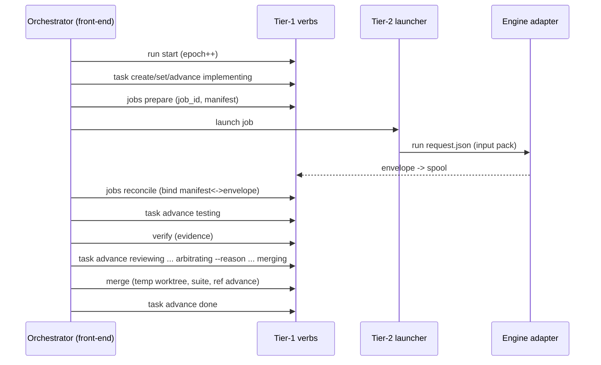

# Orchid — Kernel Specification

*Normative. One of four documents split from the design spec; see [2026-07-24-orchid-design.md](./2026-07-24-orchid-design.md) for the index and orientation.*

## Purpose

Orchid is a multi-agent orchestrator for people who hold subscriptions to
several AI coding CLIs and want them working together on large, long-running
tasks. **Roles — orchestrator, implementer, reviewer, arbiter, plan_critic,
and future custom roles — are pure configuration**; any engine whose declared
capabilities satisfy a role's requirements can hold it. The shipped defaults
reflect the author's subscriptions (Claude Code orchestrates/arbitrates,
Codex implements, Antigravity and a fresh Codex session review), but nothing
in the architecture privileges them.

Honestly stated, the kernel is a small **file-based workflow scheduler**:
deterministic CLI verbs plus stateless LLM ticks over git state. Design
principles: no daemon, no dashboard, no terminal emulation, no persistent
runtime process. Engines are driven through their first-party headless modes,
so billing stays on each vendor's subscription. All durable state is files in
git — sessions are disposable; the files are the truth.

**Platforms:** macOS and Linux (bash 3.2+, git, jq); Windows via WSL2.

## Architecture

Two locations; strict split between tooling (global) and run state (per
target repo).

### Tool repo layout

```
PROTOCOL.md                 # engine-neutral tick procedure — KERNEL-OWNED,
                            #   written in CLI verbs; plugins never edit it
skills/                     # the CLAUDE front-end for the orchestrator role —
  orchid/SKILL.md           #   one of several front-ends, not the architecture.
  orchid-plan/SKILL.md      #   Front-ends are a CONVENTION (anything that
  orchid-resume/SKILL.md    #   executes PROTOCOL.md via verbs), not a
  orchid-review/SKILL.md    #   discovered plugin kind. (review skill: v1)
bin/
  orchid                    # THE CLI: git-style dispatcher
libexec/                    # TIER 1 — deterministic verbs: state transitions
  orchid-doctor             #   only. Never invoke an LLM, never block on the
  orchid-init               #   network, never spawn long-lived processes.
  orchid-run                #   start/resume/advance/accept/new — epochs, runs
  orchid-task               #   create/show/list/set/advance/unblock/retry
  orchid-requirements       #   import (operator-owned exception)
  orchid-plan               #   apply/refresh-context (atomic transactions)
  orchid-verify             #   deterministic verification + evidence
  orchid-merge              #   transactional merge (never triggers reviews)
  orchid-jobs               #   prepare/check/reconcile (NOT launch — tier 2)
  orchid-plugins            #   list/validate/trust (v1-m1); lifecycle (v1-m3)
  orchid-journal            #   add/tail/show — decision journal
  orchid-lessons            #   add/update/retire/consolidate (v1)
  orchid-config             #   list effective config with per-key provenance
  orchid-status             #   task + run-level status; --explain prints WHY
                            #   the scheduler did/didn't act (blocked
                            #   predicates by name: waiting-for-independent-
                            #   reviewer, exclusive-overlap, rebase-pending,
                            #   lease-not-stale…) — the "why did nothing
                            #   happen?" surface
  orchid-notify             #   user questions out
  orchid-answer             #   user answers in (idempotent inbox)
runners/                    # TIER 2 — effectful: launch processes.
  orchid-launch             #   the kernel launcher: spawns engine adapters
  orchid-tick  orchid-pump  #   headless tick; LLM-free heartbeat (v1-m2)
plugins/                    # TIER 3 — the BUILT-IN plugin set, discovered via
  engines/codex/            #   the same path and contracts as third-party
  engines/agy/              #   plugins. Engine adapters write ONLY to the
  engines/claude/           #   runtime spool, never durable state.
  archetypes/feature/
templates/  install.sh  docs/specs/  docs/extending/  README.md  LICENSE
```

**The determinism boundary (hard rule, tier 1 only):** `libexec/` verbs are
deterministic plumbing — state transitions over files: no LLM calls, no
daemon, no database, no message routing, and — round-4 fix — **no spawning
of long-lived processes.** `orchid jobs launch` is therefore reclassified:
the CLI keeps the ergonomic entry point, but it delegates to the tier-2
launcher (`runners/orchid-launch`), and is documented as effectful. Tier-1
`orchid jobs` retains only `prepare` (mint job_id, write manifest), `check`,
and `reconcile`.

**The normative process model (who runs, who authorizes):**

1. A run has a monotonic **epoch**. `orchid run start|resume` (tier 1)
   increments the epoch, fences out stale processes, and records the
   orchestrating front-end.
2. The orchestrating engine is either operator-started (the interactive
   session — the ONE process the kernel does not launch; this privilege
   exception is explicit, and its authority derives from holding the
   current lease, not from how it was started) or kernel-launched by the
   pump (`orchid-tick`).
3. The orchestrator holds the **lease** (identity + epoch, refreshed per
   turn). Individual verb invocations are separate short-lived processes:
   each takes the mkdir lock for its own transaction and validates
   `ORCHID_EPOCH` (passed by the orchestrator, minted at `run
   start/resume`). A verb bearing a stale epoch refuses to run — fencing,
   so a zombie orchestrator from before a crash can never mutate state.
4. Engines are launched ONLY by the tier-2 launcher, which writes the
   manifest via tier-1 `jobs prepare` first. Engines never spawn engines.

**Single-writer rule with a complete ownership table** — every durable file
has exactly one writing verb; anything not listed is read-only for everyone:

| File | Sole writer (verb) |
|---|---|
| `tasks/*.md` | `orchid task create/set/advance/unblock/retry` |
| `roadmap.md` | `orchid plan apply` (atomic roadmap+tasks transaction), `orchid run advance/accept` (run_status) |
| `requirements.md` | `orchid requirements import <file>` — the operator-owned EXCEPTION: authored by hand anywhere, imported by verb, immutable after plan |
| `context.md` | `orchid plan apply` / `orchid plan refresh-context` |
| `journal.md` | `orchid journal add` (also auto-written by reason-bearing verbs) |
| `lessons.md` | `orchid lessons add/update/retire/consolidate` |
| `baseline.md` | `orchid init` |
| `reviews/*` | `orchid jobs reconcile` (envelopes), `orchid verify`/`orchid merge` (evidence), `orchid run accept` (acceptance) |
| `plugins.lock` | `orchid plugins lock` |
| `BLOCKERS.md` | `orchid notify` |

Task/run schemas are versioned (`schema: 1` in frontmatter) and include the
scheduling and budget fields the loop relies on: `exclusive`, `resources`,
`wallclock_budget_s`, `started_at`, `run_id`.

### Run state: `<target-repo>/.orchid/`

```
# committed (durable, on the integration branch only):
requirements.md  roadmap.md  baseline.md  context.md
tasks/T001.md ...           # frontmatter + body; state machine lives here
reviews/ ...                # envelopes (renamed from spool), verify/merge logs
journal.md                  # v0: append-only decision journal (see Memory)
lessons.md                  # v1: cross-run repo lessons (see Memory)
plugins.lock                # v1: resolved plugin identities for this run
                            #   (id, version, digest, source, contract,
                            #   capability-test result) — a run's behavior
                            #   never silently changes because a plugin did
BLOCKERS.md

# runtime/ (gitignored — machine-local, volatile):
lock/                       # mkdir lock; owner.json (pid, pid_start_time,
                            #   epoch, hostname, created_at). Breaking a lock
                            #   requires BOTH: owner not verifiably alive
                            #   (pid dead, OR pid_start_time mismatch — pid
                            #   reuse guard, OR foreign hostname) AND age >
                            #   60s past lease staleness measured from file
                            #   mtime (single clock; host-sleep gaps only
                            #   ever delay breaking, never hasten it).
                            #   Breaking is itself journaled.
lease.json                  # orchestrator heartbeat lease
jobs/<job_id>.json          # write-ahead manifests, keyed by JOB (not task):
                            #   parallel reviewers never collide
spool/                      # engine result envelopes awaiting reconciliation
engines.json                # availability ledger (per-machine quota state)
answers/  logs/
```

**Bootstrap (existing repo):** `orchid doctor` → `orchid init` creates the
integration branch from the default-branch HEAD and commits `.orchid/` there.
User branches are never touched. **Greenfield (v1):** `orchid-plan` makes a
root commit before any worktree exists (`git worktree add` needs a HEAD);
scaffolding is T001; `orchid doctor --greenfield` skips checks that cannot
apply pre-scaffold. **Scaffold verification:** tasks flagged
`archetype: feature, scaffold: true` may use structural assertions (files
exist, manifest parses, build command exits 0) as `verification_commands` —
resolving the bootstrap paradox of testing a test-runner that doesn't exist
yet.

**Worktree contamination guard:** task worktrees get `.orchid/` appended to
`.git/info/exclude`, implementer prompts forbid touching it, and
`orchid task advance` REFUSES entry to `testing` while any commit in
`base_sha..candidate_sha` touches `.orchid/` paths (the orchestrator strips
such commits and re-verifies). State corruption via task branches is
structurally impossible.

## The loop

The orchestrating session executes PROTOCOL.md under the run lock each tick:
reconcile spool → advance tasks → launch by ROLE via the resolver (never by
engine name) up to the concurrency cap (v0: 1; v1: 2 + scheduling rules) →
`orchid merge` at most one candidate → commit durable state → refresh lease
→ sleep with fallback wakeup. Events (background-task notifications) are an
optimization; reconciliation is the guarantee; the pump (v1) guarantees
ticks outlive the session.

**Scheduling rules (v1):** dependency-manifest tasks serialize; unknown test
environments run `testing`/`merging` serially; `exclusive: true` and
`resources:` declarations (ports, dbs) gate parallelism — worktrees isolate
git state only, never caches/ports/servers.

**Plan phase** (`orchid-plan`): draft roadmap from requirements → the
resolved `role.plan_critic` engine critiques (never the drafting engine) →
revise → loop. **Context pack:** `.orchid/context.md` created at plan time,
injected into every request document; static until explicit
`--refresh-context`.

## Preflight (`orchid doctor`)

Read-only; fails safely. Validates: git topology, worktree support, jq,
plugin discovery report (origin/trust/collisions), every `role.*` binding
resolving to a discovered plugin whose capabilities satisfy the role
descriptor (labeled `unverified` until the v1 capability suite passes it),
engine binaries/auth (cheap no-op probes derived from resolved adapters —
not a separate `engines=` list), explicit verification commands (or
`--greenfield`), integration branch creatable, platform supported.

## Task lifecycle

**Canonical transition table (the single source of state truth — also the
test oracle; per-round-Perplexity fix, all state logic previously spread
across prose sections is normative HERE):**

| From | Trigger verb | Preconditions | Writes | Next |
|---|---|---|---|---|
| pending | `task advance` | deps done; worktree created; base_sha set | frontmatter | implementing |
| implementing | `task advance` | implementer envelope `ok`; candidate_sha set; no commit touches `.orchid/` | frontmatter | testing |
| testing | `verify` PASS → `task advance` | evidence recorded | evidence log, frontmatter | reviewing |
| testing | `verify` FAIL → `task advance` | — (attempts++ unless `--waive-attempt --reason`) | frontmatter, journal | rework |
| reviewing | all required review envelopes reconciled → `task advance` | fail-closed envelope checks | frontmatter | arbitrating |
| arbitrating | `task advance --reason` (approve) | findings ≥ blocking_severity resolved | frontmatter, journal | merging |
| arbitrating | `task advance --reason` (reject) | attempts++ unless waived | frontmatter, journal | rework |
| merging | `merge` exit 0 → `task advance` | serialized; base current; temp-worktree suite green | integration ref, evidence, frontmatter | done |
| merging | `merge` exit 1 (`validation_failed`) → `task advance` | — | evidence, frontmatter | rework |
| merging | `merge` exit 5 (`rebase_rereview_required`) | rebase done, SHAs updated; reviews invalidated | frontmatter, journal(`rebase_review`) | testing |
| rework | `task advance` | rework spec written into task body | frontmatter | implementing |
| any | `task advance --reason` | ≤3 attempts exhausted / budget / operator | frontmatter, journal | blocked |
| blocked | `task unblock --reason` | guidance recorded | frontmatter, journal | rework |

Feature-archetype diagram (other archetypes declare row subsets within
kernel invariants):

```
pending → implementing → testing → reviewing → arbitrating → merging → done
                ↑            │         │            │
                └── rework (≤3) ───────┴────────────┤
                                                    └→ blocked
```

- **testing** = `orchid verify <id>`: runs `verification_commands` in the
  task worktree; records evidence (command, cwd, SHA, timestamps, exit
  codes, log digest). Sole acceptance authority for tests.
- **merging** = `orchid merge <id>`: serialized, transactional, and — round-4
  determinism fix — NEVER triggers reviews itself. If integration HEAD ≠
  `base_sha`, the verb performs the rebase, then exits
  `rebase_rereview_required` (code 5), resetting the task to `testing` with
  updated SHAs. The TICK then relaunches verify and reviews (delta review:
  reviewers receive the range-diff and new base; full re-review if
  non-trivial — the classification is the orchestrator's, journaled with
  kind `rebase_review`). A rebased candidate is UNCONDITIONALLY re-verified;
  a textually clean rebase is not semantically safe against parallel
  changes. On a current base: merge in a temp worktree, run the suite,
  advance the integration ref on pass; `validation_failed` returns that
  exact candidate to rework with logs. **v0 baseline semantics:** the suite
  must pass, full stop; `baseline.md` records pre-existing failures for
  humans. Baseline-aware comparison is post-v1.
- **Attempt fairness (tier-boundary clean):** `orchid task advance` to
  rework increments `attempts` BY DEFAULT — the deterministic verb never
  judges semantics. The orchestrator may pass `--waive-attempt --reason`
  when the failure signature is disjoint from the prior attempt's (distinct
  forward progress); the waiver is a journaled decision (kind
  `attempt_waiver`). The ≤3 cap targets repeated identical failures; the
  per-task wall-clock budget is the unconditional backstop.
  `infra_failures` NEVER consume attempts.

Frontmatter (`schema: 1`): `id, title, status, archetype, scaffold, branch,
worktree, run_id, depends_on, attempts, infra_failures, session_id,
implementer_engine_id, base_sha, candidate_sha, risk_tier,
blocking_severity, stop_condition, engine, effort, acceptance_criteria,
verification_commands, resources, exclusive, wallclock_budget_s,
started_at, created, updated`.

**Review immutability:** reviewers inspect exactly `base_sha..candidate_sha`;
any candidate change invalidates reviews (see rebase rule). Incomplete or
malformed review NEVER counts as approval.

**Risk is two separate fields (round-4 fix — `risk_threshold` was doing
contradictory double duty):** `risk_tier: low|medium|high` drives review
ROUTING and independence requirements, monotonic (upgradable, never
downgradable, `--reason` required); `blocking_severity` (default derived:
low tier → high-severity findings block; medium/high tier → medium+ block)
drives which findings block. High-risk tasks therefore block on MORE
findings, never fewer.

**Independence:** *session independence* (fresh session, same engine) vs
*engine independence* (different vendor), enforced by the resolver against
the task's recorded `implementer_engine_id`. Routing: `low` → single
engine-independent reviewer (default agy inline); if NO engine-independent
reviewer is available, the resolver falls back to session independence
LABELED AND JOURNALED as such — never silently. `medium`/`high` → dual
review (worktree-capable for depth + engine-independent for diversity).
Two-engine installs are "degraded independence": medium accepts labeled
session independence; high queues for engine independence.
**Inline-review blind-spot guard:** inline prompts include the pack
manifest AND the changed-symbol list; routing upgrades to a
worktree-capable reviewer when changed symbols are referenced in un-diffed
files.

**Arbitration:** findings below the task's risk threshold never block;
reviewer agreement is strong signal; on disagreement the orchestrator reads
the diff and decides. The orchestrator implements nothing beyond ≤ ~10-line
arbitration trivia.

**Acceptance:** requirement IDs at plan time; roadmap keeps the
requirement→task coverage map; run-level status lives in roadmap frontmatter
(`run_status: planning|running|accepting|complete|blocked`); the final
acceptance gate (coverage check + end-to-end acceptance tests) writes an
evidence record to `reviews/acceptance.log` before `run_status: complete`.
`orchid status` shows task table, jobs, open questions, AND run-level state.

## Sequence: happy path (one task)


## Sequence: crash → resume → reconcile → fence
```mermaid
sequenceDiagram
  participant O2 as New orchestrator
  participant K as Tier-1 verbs
  participant Z as Zombie process (old epoch)
  O2->>K: run resume (break stale lock if owner dead; epoch++)
  O2->>K: jobs check (identify dead/live by pgid+start-time)
  O2->>K: jobs reconcile (quarantine mismatches)
  Z--xK: any verb with stale ORCHID_EPOCH -> REFUSED (INV-02)
  O2->>K: status -> active set -> decision capsules
  O2->>O2: tick normally
```

## Memory & resumption

Orchid has memories, deliberately not thoughts. Durable files carry every
fact needed to resume or hand off; in-flight LLM reasoning dies with its
session BY DESIGN — stateless ticks re-derive judgment from durable facts,
which is precisely what lets a different engine (or a fresh session) pick up
mid-run: facts and decisions transfer between models; chains of thought do
not. (A session MAY keep scratch notes under `runtime/scratch/<session>/`;
they are garbage on resume — no successor ever reads them. Engine trajectory
logs are retained as diagnostics for humans, never re-fed to models.)

### The decision journal (`journal.md`, v0)

Append-only, one entry per decision, written ONLY via the verb:

```
orchid journal add --task T007 --kind arbitration \
  --by "claude/orchestrator s-9f2" \
  "Approved over agy's request-changes: the flagged race is unreachable —
   writes serialize on the run lock (libexec/orchid-task:41). Codex-review
   concurred. Findings below medium ignored per risk_threshold."
```

renders as:

```markdown
## 2026-07-25T14:02:11Z T007 arbitration (claude/orchestrator s-9f2)
Approved over agy's request-changes: the flagged race is unreachable — ...
```

- **Entry kinds (closed set):** `arbitration` (BOTH outcomes), `risk_change`,
  `attempt_waiver`, `kill` (spinning/stall, dead-end named), `blocker`,
  `blocker_resolved`, `rebase_review` (delta-vs-full classification),
  `plan_revision`, `acceptance`, `intervention` (operator verbs log
  automatically), `lesson` (mirrored to `lessons.md`).
- **Enforcement is a complete decision matrix, kernel-level:** every
  judgment-bearing verb refuses to run without `--reason`, which it writes
  atomically with the state change — `task advance` to `merging`, `blocked`,
  and `rework`-from-`arbitrating` (both arbitration outcomes recorded);
  `task set risk_tier` (monotonicity enforced separately from prose);
  `--waive-attempt`; `task unblock/retry`; `run accept`;
  `lessons retire`. Actor identity (`engine/role/session`), run, epoch,
  job, and SHAs are derived from KERNEL context — never caller-supplied, so
  the audit trail is not forgeable. A decision without a recorded why is
  structurally impossible.
- **Read surface:** `orchid journal tail [-n N]`,
  `orchid journal show --task T007` (that task's full decision history).
  Entries are prose for successors and humans; NEVER parsed for control
  flow — the state machine remains the only authority.

### Cross-run lessons (`lessons.md`, v1)

A lesson is a durable repo truth worth remembering across runs: a flaky
test, an unstated convention, a build quirk, an engine-specific weakness
("codex ignores the barrel-file rule in this repo").

- **Structure (round-4 fix — prose lines can't be safely maintained):**
  each lesson has a stable ID and fields: `scope` (repo | plugin/model
  identity for engine-specific lessons, which EXPIRE with the engine
  version), statement, evidence pointers (task/journal refs),
  first/last-confirmed dates, invalidation condition, and state
  (`active | superseded | retired`).
- **Birth:** PROTOCOL directs the orchestrator to consider a lesson at
  exactly three moments — a rework caused by something `context.md` failed
  to state; a recurring REPO-behavior flake (test/build — vendor
  infrastructure blips belong in the availability ledger, never in
  lessons); an arbitration that turned on repo knowledge no file contained.
- **Verbs:** `orchid lessons add/update/retire/consolidate` — deterministic,
  journaled (retire requires `--reason`). Caps by bytes/items, not lines.
  At plan phase: prune falsified, consolidate overlaps, and PROMOTE lessons
  that have become encoded in code/docs into `context.md` (then retire them
  — a truth the repo now states is context, not a lesson).
- **Across runs:** `orchid run new` archives the previous run's tasks,
  reviews, and journal under `runs/<run_id>/` and carries forward ONLY
  `context.md` + ACTIVE lessons — the defined inheritance boundary.
- **Distinct from `context.md`:** context is what the repo IS (regenerable
  from the code); lessons are what the code CANNOT tell you (learned the
  hard way).

### The prose firewall (stated sharply, per Perplexity round 5)

No control decision may depend on free-form text unless a deterministic verb
has first translated it into structured state — memory artifacts inform
judgment; only frontmatter, envelopes, and manifests drive the machine.
Artifact purposes, exclusively: `context.md` = stable repo facts;
`lessons.md` = cross-run heuristics; `journal.md` = irreversible decisions +
rationale; task body = current execution instructions only. A memory file
drifting toward a second scheduling system is a design bug.

### Per-role memory injection (what each engine call receives)

Assembled by the kernel into every request document, under a byte budget —
recipients get what their judgment needs, nothing more:

| Role | Receives |
|---|---|
| implementer | context.md + lessons.md + task body (incl. its OWN rework history and named dead-ends) |
| reviewer | context.md + lessons.md + diff/manifest + acceptance criteria + stop condition (never other tasks' state) |
| arbiter | both review envelopes + this task's journal history + diff on demand |
| plan_critic | requirements + draft roadmap + lessons.md |
| orchestrator (tick) | status + active task files + decision capsules + journal tail + lessons.md (it owns lessons hygiene) + open answers |

### Resumption procedure (reconcile FIRST, then bounded snapshot)

Round-4 ordering fix: reading memories before reconciling jobs lets a
just-finished job invalidate the snapshot. `orchid-resume`:
1. acquire lock, fence epoch (`orchid run resume`);
2. `orchid jobs check` + `orchid jobs reconcile` (quarantine included);
3. `orchid status` — NOW compute the active set from reconciled reality;
4. per active task: task file (full, non-truncatable) + its **decision
   capsule** — the kernel maintains `runtime/journal-index/<task>` (open
   decisions + last N entries per task, updated on every journal write), so
   task-scoped judgment is O(capsule), never a scan of the monolithic
   journal;
5. `journal tail -n 20` + `context.md` + active `lessons.md` — all under
   the same explicit byte budgets as request packs;
6. tick normally.
The same procedure serves crash recovery, engine failover (a codex tick
inherits a claude tick's decisions with rationale), and cold-start weeks
later. The append-only journal remains the audit truth; the index is a
derived cache, rebuildable from it.

## Stuck-agent detection

| Mode | Defense |
|---|---|
| Dead | pgid + start-time liveness per `orchid jobs check` |
| Hung | stall: log mtime/size frozen ~10 min → kill, retry |
| Blocked on prompt | structurally impossible: launcher stdin `/dev/null` + `approval_policy=never` + never-prompt flags |
| Spinning | deterministic FIRST, with a false-positive guard: duplicate-line checks apply to the ADAPTER's own output, use a sliding window (≥5 min identical lines AND no CPU/disk delta AND no new commits) — build tools legitimately repeat progress lines and are never judged by line content alone; LLM log-tail judgment is the ESCALATION tier |

Write-ahead manifests keyed by job_id (task, attempt, role, engine id +
digest, pgid, start-time, session_id, worktree, base_sha, log) with child
handshake marker; reconciliation never trusts notifications; escalation
ladder bounded by wall-clock budget; orchestrator token cost stays flat.

## Guardrails & failure handling

- Engine calls: deadline in the request (default 60 min), envelope checks,
  one auto-retry, then `infra_failures++` or rework per Attempt fairness;
  3 rework attempts → `blocked`; repeated infra failures → engine marked
  unavailable, task re-queued.
- Rate limits: ledger-marked; task re-queues untouched; dispatch falls to
  the secondary (v1) or waits (v0). A window pauses an engine, never work.
- Runaway: rework cap, concurrency cap, reviewer stop-conditions, per-task
  wall-clock budget.
- Blockers: `BLOCKERS.md` + `orchid notify`. **Operator verbs:** `orchid
  task unblock <id> [--guidance "..."]` and `orchid task retry <id>` —
  validated transitions, guidance recorded into the task body, intervention
  logged in the audit trail. No hand-editing needed, ever.
- Crash/restart: `orchid-resume` = doctor → break stale lock if owner dead →
  reconcile manifests/spool. Never re-adopt ambiguous processes: job
  identity is job_id + pgid + start-time; unidentifiable → confirm
  termination, relaunch cleanly. Session resume is an optimization.

## Execution policy (the autonomy boundary)

Per enabled role×engine pair, enforced by the kernel launcher (env
allowlist, stdin `/dev/null`, private output path) plus vendor-CLI sandbox
flags: implementer worktree-write + `approval_policy=never` + no secrets +
network only in declared install phases; reviewers read-only; orchestrator
repo+`.orchid/` scope. **External mutations prohibited in v0/v1** (no push,
deploy, publish, prod-data) — blockers instead. `orchid.config` and
`plugin.conf` are parsed data, never sourced.

## Glossary (one sentence each; forbidden confusions marked ✗)

- **Engine** — a vendor AI accessed through an adapter plugin. ✗ not a role.
- **Role** — a named job (orchestrator/implementer/reviewer/arbiter/
  plan_critic/custom) bound to engines by config. ✗ not an engine.
- **Adapter** — the executable translating one engine into the
  request/envelope contract.
- **Front-end** — whatever drives the orchestrator role interactively
  (Claude skill, tick, future TUI). ✗ not a discovered plugin kind.
- **Runner** — tier-2 effectful launcher (launch/tick/pump). ✗ not a verb.
- **Verb** — a tier-1 deterministic state transition. ✗ never spawns
  long-lived processes.
- **Tick** — ONE bounded execution of PROTOCOL.md. ✗ not a durable process.
- **Job** — one kernel-minted engine invocation (job_id). ✗ not an attempt.
- **Attempt** — the logical rework counter on a task.
- **Envelope / Request / Input pack** — result contract / invocation
  contract / materialized per-job memory.
- **Archetype** — a declared workflow shape (transition-table subset +
  templates). ✗ not code.
- **Run / Epoch / Lease** — one requirements-to-acceptance cycle / fencing
  counter / orchestrator ownership heartbeat.

## Kernel guarantees / non-guarantees

**Guaranteed:** single writer per durable file; validated transitions only;
epoch-fenced mutation; envelopes bound to launches (quarantine otherwise);
tests pass only via `orchid verify`; unreviewed trees never merge; engines
never spawn engines; a decision without a journaled reason cannot occur on
reason-bearing verbs; crash loses at most the current uncommitted tick.
**NOT guaranteed:** plugin containment (plugins are trusted code);
engine output quality (reviews/arbitration mitigate, never prove);
wall-clock progress when required engines are unavailable (work queues);
semantic correctness beyond declared verification commands.

## Conformance invariants (the executable contract; tests carry these IDs)

- INV-01 no tier-1 verb spawns a long-lived process
- INV-02 a stale epoch cannot mutate durable state
- INV-03 envelope mismatch/replay/oversize → quarantine, never acceptance
- INV-04 a commit touching `.orchid/` blocks entry to `testing`
- INV-05 kernel code never branches on a plugin's name
- INV-06 no engine process is spawned except by the tier-2 launcher
- INV-07 a candidate whose SHA changed cannot merge without re-verify +
  re-review (rebase included)
- INV-08 reason-bearing transitions fail without `--reason`; actor identity
  is kernel-derived
- INV-09 repo-local plugins never execute without an out-of-repo trust
  record
- INV-10 duplicate plugin IDs are an error, never a shadow
- INV-11 `verify` evidence is the only path to a passing `testing` state
- INV-12 non-truncatable inputs over budget fail with `input_overflow`,
  never silently truncate
