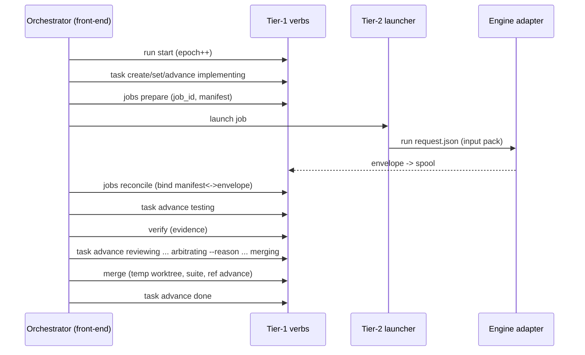

# Orchid — Kernel Specification

*Normative. One of four documents split from the design spec; see [2026-07-24-orchid-design.md](./2026-07-24-orchid-design.md) for the index and orientation.*

## Purpose

Orchid is a multi-agent orchestrator for people who hold subscriptions to
several AI coding CLIs and want them working together on large, long-running
tasks. **Roles — orchestrator, implementer, reviewer, arbiter, plan_critic,
and future custom roles — are pure configuration**; any engine whose declared
capabilities satisfy a role's requirements can hold it. The shipped defaults
reflect the author's subscriptions (Claude Code orchestrates/arbitrates,
Codex implements, Antigravity and a fresh Codex session review), but nothing
in the architecture privileges them.

Honestly stated, the kernel is a small **file-based workflow scheduler**:
deterministic CLI verbs plus stateless LLM ticks over git state. Design
principles: no daemon, no dashboard, no terminal emulation, no persistent
runtime process. Engines are driven through their first-party headless modes,
so billing stays on each vendor's subscription. All durable state is files in
git — sessions are disposable; the files are the truth.

**Platforms:** macOS and Linux (bash 3.2+, git, jq); Windows via WSL2.

## Architecture

Two locations; strict split between tooling (global) and run state (per
target repo).

### Tool repo layout

```
PROTOCOL.md                 # engine-neutral tick procedure — KERNEL-OWNED,
                            #   written in CLI verbs; plugins never edit it
skills/                     # the CLAUDE front-end for the orchestrator role —
  orchid/SKILL.md           #   one of several front-ends, not the architecture.
  orchid-plan/SKILL.md      #   Front-ends are a CONVENTION (anything that
  orchid-resume/SKILL.md    #   executes PROTOCOL.md via verbs), not a
  orchid-review/SKILL.md    #   discovered plugin kind. (review skill: v1)
bin/
  orchid                    # THE CLI: git-style dispatcher
libexec/                    # TIER 1 — deterministic verbs: state transitions
  orchid-doctor             #   only. Never invoke an LLM, never block on the
  orchid-init               #   network, never spawn long-lived processes.
  orchid-start              #   one-command existing-repo setup (v1.1): it only
                            #   SEQUENCES doctor/init/worktree/requirements
                            #   import, refusing with an exact recovery
                            #   anything it cannot do safely; every verb it
                            #   composes stays callable on its own
  orchid-run                #   start/resume/advance/accept/new — epochs, runs
  orchid-task               #   create/show/list/set/advance/unblock/retry
  orchid-requirements       #   import (operator-owned exception)
  orchid-plan               #   apply/refresh-context (atomic transactions)
  orchid-verify             #   deterministic verification + evidence
  orchid-merge              #   transactional merge (never triggers reviews)
  orchid-jobs               #   prepare/check/reconcile (NOT launch — tier 2)
  orchid-plugins            #   list/validate/trust (v1-m1); lifecycle (v1-m3)
  orchid-journal            #   add/tail/show — decision journal
  orchid-lessons            #   add/update/retire/consolidate (v1)
  orchid-config             #   list effective config with per-key provenance;
                            #   commit <reason> (v1-m4 — SHIPPED): the safe
                            #   operator path for landing an orchid.config
                            #   edit onto the integration branch, via the same
                            #   temp-worktree CAS transaction as plan apply
  orchid-status             #   task + run-level status; --explain prints WHY
                            #   the scheduler did/didn't act (blocked
                            #   predicates by name: waiting-for-independent-
                            #   reviewer, exclusive-overlap, rebase-pending,
                            #   lease-not-stale…) — the "why did nothing
                            #   happen?" surface
  orchid-notify             #   user questions out
  orchid-answer             #   user answers in (idempotent inbox)
  orchid-trust              #   unattended <repo>/show/revoke — the machine-
                            #   local acknowledgement the headless seats
                            #   require; never inferred, never in-repo
  orchid-version            #   prints the installed version
  orchid-drive              #   bare TIER HANDOFFS: argument-free dispatch to
  orchid-service            #   runners/orchid-drive and runners/orchid-service
                            #   respectively. Both are directly executable
                            #   entry surfaces, so each resolves its own
                            #   installed location rather than trusting an
                            #   inherited ORCHID_ROOT. The effectful work
                            #   (long-lived processes, launchd/crontab) lives
                            #   in tier 2, which is why these two are handoffs
                            #   and not implementations.
runners/                    # TIER 2 — effectful: launch processes.
  orchid-launch             #   the kernel launcher: spawns engine adapters
  orchid-tick  orchid-pump  #   headless tick; LLM-free heartbeat
                            #   (v1-m2 — SHIPPED); the pump also drains the
                            #   notify outbox each pass (v1-m4 — SHIPPED)
  orchid-service            #   install/uninstall/status: schedules the pump
                            #   via the host's own scheduler (launchd/cron)
                            #   (v1-m4 — SHIPPED)
plugins/                    # TIER 3 — the BUILT-IN plugin set, discovered via
  engines/codex/            #   the same path and contracts as third-party
  engines/agy/              #   plugins. Engine adapters write ONLY to the
  engines/claude/           #   runtime spool, never durable state.
  archetypes/feature/
templates/  install.sh  docs/specs/  docs/extending/  README.md  LICENSE
```

**The determinism boundary (hard rule, tier 1 only):** `libexec/` verbs are
deterministic plumbing — state transitions over files: no LLM calls, no
daemon, no database, no message routing, and — round-4 fix — **no spawning
of long-lived processes.** `orchid jobs launch` is therefore reclassified:
the CLI keeps the ergonomic entry point, but it delegates to the tier-2
launcher (`runners/orchid-launch`), and is documented as effectful. Tier-1
`orchid jobs` retains only `prepare` (mint job_id, write manifest), `check`,
and `reconcile`.

**The normative process model (who runs, who authorizes):**

1. A run has a monotonic **epoch**. `orchid run start|resume` (tier 1)
   increments the epoch, fences out stale processes, and records the
   orchestrating front-end.
2. The orchestrating engine is either operator-started (the interactive
   session — the ONE process the kernel does not launch; this privilege
   exception is explicit, and its authority derives from holding the
   current lease, not from how it was started) or kernel-launched by the
   pump (`orchid-tick`).
3. The orchestrator holds the **lease** (identity + epoch, refreshed per
   turn). `orchid run release-lease` (v1-m4 — SHIPPED, epoch-fenced): the
   clean-session-exit affordance, called at the end of PROTOCOL.md's
   COMPLETION — writes `released: true` into `lease.json`, which both `run
   new`'s freshness guard and the pump's staleness check treat as
   immediately stale regardless of `refreshed_at`'s own age, closing the
   incident where a session's own final tick otherwise left `run new`/the
   pump blocked for up to `pump_stale_s`. `orchid run start|resume` takes the mkdir lock only transiently —
   just long enough to fence a new epoch and refresh the lease — it does
   not hold the lock for the run's duration. Individual verb invocations
   are separate short-lived processes: each validates `ORCHID_EPOCH`
   (passed by the orchestrator, minted at `run start/resume`). In v0,
   mutating verbs are fenced by epoch, not serialized by a lock, and rely
   on a single orchestrator running at a time; a verb bearing a stale
   epoch refuses to run — fencing, so a zombie orchestrator from before a
   crash can never mutate state. Per-verb transactional locking (each verb
   taking its own lock for its own transaction) is a Plan B deliverable,
   arriving alongside the tick loop.
4. Every engine launch site implemented by Orchid lives in a tier-2 runner,
   which writes the manifest via tier-1 `jobs prepare` first. This is a
   source-level topology invariant, not a jail around a shell-capable engine
   process.

**Single-writer rule with a complete ownership table** — every durable file
has exactly one writing verb; anything not listed is read-only for everyone:

| File | Sole writer (verb) |
|---|---|
| `tasks/*.md` | `orchid task create/set/advance/unblock/retry/handoff` |
| `roadmap.md` | `orchid plan apply` (atomic roadmap+tasks transaction), `orchid run advance/accept` (run_status) |
| `requirements.md` | `orchid requirements import <file>` — the operator-owned EXCEPTION: authored by hand anywhere, imported by verb, immutable after plan |
| `orchid.config` (as committed on the integration branch) | `orchid config commit --reason "..."` (v1-m4 — SHIPPED) — operator-owned like `requirements.md`: authored by hand anywhere, but landed onto the integration branch only through this verb, never a direct hand-commit into a (possibly stale) checkout |
| `context.md` | `orchid plan apply` / `orchid plan refresh-context` |
| `journal.md` | `orchid journal add` (also auto-written by reason-bearing verbs) |
| `lessons.md` | `orchid lessons add/update/retire/consolidate` |
| `baseline.md` | `orchid init` |
| `reviews/*` | `orchid jobs reconcile` (envelopes, including hook-point envelopes filed as `<task>-a<n>-hook-<point>.json`, and the plan-critique envelopes filed as `plan-a<n>-plan_critic.json`), `orchid verify`/`orchid merge` (evidence), `orchid run accept` (acceptance) |
| `plugins.lock` | `orchid plugins lock` |
| `BLOCKERS.md` | `orchid notify` |
| `runs/<run_id>/` | `orchid run new` (archival move of the just-finished run's `tasks/`, `reviews/`, `journal.md`, `roadmap.md`, `BLOCKERS.md` — written once, at rollover, never touched again) |

Task/run schemas are versioned (`schema: 1` in frontmatter) and include the
scheduling and budget fields the loop relies on: `exclusive`, `resources`,
`wallclock_budget_s`, `started_at`, `run_id`. `started_at` is re-stamped on
every dispatch (pending/rework into an active status), so
`wallclock_budget_s` bounds the current ATTEMPT rather than calendar time
since the task's first dispatch — see PROTOCOL.md's `budget-exceeded` bullet.

### Run state: `<target-repo>/.orchid/`

```
# committed (durable, on the integration branch only):
requirements.md  roadmap.md  baseline.md  context.md
tasks/T001.md ...           # frontmatter + body; state machine lives here
reviews/ ...                # envelopes (renamed from spool), verify/merge logs
journal.md                  # v0: append-only decision journal (see Memory)
lessons.md                  # v1: cross-run repo lessons (see Memory)
plugins.lock                # v1: resolved plugin identities for this run
                            #   (id, version, digest, source, contract,
                            #   capability-test result) — a run's behavior
                            #   never silently changes because a plugin did
BLOCKERS.md

# runtime/ (gitignored — machine-local, volatile):
lock/                       # mkdir lock; owner.json (pid, pid_start_time,
                            #   epoch, hostname, created_at). Breaking a lock
                            #   requires BOTH: owner not verifiably alive
                            #   (pid dead, OR pid_start_time mismatch — pid
                            #   reuse guard, OR foreign hostname) AND age >
                            #   60s past lease staleness measured from file
                            #   mtime (single clock; host-sleep gaps only
                            #   ever delay breaking, never hasten it).
                            #   Breaking is itself journaled.
lease.json                  # orchestrator heartbeat lease
jobs/<job_id>.json          # write-ahead manifests, keyed by JOB (not task):
                            #   parallel reviewers never collide
spool/                      # engine result envelopes awaiting reconciliation
engines.json                # availability ledger (per-machine quota state)
answers/  logs/
```

**Bootstrap (existing repo):** `orchid doctor` → `orchid init` creates the
integration branch from the default-branch HEAD and commits `.orchid/` there.
User branches are never touched. **Greenfield (v1):** `orchid init --greenfield`
makes a root commit before any worktree exists (`git worktree add` needs a HEAD);
scaffolding is T001; `orchid doctor --greenfield` skips checks that cannot
apply pre-scaffold. **Scaffold verification:** tasks flagged
`archetype: feature, scaffold: true` may use structural assertions (files
exist, manifest parses, build command exits 0) as `verification_commands` —
resolving the bootstrap paradox of testing a test-runner that doesn't exist
yet.

**Worktree contamination guard:** task worktrees get `.orchid/` appended to
`.git/info/exclude`, implementer prompts forbid touching it, and
`orchid task advance` REFUSES entry to `testing` while any commit in
`base_sha..candidate_sha` touches `.orchid/` paths (the orchestrator strips
such commits and re-verifies). Thus a candidate containing a committed
`.orchid/` change cannot cross this kernel transition; this does not claim
general filesystem containment of the engine process.

## The loop

The orchestrating session executes PROTOCOL.md under the run lock each tick:
reconcile spool → advance tasks → launch by ROLE via the resolver (never by
engine name) up to the concurrency cap (v0: 1; v1-m2 — SHIPPED: 2 +
scheduling rules, `lib/schedule.sh`) → `orchid merge` at most one candidate →
commit durable state → refresh lease → sleep with fallback wakeup. Events
(background-task notifications) are an optimization; reconciliation is the
guarantee; the pump (`runners/orchid-pump`, v1-m2 — SHIPPED) guarantees
ticks outlive the session.

**Scheduling rules (v1-m2 — SHIPPED):** `lib/schedule.sh`'s
`schedule_dispatch_blockers`, the single home for the predicate set,
enforced by `orchid task advance` on dispatch and surfaced read-only by
`orchid status --explain`: dependency-manifest tasks serialize
(`waiting-deps`) — `depends_on` separates ids by **comma or whitespace**, and
`orchid task set <id> depends_on <value>` refuses at write time any id with no
task file, because an unsatisfiable id is otherwise reported as an ordinary
`waiting-deps (<id>)` and reads like a task correctly waiting its turn; the
concurrency cap gates how many tasks may be active at
once (`concurrency-cap`); `exclusive: true` and `resources:` declarations
(ports, dbs) gate parallelism (`exclusive-overlap`, `resource-conflict`) —
worktrees isolate git state only, never caches/ports/servers; unknown test
environments still run `testing`/`merging` serially within a single tick
regardless of the cap (PROTOCOL.md's Preamble).

**Plan phase** (`orchid-plan`): draft roadmap from requirements → the
resolved `role.plan_critic` engine critiques (never the drafting engine) →
revise → loop. **Context pack:** `.orchid/context.md` created at plan time,
injected into every request document; static until explicit
`--refresh-context`.

## Preflight (`orchid doctor`)

Read-only; fails safely. Validates: git topology, worktree support, jq,
plugin discovery report (origin/trust/collisions), every `role.*` binding
resolving to a discovered plugin whose capabilities satisfy the role
descriptor (labeled `unverified` until the v1 capability suite passes it),
engine binaries/auth (cheap no-op probes derived from resolved adapters —
not a separate `engines=` list), explicit verification commands (or
`--greenfield`), integration branch creatable, platform supported.

## Task lifecycle

**Canonical transition table (the single source of state truth — also the
test oracle; per-round-Perplexity fix, all state logic previously spread
across prose sections is normative HERE):**

| From | Trigger verb | Preconditions | Writes | Next |
|---|---|---|---|---|
| pending | `task advance` | deps done; worktree created; base_sha set | frontmatter | implementing |
| implementing | `task advance` | implementer envelope `ok`; candidate_sha set; no commit touches `.orchid/` | frontmatter | testing |
| testing | `verify` PASS → `task advance` | evidence recorded | evidence log, frontmatter | reviewing |
| testing | `verify` FAIL → `task advance` | — (attempts++ unless `--waive-attempt --reason`) | frontmatter, journal | rework |
| reviewing | all required review envelopes reconciled → `task advance` | fail-closed envelope checks | frontmatter | arbitrating |
| arbitrating | `task advance --reason` (approve) | findings ≥ blocking_severity resolved | frontmatter, journal | merging |
| arbitrating | `task advance --reason` (reject) | attempts++ unless waived | frontmatter, journal | rework |
| merging | `merge` exit 0 → `task advance` | serialized; base current; temp-worktree suite green | integration ref, evidence, frontmatter | done |
| merging | `merge` exit 1 (`validation_failed`) → `task advance` | — | evidence, frontmatter | rework |
| merging | `merge` exit 5 (`rebase_rereview_required`) | rebase done, SHAs updated; reviews invalidated | frontmatter, journal(`rebase_review`) | testing |
| rework | `task advance` | rework spec written into task body | frontmatter | implementing |
| any | `task advance --reason` | ≤3 attempts exhausted / budget / operator | frontmatter, journal | blocked |
| blocked | `task unblock --reason` | guidance recorded | frontmatter, journal | rework |

**Enforcement ownership of the preconditions above:** preconditions marked
deps/worktree/SHAs (deps done, worktree created, base_sha/candidate_sha set)
are ORCHESTRATOR-enforced in v0 — the orchestrator decides when they hold and
supplies the values; the kernel itself enforces legality of the transition
graph, `--reason` presence on reason-bearing edges, risk-tier monotonicity,
the `.orchid/` worktree-contamination guard, evidence recorded (passing
verify log) as the sole gate on `testing` → `reviewing`, and — closing the
last conditional gap — refuses entry to `testing` outright when `base_sha` or
`candidate_sha` is unset, rather than silently skipping the `.orchid/` check.

Feature-archetype diagram (other archetypes declare row subsets within
kernel invariants):

```
pending → implementing → testing → reviewing → arbitrating → merging → done
                ↑            │         │            │
                └── rework (≤3) ───────┴────────────┤
                                                    └→ blocked
```

- **testing** = `orchid verify <id>`: runs `verification_commands` in the
  task worktree; records evidence (command, cwd, SHA, timestamps, exit
  codes, log digest). Sole acceptance authority for tests.
- **merging** = `orchid merge <id>`: serialized, transactional, and — round-4
  determinism fix — NEVER triggers reviews itself. If integration HEAD ≠
  `base_sha`, the verb performs the rebase, then exits
  `rebase_rereview_required` (code 5), resetting the task to `testing` with
  updated SHAs. The TICK then relaunches verify and reviews (delta review:
  reviewers receive the range-diff and new base; full re-review if
  non-trivial — the classification is the orchestrator's, journaled with
  kind `rebase_review`). A rebased candidate is UNCONDITIONALLY re-verified;
  a textually clean rebase is not semantically safe against parallel
  changes. On a current base: merge in a temp worktree, run the suite,
  advance the integration ref on pass; `validation_failed` returns that
  exact candidate to rework with logs. **v0 baseline semantics:** the suite
  must pass, full stop; `baseline.md` records pre-existing failures for
  humans. Baseline-aware comparison is post-v1.
  **Consequences of the ref-only advance (m3 ledger, found live):** the
  integration-ref advance above is a bare `git update-ref` — it never touches
  any OTHER checkout of that branch, by design, since it must not write into
  a working tree it does not own. A long-lived checkout of the integration
  branch left open across a merge keeps a stale index/tree, and that has two
  distinct consequences, both now guarded:
  - Committing directly from that stale checkout silently REVERTS the
    just-merged work (the commit's parent is still the pre-merge SHA).
    `orchid doctor` FAILs and `orchid status` warns on the staged-deletion
    signature (`orchid_stale_checkout`), and `orchid config commit` is the
    safe operator path for the one file that legitimately needs committing
    from there.
  - If orchid ITSELF is being run out of that checkout — `bin/orchid`
    resolves `ORCHID_ROOT` from its own location, so the verbs, libs,
    runners and engine adapters all come from its working tree — the run is
    driven by PRE-MERGE code indefinitely while every merge reports success
    (lesson L018, observed live for a full day). Every verb therefore
    REFUSES to run when `ORCHID_ROOT` is a checkout parked on the
    integration branch whose kernel directories do not match HEAD
    (`orchid_root_stale`, enforced at `lib/common.sh` source time).
    Deliberately narrow: a development checkout on any other branch is never
    asked, however dirty, and `.orchid/` is neither inspected nor touched, so
    uncommitted durable run state is never a refusal and never at risk.
  The refresh both point at is `git checkout HEAD -- . ':(exclude).orchid'` —
  never a bare `git checkout HEAD -- .`, which would clobber uncommitted
  `.orchid/` run state.
- **Attempt fairness (tier-boundary clean):** `orchid task advance` to
  rework increments `attempts` BY DEFAULT — the deterministic verb never
  judges semantics. The orchestrator may pass `--waive-attempt --reason`
  when the failure signature is disjoint from the prior attempt's (distinct
  forward progress); the waiver is a journaled decision (kind
  `attempt_waiver`). The ≤3 cap targets repeated identical failures; the
  per-task wall-clock budget is the unconditional backstop.
  `infra_failures` NEVER consume attempts.

Frontmatter (`schema: 1`): `id, title, status, archetype, scaffold, branch,
worktree, run_id, depends_on, attempts, infra_failures, session_id,
implementer_engine_id, base_sha, candidate_sha, risk_tier,
blocking_severity, stop_condition, hook_guidance, handoff_ack, engine, effort,
acceptance_criteria, verification_commands, resources, exclusive,
wallclock_budget_s, started_at, created, updated`. `handoff_ack` (v1.1):
kernel-owned and written by `orchid task handoff <id> --ack|--clear --reason
"..."` ALONE — `orchid task set` refuses it by name, because its only legal
value is the task's current `candidate_sha` at the moment of the ack and a
hand-set field is the one way this record could lie. Empty means the
`operator-handoff` boundary is outstanding; equal to `candidate_sha` AND to
`HEAD` of the tree verification would run in, with that tree CLEAN, means the
operator performed that candidate's execution-requiring mechanical steps and a
resumed pass proceeds. The last two comparisons are what keep the rule about a
committed TREE rather than about two fields written together: an ack followed by
one more commit leaves both fields equal and naming a tree that exists nowhere,
and an ack given over uncommitted work leaves all three shas equal and naming a
commit that does not contain it — a pass that read either as done would verify a
commit nobody acknowledged. `--ack` is refused outright over a dirty tree
(`.orchid/` excepted, being no part of the candidate) and from any status other
than `testing`, the one point in the procedure this pause exists at: from
`reviewing`, `arbitrating` or `merging` its advance would move `candidate_sha`
out from under judgments already bound to that exact commit. `--clear` is
restricted by neither, since it only ever withdraws. It is bound to a
candidate, never to a task or a
moment: entry to `rework` and `orchid merge`'s rebase arm both clear it, the
same INV-07 invalidation that drops verify evidence, so a rebased tree never
inherits an acknowledgement made against the tree it replaced. `--ack` also
ADVANCES `candidate_sha` to `HEAD` of the tree `orchid verify` resolves (the
task's `worktree` when set, else the repo) before binding to it — but only to a
commit that DESCENDS from the current candidate and is contained in the task's
`branch`, refusing otherwise in a message naming both shas, since adopting an
unrelated `HEAD` would be a worse mis-binding than the drift the advance
removes — and re-running entry-to-`testing`'s `.orchid/` scan over
`base_sha..HEAD`, refusing on a
hit: a hand-off exists to commit work AFTER the candidate was captured, so
without the advance the record would name a commit that was never the one
verified — the drift lesson L025 records — and it is the one other path that
moves `candidate_sha` past INV-04's gate. As this ships, `orchid verify` itself
does not compare the two before running — it records both into its evidence
header and runs; the equality the advance leaves behind is what INV-11's
`testing → reviewing` gate reads out of that header afterwards. (A task
proposing that verification refuse outright on a mismatch, T031, is unmerged at
the time of writing; nothing above depends on it.)
`hook_guidance` (v1-m3):
written by the orchestrator from a bound `hook.on_verify_fail` handler's
`.artifact.guidance` string, via `orchid task set <id> hook_guidance
"..."`, before the rework advance (PROTOCOL.md, THE TICK's `testing` FAIL
arm) — the only frontmatter field a hook handler's own artifact ever
reaches, and only through that ordinary verb, never written directly.

**Review immutability:** reviewers inspect exactly `base_sha..candidate_sha`;
any candidate change invalidates reviews (see rebase rule). Incomplete or
malformed review NEVER counts as approval.

**Risk is two separate fields (round-4 fix — `risk_threshold` was doing
contradictory double duty):** `risk_tier: low|medium|high` drives review
ROUTING and independence requirements, monotonic (upgradable, never
downgradable, `--reason` required); `blocking_severity` (default derived:
low tier → high-severity findings block; medium/high tier → medium+ block)
drives which findings block. High-risk tasks therefore block on MORE
findings, never fewer.

**Independence:** *session independence* (fresh session, same engine) vs
*engine independence* (different vendor), enforced by the resolver against
the task's recorded `implementer_engine_id`. Routing: `low` → single
engine-independent reviewer (default agy inline); if NO engine-independent
reviewer is available, the resolver falls back to session independence
LABELED AND JOURNALED as such — never silently. `medium`/`high` → dual
review (worktree-capable for depth + engine-independent for diversity).
Two-engine installs are "degraded independence": medium accepts labeled
session independence; high queues for engine independence.
**Inline-review blind-spot guard:** inline prompts include the pack
manifest AND the changed-symbol list; routing upgrades to a
worktree-capable reviewer when changed symbols are referenced in un-diffed
files.

**Arbitration:** findings below the task's risk threshold never block;
reviewer agreement is strong signal; on disagreement the orchestrator reads
the diff and decides. The orchestrator implements nothing beyond ≤ ~10-line
arbitration trivia.

**Acceptance:** requirement IDs at plan time; roadmap keeps the
requirement→task coverage map; run-level status lives in roadmap frontmatter
(`run_status: planning|running|accepting|complete|blocked`); the final
acceptance gate (coverage check + end-to-end acceptance tests) writes an
evidence record to `reviews/acceptance.log` before `run_status: complete`.
`orchid status` shows task table, jobs, open questions, AND run-level state.
`orchid status --html` (v1-m4 — SHIPPED) is a separate output MODE, not an
addition to that text report: it writes a self-contained static page (run
header, task table with the same why-predicate text, engines ledger, open
blockers, last-10 journal entries) to `status_page` (config, default
`runtime/status.html`) and prints ONLY the path it wrote on stdout — safety
warnings (split-brain, stale checkout) still go to stderr in either mode.

## Sequence: happy path (one task)


## Sequence: crash → resume → reconcile → fence
```mermaid
sequenceDiagram
  participant O2 as New orchestrator
  participant K as Tier-1 verbs
  participant Z as Zombie process (old epoch)
  O2->>K: run resume (break stale lock if owner dead; epoch++)
  O2->>K: jobs check (identify dead/live by pgid+start-time)
  O2->>K: jobs reconcile (quarantine mismatches)
  Z--xK: any verb with stale ORCHID_EPOCH -> REFUSED (INV-02)
  O2->>K: status -> active set -> decision capsules
  O2->>O2: tick normally
```

## Memory & resumption

Orchid has memories, deliberately not thoughts. Durable files carry every
fact needed to resume or hand off; in-flight LLM reasoning dies with its
session BY DESIGN — stateless ticks re-derive judgment from durable facts,
which is precisely what lets a different engine (or a fresh session) pick up
mid-run: facts and decisions transfer between models; chains of thought do
not. (A session MAY keep scratch notes under `runtime/scratch/<session>/`;
they are garbage on resume — no successor ever reads them. Engine trajectory
logs are retained as diagnostics for humans, never re-fed to models.)

### The decision journal (`journal.md`, v0)

Append-only, one entry per decision, written ONLY via the verb:

```
orchid journal add --task T007 --kind arbitration \
  --by "claude/orchestrator s-9f2" \
  "Approved over agy's request-changes: the flagged race is unreachable —
   writes serialize on the run lock (libexec/orchid-task:41). Codex-review
   concurred. Findings below medium ignored per risk_threshold."
```

renders as:

```markdown
## 2026-07-25T14:02:11Z T007 arbitration (claude/orchestrator s-9f2)
Approved over agy's request-changes: the flagged race is unreachable — ...
```

- **Entry kinds (closed set):** `arbitration` (BOTH outcomes), `risk_change`,
  `attempt_waiver`, `kill` (spinning/stall, dead-end named), `blocker`,
  `blocker_resolved`, `rebase_review` (delta-vs-full classification),
  `plan_revision`, `acceptance`, `intervention` (operator verbs log
  automatically; also the kind used for a lock-break entry written by
  `orchid run start|resume` when it breaks a stale lock), `lesson` (mirrored
  to `lessons.md`).
- **Enforcement is a complete decision matrix, kernel-level:** every
  judgment-bearing verb refuses to run without `--reason`, which it journals
  BEFORE writing the state change — `task advance` to `merging`, `blocked`,
  and `rework`-from-`arbitrating` (both arbitration outcomes recorded);
  `task set risk_tier` (monotonicity enforced separately from prose);
  `--waive-attempt`; `task unblock/retry`; `run accept`;
  `lessons retire`. Sequential atomic writes (journal first, state second) mean
  crashes leave at most orphan journal entries (benign, re-runnable), never
  unjournaled state changes. This is INV-08's guarantee: no state change occurs
  without an already-journaled reason. Actor identity (`engine/role/session`),
  run, epoch, job, and SHAs are derived from KERNEL context rather than
  supplied as transition arguments, so Orchid-owned transition records use
  kernel context rather than model prose. This is not a host-level
  tamper-proof log. **Exception, stated plainly:** the lock-break
  `intervention` entry is written AFTER the new
  epoch is minted (it must journal under a valid fenced epoch, per the epoch
  write ordering in `orchid run start|resume`), not before any state
  change — it is informational (no state mutation depends on it), so this is
  the one journal write that follows epoch-mint rather than preceding a state
  change. Reason-bearing transition verbs refuse the state change when the
  required reason is absent.
- **Read surface:** `orchid journal tail [-n N]`,
  `orchid journal show --task T007` (that task's full decision history).
  Entries are prose for successors and humans; NEVER parsed for control
  flow — the state machine remains the only authority.

### Cross-run lessons (`lessons.md`, v1-m3 — SHIPPED)

A lesson is a durable repo truth worth remembering across runs: a flaky
test, an unstated convention, a build quirk, an engine-specific weakness
("codex ignores the barrel-file rule in this repo").

- **Structure (round-4 fix — prose lines can't be safely maintained):**
  each lesson has a stable ID and fields: `scope` (repo | plugin/model
  identity for engine-specific lessons, which EXPIRE with the engine
  version), statement, evidence pointers (task/journal refs),
  first/last-confirmed dates, invalidation condition, and state
  (`active | superseded | retired`).
- **Birth:** PROTOCOL directs the orchestrator to consider a lesson at
  exactly three moments — a rework caused by something `context.md` failed
  to state; a recurring REPO-behavior flake (test/build — vendor
  infrastructure blips belong in the availability ledger, never in
  lessons); an arbitration that turned on repo knowledge no file contained.
- **Verbs:** `orchid lessons add/update/retire/consolidate` — deterministic,
  journaled (retire requires `--reason`). Caps by bytes/items, not lines.
  At plan phase: prune falsified, consolidate overlaps, and PROMOTE lessons
  that have become encoded in code/docs into `context.md` (then retire them
  — a truth the repo now states is context, not a lesson).
- **Across runs:** `orchid run new` archives the previous run's tasks,
  reviews, and journal under `runs/<run_id>/` and carries forward ONLY
  `context.md` + ACTIVE lessons — the defined inheritance boundary.
- **Distinct from `context.md`:** context is what the repo IS (regenerable
  from the code); lessons are what the code CANNOT tell you (learned the
  hard way).

### The prose firewall (stated sharply, per Perplexity round 5)

No control decision may depend on free-form text unless a deterministic verb
has first translated it into structured state — memory artifacts inform
judgment; only frontmatter, envelopes, and manifests drive the machine.
Artifact purposes, exclusively: `context.md` = stable repo facts;
`lessons.md` = cross-run heuristics; `journal.md` = irreversible decisions +
rationale; task body = current execution instructions only. A memory file
drifting toward a second scheduling system is a design bug.

### Per-role memory injection (what each engine call receives)

Assembled by the kernel into every request document, under a byte budget —
recipients get what their judgment needs, nothing more:

| Role | Receives |
|---|---|
| implementer | context.md + lessons.md + task body (incl. its OWN rework history and named dead-ends) |
| reviewer | context.md + lessons.md + diff/manifest + acceptance criteria + stop condition (never other tasks' state) |
| arbiter | both review envelopes + this task's journal history + diff on demand |
| plan_critic | requirements + draft roadmap + concatenated tasks.md (every current `tasks/*.md`, tail-first truncatable) + lessons.md |
| orchestrator (tick) | status + active task files + decision capsules + journal tail + lessons.md (it owns lessons hygiene) + open answers |

### Resumption procedure (reconcile FIRST, then bounded snapshot)

Round-4 ordering fix: reading memories before reconciling jobs lets a
just-finished job invalidate the snapshot. `orchid-resume`:
1. acquire lock, fence epoch (`orchid run resume`);
2. `orchid jobs check` + `orchid jobs reconcile` (quarantine included);
3. `orchid status` — NOW compute the active set from reconciled reality;
4. per active task: task file (full, non-truncatable) + its **decision
   capsule** — the kernel maintains `runtime/journal-index/<task>` (open
   decisions + last N entries per task, updated on every journal write), so
   task-scoped judgment is O(capsule), never a scan of the monolithic
   journal;
5. `journal tail -n 20` + `context.md` + active `lessons.md` — all under
   the same explicit byte budgets as request packs;
6. tick normally.
The same procedure serves crash recovery, engine failover (a codex tick
inherits a claude tick's decisions with rationale), and cold-start weeks
later. The append-only journal remains the audit truth; the index is a
derived cache, rebuildable from it.

## Stuck-agent detection

| Mode | Defense |
|---|---|
| Dead | pgid + start-time liveness per `orchid jobs check` |
| Hung | stall: log mtime/size frozen ~10 min → kill, retry |
| Blocked on an interactive terminal prompt | supported adapters receive stdin `/dev/null` plus their documented noninteractive/never-approval flags; a vendor regression can still fail or hang and is bounded by timeout |
| Spinning | deterministic FIRST, with a false-positive guard: duplicate-line checks apply to the ADAPTER's own output, use a sliding window (≥5 min identical lines AND no CPU/disk delta AND no new commits) — build tools legitimately repeat progress lines and are never judged by line content alone; LLM log-tail judgment is the ESCALATION tier |

Write-ahead manifests keyed by job_id (task, attempt, role, engine id +
digest, pgid, start-time, session_id, worktree, base_sha, log) with child
handshake marker; reconciliation never trusts notifications; escalation
ladder bounded by wall-clock budget; orchestrator token cost stays flat.

## Guardrails & failure handling

- Engine calls: deadline in the request (default 60 min), envelope checks,
  one auto-retry, then `infra_failures++` or rework per Attempt fairness;
  3 rework attempts → `blocked`; repeated infra failures → engine marked
  unavailable, task re-queued.
- Rate limits: ledger-marked; task re-queues untouched; dispatch falls to
  the secondary (v1) or waits (v0). A window pauses an engine, never work.
- Runaway: rework cap, concurrency cap, reviewer stop-conditions, per-task
  wall-clock budget.
- Blockers: `BLOCKERS.md` + `orchid notify`. **Operator verbs:** `orchid
  task unblock <id> [--reason "..."]` and `orchid task retry <id>` —
  validated transitions, guidance recorded into the task body, intervention
  logged in the audit trail. No hand-editing needed, ever.
- Crash/restart: `orchid-resume` = doctor → break stale lock if owner dead →
  reconcile manifests/spool. Never re-adopt ambiguous processes: job
  identity is job_id + pgid + start-time; unidentifiable → confirm
  termination, relaunch cleanly. Session resume is an optimization.
- Prepared-never-launched manifests (m3 ledger, closed): a launcher crash
  between `jobs prepare` and the actual spawn leaves a `pid: 0` manifest that
  ordinary `jobs gc` deliberately skips (it isn't "dead", just never
  started) and `jobs check` re-reports forever. `orchid jobs gc
  --reap-prepared [--older-than-s N]` (v1-m4 — SHIPPED) is a SEPARATE,
  exclusive gc mode targeting exactly those pid-0 manifests, age-gated off
  the manifest FILE's own mtime (a never-launched manifest's `started_at` is
  always 0); ordinary `gc` is unchanged and must still be invoked on its own
  cadence (e.g. a separate cron line) — this is not folded into the default
  pass.

## Execution policy (the autonomy boundary)

The boundary has five distinct layers; none should be described as another:

1. **Launcher environment hygiene (kernel-enforced):** an environment
   allowlist, stdin `/dev/null`, and a kernel-chosen private output path
   reduce ambient credentials, hidden prompts, and output confusion. They do
   not restrict syscalls or which commands a shell-capable child may run.
2. **Vendor sandboxing (vendor-enforced, adapter-specific):** for example,
   Codex review is read-only and its implement/orchestrate path uses
   `workspace-write` plus `approval_policy=never`. Claude's headless
   orchestrator instead receives Bash tool access; that is permission to use
   a tool, not a per-command sandbox. Guarantees vary by CLI.
3. **Prompt policy (advisory to the model):** PROTOCOL.md requires
   repo-local mutation only, no push/fetch/deploy, and use of Orchid's
   launcher. Target-repository requirements, tasks, diffs, filenames, and
   source may contain prompt injection, especially dangerous when the
   orchestrator has Bash. The machine-local unattended acknowledgement makes
   the operator accept that residual risk; it does not sanitize the prompt.
4. **Command brokerage (not available yet):** the current orchestrator calls
   Bash directly. No broker enforces an Orchid-only command vocabulary or
   mediates every subprocess. That work belongs to T002 and is intentionally
   not wired here.
5. **OS containment (not provided):** adapters/plugins are trusted host code;
   Orchid v1 does not jail their process trees, apply an OS sandbox profile,
   or provide a network namespace.

`orchid.config` and `plugin.conf` are parsed data, never sourced.
**Defense in depth (v1-m4 — SHIPPED):** `orchid init` installs a pre-push
hook (`templates/pre-push.sh`,
`push_guard` config, default true; never overwrites a pre-existing user
hook) refusing any push whose destination ref is a task branch or the
integration branch (the name baked in at install time, not read from
`orchid.config` at push time, since a task worktree has no `orchid.config`
at all), overridable per-push via `ORCHID_ALLOW_PUSH=1` — a backstop for
when the no-external-mutation policy above is violated anyway, not a
replacement for it.

## Glossary (one sentence each; forbidden confusions marked ✗)

- **Engine** — a vendor AI accessed through an adapter plugin. ✗ not a role.
- **Role** — a named job (orchestrator/implementer/reviewer/arbiter/
  plan_critic/custom) bound to engines by config. ✗ not an engine.
- **Adapter** — the executable translating one engine into the
  request/envelope contract.
- **Front-end** — whatever drives the orchestrator role interactively
  (Claude skill, tick, future TUI). ✗ not a discovered plugin kind.
- **Runner** — tier-2 effectful launcher (launch/tick/pump). ✗ not a verb.
- **Verb** — a tier-1 deterministic state transition. ✗ never spawns
  long-lived processes.
- **Tick** — ONE bounded execution of PROTOCOL.md. ✗ not a durable process.
- **Job** — one kernel-minted engine invocation (job_id). ✗ not an attempt.
- **Attempt** — the logical rework counter on a task.
- **Envelope / Request / Input pack** — result contract / invocation
  contract / materialized per-job memory.
- **Archetype** — a declared workflow shape (transition-table subset +
  templates). ✗ not code.
- **Run / Epoch / Lease** — one requirements-to-acceptance cycle / fencing
  counter / orchestrator ownership heartbeat.

## Kernel guarantees / non-guarantees

**Guaranteed:** single writer per durable file; validated transitions only;
epoch-fenced mutation; envelopes bound to launches (quarantine otherwise);
tests pass only via `orchid verify`; unreviewed trees never merge; Orchid's
own engine launch sites route through tier-2 runners; a decision without a
journaled reason cannot occur on reason-bearing verbs; crash loses at most
the current uncommitted tick.
**NOT guaranteed:** plugin containment (plugins are trusted code);
an enforceable command allowlist for a shell-capable orchestrator;
immunity to prompt injection from target-repository content;
engine output quality (reviews/arbitration mitigate, never prove);
wall-clock progress when required engines are unavailable (work queues);
semantic correctness beyond declared verification commands.

## Conformance invariants (the executable contract; tests carry these IDs)

- INV-01 no tier-1 verb spawns a long-lived process
- INV-02 a stale epoch cannot mutate durable state
- INV-03 envelope mismatch/replay/oversize → quarantine, never acceptance
- INV-04 a commit touching `.orchid/` blocks entry to `testing`
- INV-05 kernel code never branches on a plugin's name
- INV-06 Orchid source contains no engine-spawn site outside tier-2 runners
- INV-07 a candidate whose SHA changed cannot merge without re-verify +
  re-review (rebase included)
- INV-08 reason-bearing transitions fail without `--reason`; actor identity
  is kernel-derived
- INV-09 repo-local plugins never execute without an out-of-repo trust
  record
- INV-10 duplicate plugin IDs are an error, never a shadow
- INV-11 `verify` evidence is the only path to a passing `testing` state
- INV-12 non-truncatable inputs over budget fail with `input_overflow`,
  never silently truncate
- INV-13 the deterministic driver mutates durable/cross-process state only
  through named verbs, and decides only on structured fields
- INV-14 no kernel source branches on any discovered engine identifier

## Proof discipline: every gate ships a RED case (v1.1)

Runs r-001 and r-002 kept producing one defect in different costumes: a check
that reported success without having tested anything. A review envelope with
an empty `findings[]`. A probe that grepped the reply for the string it had
itself fed into the prompt. A rehearsal snapshot comparing a tree that was
never at risk. `doctor` reporting outbound ok without reading the config its
plugin requires. An inbound line whose output was identical whether or not a
gateway existed. Each was written in good faith; none could fail.
**A check that cannot fail is not a check** — in a log it is
indistinguishable from one that ran, which is why every one of them survived
review.

The rule, normative for anything in this repository that gates a transition,
a merge, a release, or a claim in the docs:

> A check that gates anything
> **must ship a RED case demonstrating that it detects the failure it exists for**,
> and that RED case must itself be exercised by the suite.

Three consequences, each of which is the rule's real content:

- **The RED case is an input, not a comment.** Feed the check something it
  must reject and watch it fire. A sentence asserting that it would is the
  claim under test, not evidence for it.
- **A RED case needs a GREEN twin, in the same file.** A matcher that rejects
  everything detects nothing; the pair is what distinguishes detection from
  noise. The twin must be exercised by the gate itself — delegating it to
  another test that covers the accepting direction leaves this gate's own
  acceptance side unexercised, so a check that had simply stopped working
  would produce its rejection for the wrong reason and still read as a pass.
- **What cannot be demonstrated is recorded as `not-tested`, never as a
  pass** (`not_tested` in `tests/helpers.sh`, the same closed vocabulary —
  `pass|fail|blocked|not-tested` — `scripts/beta-qualify.sh` uses). Absence
  of evidence is not a defect. Silence about it is.

Enforcement, as far as it mechanizes: `tests/helpers.sh` exposes `red_case
<label>` and `green_case <label>`, which record and print a demonstrated
detection and its twin; its `EXIT` trap FAILS any ENROLLED file that records
either at zero, so a new invariant gate cannot opt out by not knowing the rule
exists, and no annotation, comment or unreached branch can satisfy it. A file
is enrolled by LOCATION — anything under `tests/inv/`, plus the whole-file
proofs named in `tests/helpers.sh`'s `PROOF_ENROLLED_FILES` — and that location
is resolved from the file's real path rather than read off `$0`. The
distinction is load-bearing: `$0` is whatever the caller typed, so a gate keyed
off it is enrolled when `tests/run.sh` passes an absolute path and SILENTLY
skipped when the same file is run as `tests/inv/test_x.sh` from the repo root
or as a bare `test_x.sh` from inside the directory — a check that switches
itself off depending on how it was invoked, and says nothing when it does.
`tests/test_red_case_rule.sh` additionally lints every enrolled gate for a
`# RED:` annotation, a `# GREEN:` annotation, a `red_case` call and a
`green_case` call — and exercises every half against fixtures and against a
real `tests/inv/` gate through all three invocations, because a rule about
unfalsifiable checks enforced by an unfalsifiable check would be the same
defect one level up. `tests/test_hermetic_suite.sh` is the worked example at whole-file scale:
it proves the vendor-free run fails when the suite is not hermetic, and
records what it cannot prove as not-tested. What no check can judge — whether
a recorded RED case is honest — stays reviewer-owned and is recorded as such.

## Command surfaces (v1.1)

**NOT guaranteed** above still says there is no enforceable command allowlist
for a shell-capable orchestrator. That is now true only of adapters whose
vendor CLI cannot express one. Each `kind=engine` manifest declares
`command_surface`:

- `brokered` — the adapter restricts its orchestrator to
  `runners/orchid-orchestrator-command`, a default-deny broker that validates
  argv against an enumerated set of judgment-only forms (exact reads, `orchid
  task arbitrate`, `journal add`, `lessons add`, `notify`, `run boundary
  clear`) and refuses everything else with exit 17. Vendor-enforced on WHICH
  command runs; still not OS containment, and the broker itself is
  unsandboxed. Commands only: the shipped brokered adapter's `acceptEdits`
  permission mode leaves the vendor's file-write tools open over every
  reachable path, `.orchid/` and (where `ORCHID_ROOT` is inside the driven
  repo) the broker script included — "never hand-edit `.orchid/`" is prompt
  policy, not enforcement.
- `soft` — no enforceable restriction; the orchestrator's reach is bounded
  only by launcher environment hygiene and by the operator's machine-local
  unattended acknowledgement. An absent label reads as `soft`: this field may
  weaken its own claim by omission, never strengthen it.

Both remain gated behind `orchid trust unattended`. Every headless tick
prints the resolved engine's label.

## Judgment boundaries (v1.1)

`orchid drive` executes THE TICK's mechanical steps deterministically and
stops at a named boundary rather than making a free-form judgment. The record
is owned solely by `orchid run boundary set|clear|show` (schema 1: `kind`,
`task`, `reason`, `epoch`, `at`), and 16 is the dedicated judgment-boundary
exit code — returned by `drive` when a pass stopped at one, and by `run
boundary show` when one is recorded. Kinds: `planning`, `blocked-task`,
`review-evidence`, `review-conflict`, `hook-failure`, `worktree-conflict`,
`operator-handoff`, `run-complete`, `operator-decision`. `orchid task
arbitrate` is the sole explicit judgment-result verb; see PROTOCOL.md's
"Judgment boundaries" section for the non-overlapping arbitration truth table.

`operator-handoff` (v1.1) is the one raised BETWEEN an implementer's envelope
reconciling and verification, where `handoff_before_verify` asks for it: some
mechanical work in a candidate requires EXECUTION — applying a linter's own
fix, re-pinning a release checksum, setting the mode bit on a newly added
executable — and an engine profile that denies on the command *string* can
perform none of it, so verifying first is a guaranteed failure that spends a
rework attempt on work nobody in that round could do. It is settled by no verb
an orchestrator can run, deliberately: `orchid task handoff <id> --ack` asserts
that the work was performed by an actor able to perform it, advances
`candidate_sha` to the commit that work produced (refusing any `HEAD` that does
not descend from the current candidate or does not sit on the task's branch, any
tree with uncommitted changes, any tree whose state could not be read at all —
a failed `git status` is an uninspected tree, never a clean one — and any status
but `testing`), and writes
`handoff_ack`
bound to it — so the record names the tree verification will actually run
rather than the one captured before the hand-off began. That binding is the
whole resume rule — `handoff_ack`, `candidate_sha` and the tree's `HEAD` all
equal AND that tree clean means done and the walk proceeds, anything else means
outstanding and it stops again — and it is invalidated exactly as INV-07
invalidates verify evidence, so a rebased tree never inherits an
acknowledgement made against the tree it replaced. The exact `file:line: RULE:
message` locations of a failing gate travel into the next rework brief
regardless of who acts on them (see PROTOCOL.md, THE TICK's `testing` arm):
carrying the locations is what makes a routed fix satisfiable, and the hand-off
is what stops it being routed to an actor that cannot perform it.

One boundary is recorded per pass, chosen by whether a woken orchestrator
could actually SETTLE it ahead of the ones only an operator can, then by
task-id order — so a `blocked` task, whose boundary recurs every pass until a
human runs `task unblock`/`task retry`, cannot mask another task's arbitrable
one.

"Could settle" is never read off the kind alone. It is the conjunction of the
verb that records the result (`orchid task arbitrate` for the two review
kinds, `orchid plan apply` for `planning`, `orchid run accept` for
`run-complete`, none for the rest), the resolved orchestrator adapter's
`command_surface` (a `brokered` adapter can run only the broker, whose one
state-changing judgment verb is `task arbitrate`; a `soft` adapter has no
enforceable restriction; an unrecognized label reads as `brokered`), and the
named task's CURRENT status (`task arbitrate` refuses anything but
`arbitrating`, exit 3). The pump asks the identical question before waking a
model; anything that fails it wakes nobody and the driver raises one `orchid
notify` blocker per distinct record instead.

`run-complete` is the driver's own COMPLETION hand-off: a pass that reads
every task as `done` makes COMPLETION's mechanical first call (`orchid run
advance accepting`) and stops there, because the acceptance checks and the
evidence file `orchid run accept` requires are judgment work. Against a
`brokered` orchestrator it is a blocker for a human rather than a hand-off to
a model — the broker refuses `orchid run accept`, so nothing woken could
close the run.

The driver's deterministic-approval arm gates on `findings[]` severity
against the task's `blocking_severity`, and that gate is only as live as the
reviewer adapter feeding it. `plugins/engines/claude/run` asks a `review`
reply for `FINDING: <low|medium|high>: <title>` lines alongside the
`VERDICT:` line and parses them into `findings[]` (v1-m4), so the gate bites
there; the other shipped `review` adapters ask for a `VERDICT:` line only and
always write `findings: []` (`FINDING:` lines belong to the `critique`
prompt), so with them approval turns on `verdict` and `scope_complete` alone.
An empty `findings[]` is never itself a signal — a reviewer that found
nothing to report writes the same empty array. A NON-empty one, though, is
decisive on its own: on a task whose `blocking_severity` is `medium` — the
fallback when the field is absent, and what `templates/task-migrate.md` and
`templates/task-refactor.md` ship, though `templates/task.md` and
`templates/task-test.md` ship `high` — one `medium`
finding turns an all-`approve`, all-`scope_complete` review set into a
`review-conflict` boundary. Approve-with-a-nit is not a state this gate has;
that is what arbitration is for.

To RELAX the threshold, set the field itself: `orchid task set <id>
blocking_severity high`, a plain settable key. `risk_tier` cannot do it —
it is monotonic, so `orchid task set <id> risk_tier low` is refused outright
on a task already at `medium` or above, and raising `risk_tier` only ever
tightens the derived threshold (low tier → `high`, medium/high tier →
`medium`).

Exit-code registry: 2 unknown verb, 3 illegal transition, 5
`rebase_rereview_required`, 12 `input_overflow`, 13 plugin validation
failure, 14 no eligible engine, 15 hook handler failure, 16 judgment
boundary, 17 brokered command refused.
